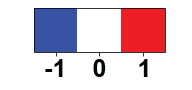
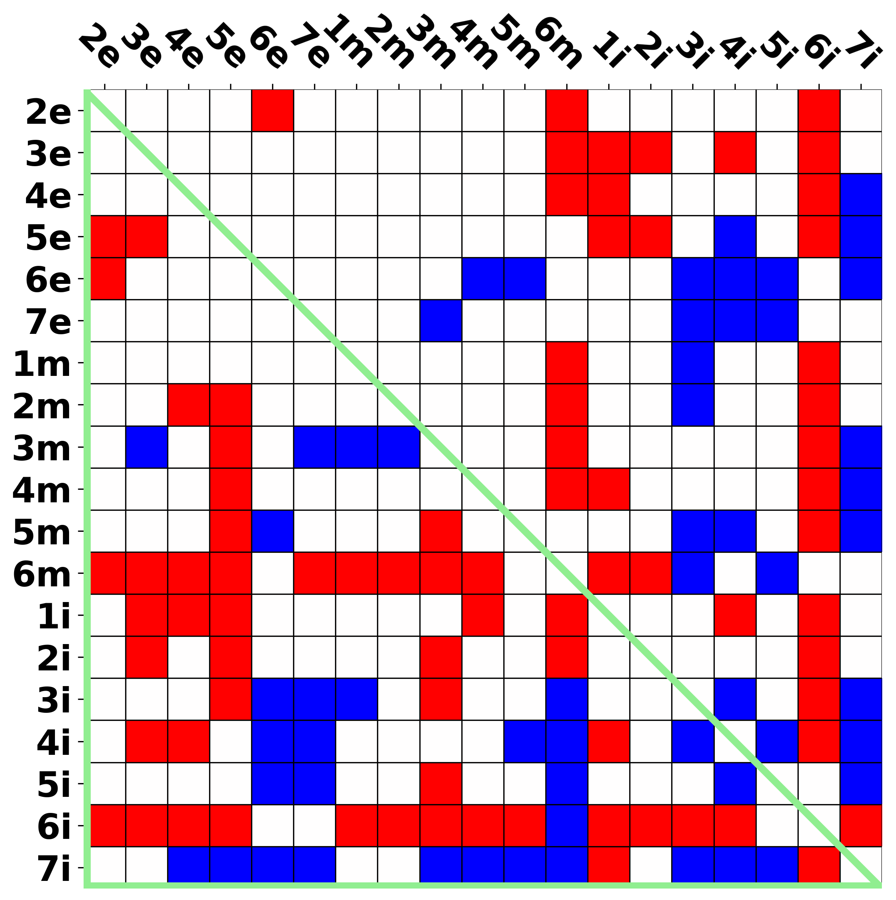

[Return to main menu](..//README.md)
 
# DRD3
 - [Raw data by structures](raw_data_DRD3.md)

[Return to "DRD3"](acc_DRD3.md) 
[Return to "D2-like receptors"](acc_d2like.md) 
## Table of content
 - Distance 
   - [Binding site residues](#Binding-site-residues) 
   - [Sub-segments](#Sub-segments) 
   - [Extracellular-ends (EE)](#Extracellular-ends) 

### Binding site residues 
[Return to top](#top) 
 - [Threshold = 0.0 (Å)](#bsi_matrixbinding_site_residues0_0) 
 - [Threshold = 0.2 (Å)](#bsi_matrixbinding_site_residues0_2) 
 - [Threshold = 0.4 (Å)](#bsi_matrixbinding_site_residues0_4) 
 - [Threshold = 0.6 (Å)](#bsi_matrixbinding_site_residues0_6) 
 - [Threshold = 0.8 (Å)](#bsi_matrixbinding_site_residues0_8) 
 - [Threshold = 1.0 (Å)](#bsi_matrixbinding_site_residues1_0) 
 
#### Binding site residues (active - inactive), distance threshold = 0.0 (Å) 
[Return to "Binding site residues"](#Binding-site-residues) 
<table><tr>
<td>category average

</td>
<td>mask

</td>
<td>mask of OBS

</td>
</tr></table>
 

 
#### Binding site residues (active - inactive), distance threshold = 0.2 (Å) 
[Return to "Binding site residues"](#Binding-site-residues) 
<table><tr>
<td>category average

</td>
<td>mask

</td>
<td>mask of OBS

</td>
</tr></table>
 

 
#### Binding site residues (active - inactive), distance threshold = 0.4 (Å) 
[Return to "Binding site residues"](#Binding-site-residues) 
<table><tr>
<td>category average

</td>
<td>mask

</td>
<td>mask of OBS

</td>
</tr></table>
 

 
#### Binding site residues (active - inactive), distance threshold = 0.6 (Å) 
[Return to "Binding site residues"](#Binding-site-residues) 
<table><tr>
<td>category average

</td>
<td>mask

</td>
<td>mask of OBS

</td>
</tr></table>
 

 
#### Binding site residues (active - inactive), distance threshold = 0.8 (Å) 
[Return to "Binding site residues"](#Binding-site-residues) 
<table><tr>
<td>category average

</td>
<td>mask

</td>
<td>mask of OBS

</td>
</tr></table>
 

 
#### Binding site residues (active - inactive), distance threshold = 1.0 (Å) 
[Return to "Binding site residues"](#Binding-site-residues) 
<table><tr>
<td>category average

</td>
<td>mask

</td>
<td>mask of OBS

</td>
</tr></table>
 

### Sub-segments 
[Return to top](#top) 
 - [Threshold = 0.0 (Å)](#pia_distmatsub-segments0_0) 
 - [Threshold = 0.2 (Å)](#pia_distmatsub-segments0_2) 
 - [Threshold = 0.4 (Å)](#pia_distmatsub-segments0_4) 
 - [Threshold = 0.6 (Å)](#pia_distmatsub-segments0_6) 
 - [Threshold = 0.8 (Å)](#pia_distmatsub-segments0_8) 
 - [Threshold = 1.0 (Å)](#pia_distmatsub-segments1_0) 
 
#### Sub-segments (active - inactive), distance threshold = 0.0 (Å) 
[Return to "Sub-segments"](#Sub-segments) 
<table><tr>
<td>category average

</td>
<td>mask

</td>
</tr></table>
 

 
#### Sub-segments (active - inactive), distance threshold = 0.2 (Å) 
[Return to "Sub-segments"](#Sub-segments) 
<table><tr>
<td>category average

</td>
<td>mask

</td>
</tr></table>
 

 
#### Sub-segments (active - inactive), distance threshold = 0.4 (Å) 
[Return to "Sub-segments"](#Sub-segments) 
<table><tr>
<td>category average

</td>
<td>mask

</td>
</tr></table>
 

 
#### Sub-segments (active - inactive), distance threshold = 0.6 (Å) 
[Return to "Sub-segments"](#Sub-segments) 
<table><tr>
<td>category average

</td>
<td>mask

</td>
</tr></table>
 

 
#### Sub-segments (active - inactive), distance threshold = 0.8 (Å) 
[Return to "Sub-segments"](#Sub-segments) 
<table><tr>
<td>category average

</td>
<td>mask

</td>
</tr></table>
 

 
#### Sub-segments (active - inactive), distance threshold = 1.0 (Å) 
[Return to "Sub-segments"](#Sub-segments) 
<table><tr>
<td>category average

</td>
<td>mask

</td>
</tr></table>
 

### Extracellular-ends 
[Return to top](#top) 
 - [Threshold = 0.0 (Å)](#end_distmatextracellular-ends0_0) 
 - [Threshold = 0.2 (Å)](#end_distmatextracellular-ends0_2) 
 - [Threshold = 0.4 (Å)](#end_distmatextracellular-ends0_4) 
 - [Threshold = 0.6 (Å)](#end_distmatextracellular-ends0_6) 
 - [Threshold = 0.8 (Å)](#end_distmatextracellular-ends0_8) 
 - [Threshold = 1.0 (Å)](#end_distmatextracellular-ends1_0) 
 
#### Extracellular-ends (active - inactive), distance threshold = 0.0 (Å) 
[Return to "Extracellular-ends"](#Extracellular-ends) 
<table><tr>
<td>category average

</td>
<td>mask

</td>
</tr></table>
 

 
#### Extracellular-ends (active - inactive), distance threshold = 0.2 (Å) 
[Return to "Extracellular-ends"](#Extracellular-ends) 
<table><tr>
<td>category average

</td>
<td>mask

</td>
</tr></table>
 

 
#### Extracellular-ends (active - inactive), distance threshold = 0.4 (Å) 
[Return to "Extracellular-ends"](#Extracellular-ends) 
<table><tr>
<td>category average

</td>
<td>mask

</td>
</tr></table>
 

 
#### Extracellular-ends (active - inactive), distance threshold = 0.6 (Å) 
[Return to "Extracellular-ends"](#Extracellular-ends) 
<table><tr>
<td>category average

</td>
<td>mask

</td>
</tr></table>
 

 
#### Extracellular-ends (active - inactive), distance threshold = 0.8 (Å) 
[Return to "Extracellular-ends"](#Extracellular-ends) 
<table><tr>
<td>category average

</td>
<td>mask

</td>
</tr></table>
 

 
#### Extracellular-ends (active - inactive), distance threshold = 1.0 (Å) 
[Return to "Extracellular-ends"](#Extracellular-ends) 
<table><tr>
<td>category average

</td>
<td>mask

</td>
</tr></table>
 

