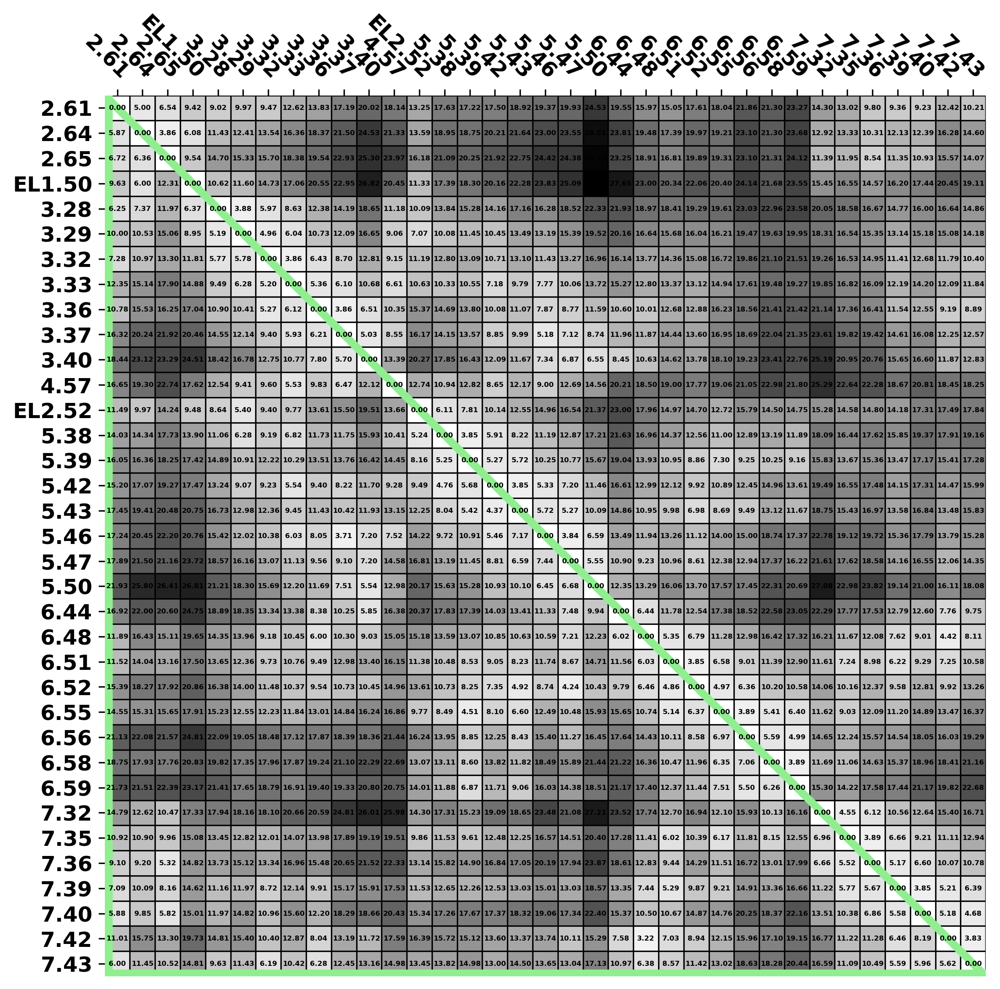
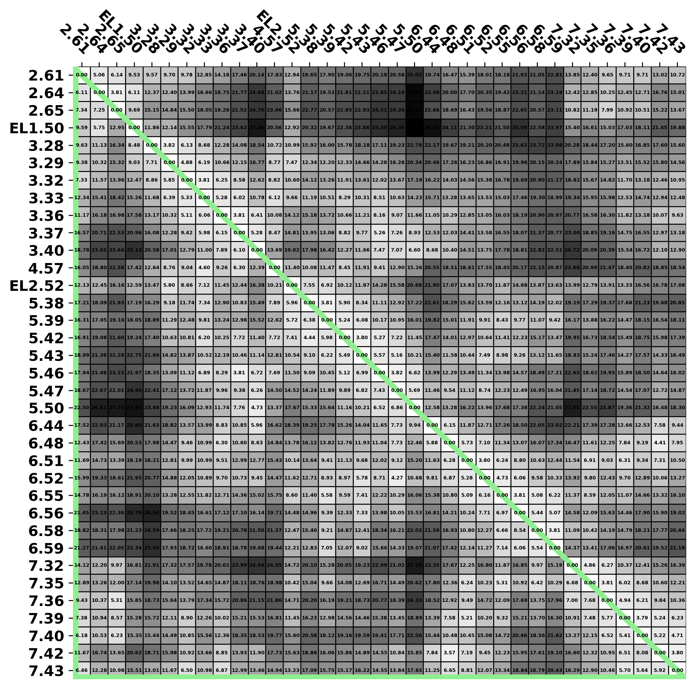
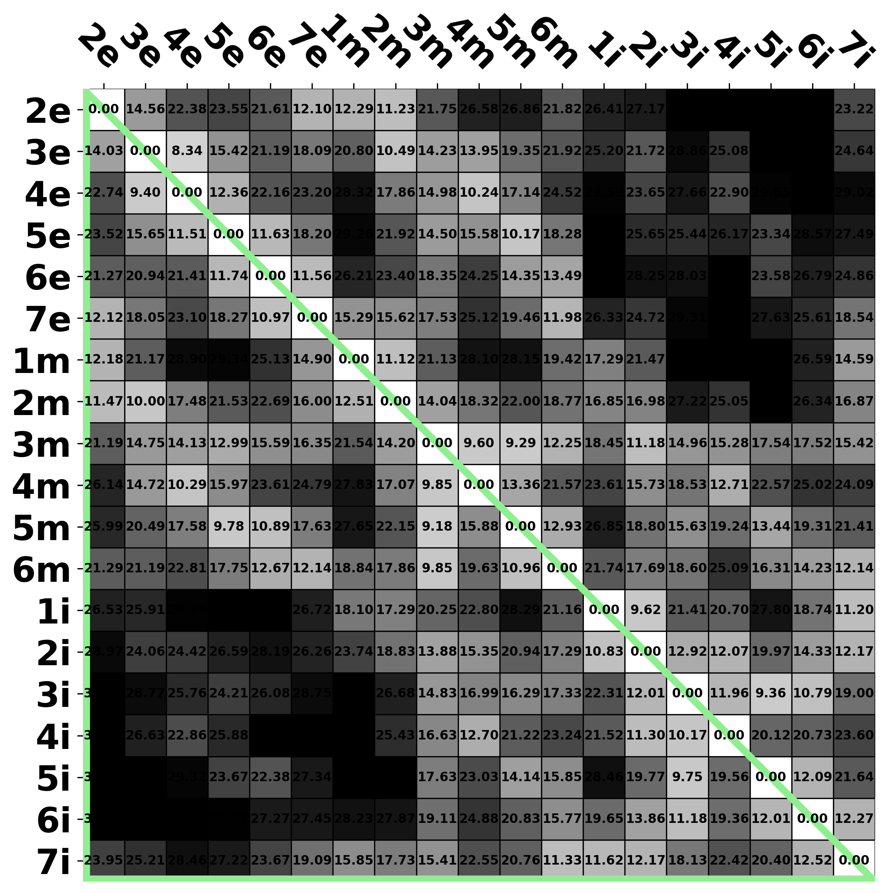

[Return to main menu](..//README.md)
 
# Raw data by structures
## ACC
 - [D2-like receptors](acc_d2like.md)
     - [DRD2](acc_DRD2.md)
     - [DRD3](acc_DRD3.md)

## Table of content
 - Distance 
   - [Binding site residues](#Binding-site-residues) 
   - [Sub-segments](#Sub-segments) 
   - [Extracellular-ends (EE)](#Extracellular-ends) 

### Binding site residues 
 - [7jvr](#Binding-site-residues_7jvr) 
 - [6cm4](#Binding-site-residues_6cm4) 
 - [6luq](#Binding-site-residues_6luq) 
 - [7dfp](#Binding-site-residues_7dfp) 
 - [7cmu](#Binding-site-residues_7cmu) 
 - [7cmv](#Binding-site-residues_7cmv) 
 - [3pbl](#Binding-site-residues_3pbl) 
 

 
### 7JVR 
[Return to top](#top) 
[Return to "Binding site residues"](#Binding-site-residues) 
<table><tr>

</td>
</tr></table>
 

 
### 6CM4 
[Return to top](#top) 
[Return to "Binding site residues"](#Binding-site-residues) 
<table><tr>

</td>
</tr></table>
 

 
### 6LUQ 
[Return to top](#top) 
[Return to "Binding site residues"](#Binding-site-residues) 
<table><tr>

</td>
</tr></table>
 

 
### 7DFP 
[Return to top](#top) 
[Return to "Binding site residues"](#Binding-site-residues) 
<table><tr>

</td>
</tr></table>
 

 
### 7CMU 
[Return to top](#top) 
[Return to "Binding site residues"](#Binding-site-residues) 
<table><tr>

</td>
</tr></table>
 

 
### 7CMV 
[Return to top](#top) 
[Return to "Binding site residues"](#Binding-site-residues) 
<table><tr>

</td>
</tr></table>
 

 
### 3PBL 
[Return to top](#top) 
[Return to "Binding site residues"](#Binding-site-residues) 
<table><tr>

</td>
</tr></table>
 

### Sub-segments 
 - [7jvr](#Sub-segments_7jvr) 
 - [6cm4](#Sub-segments_6cm4) 
 - [6luq](#Sub-segments_6luq) 
 - [7dfp](#Sub-segments_7dfp) 
 - [7cmu](#Sub-segments_7cmu) 
 - [7cmv](#Sub-segments_7cmv) 
 - [3pbl](#Sub-segments_3pbl) 
 

 
### 7JVR 
[Return to top](#top) 
[Return to "Sub-segments"](#Sub-segments) 
<table><tr>

</td>
 

 
### 6CM4 
[Return to top](#top) 
[Return to "Sub-segments"](#Sub-segments) 
<table><tr>

</td>
 

 
### 6LUQ 
[Return to top](#top) 
[Return to "Sub-segments"](#Sub-segments) 
<table><tr>

</td>
 

 
### 7DFP 
[Return to top](#top) 
[Return to "Sub-segments"](#Sub-segments) 
<table><tr>

</td>
 

 
### 7CMU 
[Return to top](#top) 
[Return to "Sub-segments"](#Sub-segments) 
<table><tr>

</td>
 

 
### 7CMV 
[Return to top](#top) 
[Return to "Sub-segments"](#Sub-segments) 
<table><tr>

</td>
 

 
### 3PBL 
[Return to top](#top) 
[Return to "Sub-segments"](#Sub-segments) 
<table><tr>

</td>
 

### Extracellular-ends 
 - [7jvr](#Extracellular-ends_7jvr) 
 - [6cm4](#Extracellular-ends_6cm4) 
 - [6luq](#Extracellular-ends_6luq) 
 - [7dfp](#Extracellular-ends_7dfp) 
 - [7cmu](#Extracellular-ends_7cmu) 
 - [7cmv](#Extracellular-ends_7cmv) 
 - [3pbl](#Extracellular-ends_3pbl) 
 

 
### 7JVR 
[Return to top](#top) 
[Return to "Extracellular-ends"](#Extracellular-ends) 
<table><tr>

</td>
 

 
### 6CM4 
[Return to top](#top) 
[Return to "Extracellular-ends"](#Extracellular-ends) 
<table><tr>

</td>
 

 
### 6LUQ 
[Return to top](#top) 
[Return to "Extracellular-ends"](#Extracellular-ends) 
<table><tr>

</td>
 

 
### 7DFP 
[Return to top](#top) 
[Return to "Extracellular-ends"](#Extracellular-ends) 
<table><tr>

</td>
 

 
### 7CMU 
[Return to top](#top) 
[Return to "Extracellular-ends"](#Extracellular-ends) 
<table><tr>

</td>
 

 
### 7CMV 
[Return to top](#top) 
[Return to "Extracellular-ends"](#Extracellular-ends) 
<table><tr>

</td>
 

 
### 3PBL 
[Return to top](#top) 
[Return to "Extracellular-ends"](#Extracellular-ends) 
<table><tr>

</td>
 

