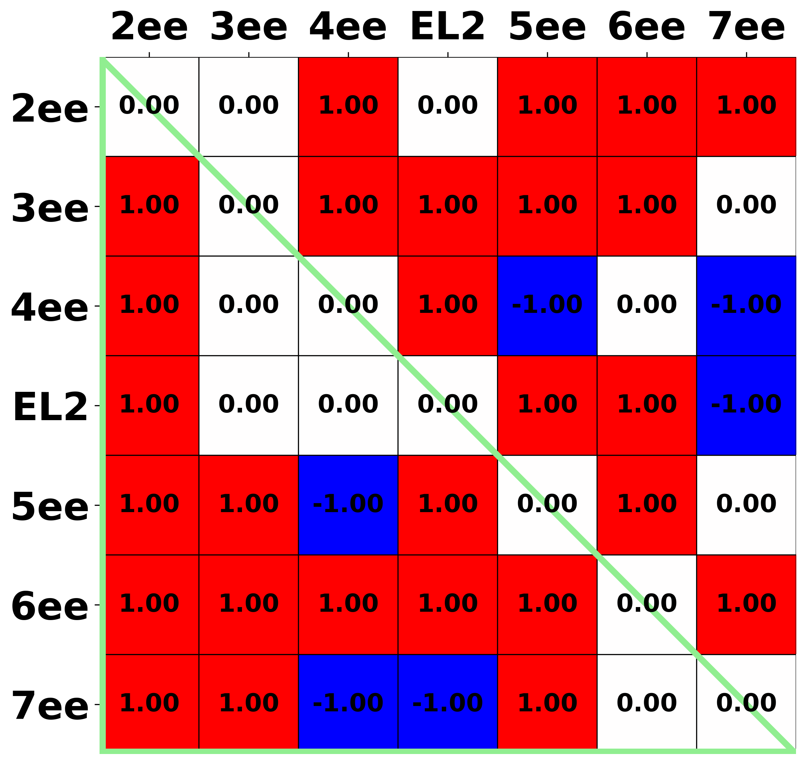

[Return to main menu](..//README.md)
 
# Raw data by structures (DRD2)
[Return to "DRD2"](acc_DRD2.md) 
[Return to "D2-like receptors"](acc_d2like.md) 
## Table of content
 - Distance 
   - [Binding site residues](#Binding-site-residues) 
   - [Sub-segments](#Sub-segments) 
   - [Extracellular-ends (EE)](#Extracellular-ends) 

### Binding site residues 
[Return to top](#top) 

<strong>Pairwise distance</strong>

 - [7JVR (active)](#Binding-site-residues_7jvr) 
 - [6CM4 (inactive)](#Binding-site-residues_6cm4) 
 - [6LUQ (inactive)](#Binding-site-residues_6luq) 
 - [7DFP (inactive)](#Binding-site-residues_7dfp) 

<strong>Pairwise distance difference</strong>

 - [7JVR (active) - 6CM4 (inactive)](#Binding-site-residues_diff_a.7jvr-i.6cm4) 
 - [7JVR (active) - 6LUQ (inactive)](#Binding-site-residues_diff_a.7jvr-i.6luq) 
 - [7JVR (active) - 7DFP (inactive)](#Binding-site-residues_diff_a.7jvr-i.7dfp) 
 

#### Pairwise distance
 

### 7JVR (active) 

[Return to top](#top) 

[Return to "Binding site residues"](#Binding-site-residues) 

<table><tr>

</td>
</tr></table>
 
 

### 6CM4 (inactive) 

[Return to top](#top) 

[Return to "Binding site residues"](#Binding-site-residues) 

<table><tr>

</td>
</tr></table>
 
 

### 6LUQ (inactive) 

[Return to top](#top) 

[Return to "Binding site residues"](#Binding-site-residues) 

<table><tr>

</td>
</tr></table>
 
 

### 7DFP (inactive) 

[Return to top](#top) 

[Return to "Binding site residues"](#Binding-site-residues) 

<table><tr>

</td>
</tr></table>
 
 
 

#### Pairwise distance difference
 

### 7JVR (active) - 6CM4 (inactive) 

[Return to top](#top) 

[Return to "Binding site residues"](#Binding-site-residues) 

- [Raw](#Binding-site-residues_pdf_raw_diff_a.7jvr-i.6cm4) 
- Classified 
    - [Threshold = 0.0 (Å)](#Binding-site-residues_pdf_cutoff_0.0_diff_a.7jvr-i.6cm4) 
    - [Threshold = 0.2 (Å)](#Binding-site-residues_pdf_cutoff_0.2_diff_a.7jvr-i.6cm4) 
    - [Threshold = 0.4 (Å)](#Binding-site-residues_pdf_cutoff_0.4_diff_a.7jvr-i.6cm4) 
    - [Threshold = 0.6 (Å)](#Binding-site-residues_pdf_cutoff_0.6_diff_a.7jvr-i.6cm4) 
    - [Threshold = 0.8 (Å)](#Binding-site-residues_pdf_cutoff_0.8_diff_a.7jvr-i.6cm4) 
    - [Threshold = 1.0 (Å)](#Binding-site-residues_pdf_cutoff_1.0_diff_a.7jvr-i.6cm4) 
 
 
Raw 

[Return to "Binding site residues"](#Binding-site-residues) 

  
 

#### Binding site residues (active - inactive), distance threshold = 0.0 (Å) 

[Return to "Binding site residues"](#Binding-site-residues) 

<table><tr>

</td>
</tr></table>
 
 

#### Binding site residues (active - inactive), distance threshold = 0.2 (Å) 

[Return to "Binding site residues"](#Binding-site-residues) 

<table><tr>

</td>
</tr></table>
 
 

#### Binding site residues (active - inactive), distance threshold = 0.4 (Å) 

[Return to "Binding site residues"](#Binding-site-residues) 

<table><tr>

</td>
</tr></table>
 
 

#### Binding site residues (active - inactive), distance threshold = 0.6 (Å) 

[Return to "Binding site residues"](#Binding-site-residues) 

<table><tr>

</td>
</tr></table>
 
 

#### Binding site residues (active - inactive), distance threshold = 0.8 (Å) 

[Return to "Binding site residues"](#Binding-site-residues) 

<table><tr>

</td>
</tr></table>
 
 

#### Binding site residues (active - inactive), distance threshold = 1.0 (Å) 

[Return to "Binding site residues"](#Binding-site-residues) 

<table><tr>

</td>
</tr></table>
 
 
 

### 7JVR (active) - 6LUQ (inactive) 

[Return to top](#top) 

[Return to "Binding site residues"](#Binding-site-residues) 

- [Raw](#Binding-site-residues_pdf_raw_diff_a.7jvr-i.6luq) 
- Classified 
    - [Threshold = 0.0 (Å)](#Binding-site-residues_pdf_cutoff_0.0_diff_a.7jvr-i.6luq) 
    - [Threshold = 0.2 (Å)](#Binding-site-residues_pdf_cutoff_0.2_diff_a.7jvr-i.6luq) 
    - [Threshold = 0.4 (Å)](#Binding-site-residues_pdf_cutoff_0.4_diff_a.7jvr-i.6luq) 
    - [Threshold = 0.6 (Å)](#Binding-site-residues_pdf_cutoff_0.6_diff_a.7jvr-i.6luq) 
    - [Threshold = 0.8 (Å)](#Binding-site-residues_pdf_cutoff_0.8_diff_a.7jvr-i.6luq) 
    - [Threshold = 1.0 (Å)](#Binding-site-residues_pdf_cutoff_1.0_diff_a.7jvr-i.6luq) 
 
 
Raw 

[Return to "Binding site residues"](#Binding-site-residues) 

  
 

#### Binding site residues (active - inactive), distance threshold = 0.0 (Å) 

[Return to "Binding site residues"](#Binding-site-residues) 

<table><tr>

</td>
</tr></table>
 
 

#### Binding site residues (active - inactive), distance threshold = 0.2 (Å) 

[Return to "Binding site residues"](#Binding-site-residues) 

<table><tr>

</td>
</tr></table>
 
 

#### Binding site residues (active - inactive), distance threshold = 0.4 (Å) 

[Return to "Binding site residues"](#Binding-site-residues) 

<table><tr>

</td>
</tr></table>
 
 

#### Binding site residues (active - inactive), distance threshold = 0.6 (Å) 

[Return to "Binding site residues"](#Binding-site-residues) 

<table><tr>

</td>
</tr></table>
 
 

#### Binding site residues (active - inactive), distance threshold = 0.8 (Å) 

[Return to "Binding site residues"](#Binding-site-residues) 

<table><tr>

</td>
</tr></table>
 
 

#### Binding site residues (active - inactive), distance threshold = 1.0 (Å) 

[Return to "Binding site residues"](#Binding-site-residues) 

<table><tr>

</td>
</tr></table>
 
 
 

### 7JVR (active) - 7DFP (inactive) 

[Return to top](#top) 

[Return to "Binding site residues"](#Binding-site-residues) 

- [Raw](#Binding-site-residues_pdf_raw_diff_a.7jvr-i.7dfp) 
- Classified 
    - [Threshold = 0.0 (Å)](#Binding-site-residues_pdf_cutoff_0.0_diff_a.7jvr-i.7dfp) 
    - [Threshold = 0.2 (Å)](#Binding-site-residues_pdf_cutoff_0.2_diff_a.7jvr-i.7dfp) 
    - [Threshold = 0.4 (Å)](#Binding-site-residues_pdf_cutoff_0.4_diff_a.7jvr-i.7dfp) 
    - [Threshold = 0.6 (Å)](#Binding-site-residues_pdf_cutoff_0.6_diff_a.7jvr-i.7dfp) 
    - [Threshold = 0.8 (Å)](#Binding-site-residues_pdf_cutoff_0.8_diff_a.7jvr-i.7dfp) 
    - [Threshold = 1.0 (Å)](#Binding-site-residues_pdf_cutoff_1.0_diff_a.7jvr-i.7dfp) 
 
 
Raw 

[Return to "Binding site residues"](#Binding-site-residues) 

  
 

#### Binding site residues (active - inactive), distance threshold = 0.0 (Å) 

[Return to "Binding site residues"](#Binding-site-residues) 

<table><tr>

</td>
</tr></table>
 
 

#### Binding site residues (active - inactive), distance threshold = 0.2 (Å) 

[Return to "Binding site residues"](#Binding-site-residues) 

<table><tr>

</td>
</tr></table>
 
 

#### Binding site residues (active - inactive), distance threshold = 0.4 (Å) 

[Return to "Binding site residues"](#Binding-site-residues) 

<table><tr>

</td>
</tr></table>
 
 

#### Binding site residues (active - inactive), distance threshold = 0.6 (Å) 

[Return to "Binding site residues"](#Binding-site-residues) 

<table><tr>

</td>
</tr></table>
 
 

#### Binding site residues (active - inactive), distance threshold = 0.8 (Å) 

[Return to "Binding site residues"](#Binding-site-residues) 

<table><tr>

</td>
</tr></table>
 
 

#### Binding site residues (active - inactive), distance threshold = 1.0 (Å) 

[Return to "Binding site residues"](#Binding-site-residues) 

<table><tr>

</td>
</tr></table>
 
 
 
 

### Sub-segments 
[Return to top](#top) 

<strong>Pairwise distance</strong>

 - [7JVR (active)](#Sub-segments_7jvr) 
 - [6CM4 (inactive)](#Sub-segments_6cm4) 
 - [6LUQ (inactive)](#Sub-segments_6luq) 
 - [7DFP (inactive)](#Sub-segments_7dfp) 

<strong>Pairwise distance difference</strong>

 - [7JVR (active) - 6CM4 (inactive)](#Sub-segments_diff_a.7jvr-i.6cm4) 
 - [7JVR (active) - 6LUQ (inactive)](#Sub-segments_diff_a.7jvr-i.6luq) 
 - [7JVR (active) - 7DFP (inactive)](#Sub-segments_diff_a.7jvr-i.7dfp) 
 

#### Pairwise distance
 

### 7JVR (active) 

[Return to top](#top) 

[Return to "Sub-segments"](#Sub-segments) 

<table><tr>

</td>
 
 

### 6CM4 (inactive) 

[Return to top](#top) 

[Return to "Sub-segments"](#Sub-segments) 

<table><tr>

</td>
 
 

### 6LUQ (inactive) 

[Return to top](#top) 

[Return to "Sub-segments"](#Sub-segments) 

<table><tr>

</td>
 
 

### 7DFP (inactive) 

[Return to top](#top) 

[Return to "Sub-segments"](#Sub-segments) 

<table><tr>

</td>
 
 
 

#### Pairwise distance difference
 

### 7JVR (active) - 6CM4 (inactive) 

[Return to top](#top) 

[Return to "Sub-segments"](#Sub-segments) 

- [Raw](#Sub-segments_pdf_raw_diff_a.7jvr-i.6cm4) 
- Classified 
    - [Threshold = 0.0 (Å)](#Sub-segments_pdf_cutoff_0.0_diff_a.7jvr-i.6cm4) 
    - [Threshold = 0.2 (Å)](#Sub-segments_pdf_cutoff_0.2_diff_a.7jvr-i.6cm4) 
    - [Threshold = 0.4 (Å)](#Sub-segments_pdf_cutoff_0.4_diff_a.7jvr-i.6cm4) 
    - [Threshold = 0.6 (Å)](#Sub-segments_pdf_cutoff_0.6_diff_a.7jvr-i.6cm4) 
    - [Threshold = 0.8 (Å)](#Sub-segments_pdf_cutoff_0.8_diff_a.7jvr-i.6cm4) 
    - [Threshold = 1.0 (Å)](#Sub-segments_pdf_cutoff_1.0_diff_a.7jvr-i.6cm4) 
 
 
Raw 

[Return to "Sub-segments"](#Sub-segments) 

  
 

#### Sub-segments (active - inactive), distance threshold = 0.0 (Å) 

[Return to "Sub-segments"](#Sub-segments) 

<table><tr>

</td>
</tr></table>
 
 

#### Sub-segments (active - inactive), distance threshold = 0.2 (Å) 

[Return to "Sub-segments"](#Sub-segments) 

<table><tr>

</td>
</tr></table>
 
 

#### Sub-segments (active - inactive), distance threshold = 0.4 (Å) 

[Return to "Sub-segments"](#Sub-segments) 

<table><tr>

</td>
</tr></table>
 
 

#### Sub-segments (active - inactive), distance threshold = 0.6 (Å) 

[Return to "Sub-segments"](#Sub-segments) 

<table><tr>

</td>
</tr></table>
 
 

#### Sub-segments (active - inactive), distance threshold = 0.8 (Å) 

[Return to "Sub-segments"](#Sub-segments) 

<table><tr>

</td>
</tr></table>
 
 

#### Sub-segments (active - inactive), distance threshold = 1.0 (Å) 

[Return to "Sub-segments"](#Sub-segments) 

<table><tr>

</td>
</tr></table>
 
 
 

### 7JVR (active) - 6LUQ (inactive) 

[Return to top](#top) 

[Return to "Sub-segments"](#Sub-segments) 

- [Raw](#Sub-segments_pdf_raw_diff_a.7jvr-i.6luq) 
- Classified 
    - [Threshold = 0.0 (Å)](#Sub-segments_pdf_cutoff_0.0_diff_a.7jvr-i.6luq) 
    - [Threshold = 0.2 (Å)](#Sub-segments_pdf_cutoff_0.2_diff_a.7jvr-i.6luq) 
    - [Threshold = 0.4 (Å)](#Sub-segments_pdf_cutoff_0.4_diff_a.7jvr-i.6luq) 
    - [Threshold = 0.6 (Å)](#Sub-segments_pdf_cutoff_0.6_diff_a.7jvr-i.6luq) 
    - [Threshold = 0.8 (Å)](#Sub-segments_pdf_cutoff_0.8_diff_a.7jvr-i.6luq) 
    - [Threshold = 1.0 (Å)](#Sub-segments_pdf_cutoff_1.0_diff_a.7jvr-i.6luq) 
 
 
Raw 

[Return to "Sub-segments"](#Sub-segments) 

  
 

#### Sub-segments (active - inactive), distance threshold = 0.0 (Å) 

[Return to "Sub-segments"](#Sub-segments) 

<table><tr>

</td>
</tr></table>
 
 

#### Sub-segments (active - inactive), distance threshold = 0.2 (Å) 

[Return to "Sub-segments"](#Sub-segments) 

<table><tr>

</td>
</tr></table>
 
 

#### Sub-segments (active - inactive), distance threshold = 0.4 (Å) 

[Return to "Sub-segments"](#Sub-segments) 

<table><tr>

</td>
</tr></table>
 
 

#### Sub-segments (active - inactive), distance threshold = 0.6 (Å) 

[Return to "Sub-segments"](#Sub-segments) 

<table><tr>

</td>
</tr></table>
 
 

#### Sub-segments (active - inactive), distance threshold = 0.8 (Å) 

[Return to "Sub-segments"](#Sub-segments) 

<table><tr>

</td>
</tr></table>
 
 

#### Sub-segments (active - inactive), distance threshold = 1.0 (Å) 

[Return to "Sub-segments"](#Sub-segments) 

<table><tr>

</td>
</tr></table>
 
 
 

### 7JVR (active) - 7DFP (inactive) 

[Return to top](#top) 

[Return to "Sub-segments"](#Sub-segments) 

- [Raw](#Sub-segments_pdf_raw_diff_a.7jvr-i.7dfp) 
- Classified 
    - [Threshold = 0.0 (Å)](#Sub-segments_pdf_cutoff_0.0_diff_a.7jvr-i.7dfp) 
    - [Threshold = 0.2 (Å)](#Sub-segments_pdf_cutoff_0.2_diff_a.7jvr-i.7dfp) 
    - [Threshold = 0.4 (Å)](#Sub-segments_pdf_cutoff_0.4_diff_a.7jvr-i.7dfp) 
    - [Threshold = 0.6 (Å)](#Sub-segments_pdf_cutoff_0.6_diff_a.7jvr-i.7dfp) 
    - [Threshold = 0.8 (Å)](#Sub-segments_pdf_cutoff_0.8_diff_a.7jvr-i.7dfp) 
    - [Threshold = 1.0 (Å)](#Sub-segments_pdf_cutoff_1.0_diff_a.7jvr-i.7dfp) 
 
 
Raw 

[Return to "Sub-segments"](#Sub-segments) 

  
 

#### Sub-segments (active - inactive), distance threshold = 0.0 (Å) 

[Return to "Sub-segments"](#Sub-segments) 

<table><tr>

</td>
</tr></table>
 
 

#### Sub-segments (active - inactive), distance threshold = 0.2 (Å) 

[Return to "Sub-segments"](#Sub-segments) 

<table><tr>

</td>
</tr></table>
 
 

#### Sub-segments (active - inactive), distance threshold = 0.4 (Å) 

[Return to "Sub-segments"](#Sub-segments) 

<table><tr>

</td>
</tr></table>
 
 

#### Sub-segments (active - inactive), distance threshold = 0.6 (Å) 

[Return to "Sub-segments"](#Sub-segments) 

<table><tr>

</td>
</tr></table>
 
 

#### Sub-segments (active - inactive), distance threshold = 0.8 (Å) 

[Return to "Sub-segments"](#Sub-segments) 

<table><tr>

</td>
</tr></table>
 
 

#### Sub-segments (active - inactive), distance threshold = 1.0 (Å) 

[Return to "Sub-segments"](#Sub-segments) 

<table><tr>

</td>
</tr></table>
 
 
 
 

### Extracellular-ends 
[Return to top](#top) 

<strong>Pairwise distance</strong>

 - [7JVR (active)](#Extracellular-ends_7jvr) 
 - [6CM4 (inactive)](#Extracellular-ends_6cm4) 
 - [6LUQ (inactive)](#Extracellular-ends_6luq) 
 - [7DFP (inactive)](#Extracellular-ends_7dfp) 

<strong>Pairwise distance difference</strong>

 - [7JVR (active) - 6CM4 (inactive)](#Extracellular-ends_diff_a.7jvr-i.6cm4) 
 - [7JVR (active) - 6LUQ (inactive)](#Extracellular-ends_diff_a.7jvr-i.6luq) 
 - [7JVR (active) - 7DFP (inactive)](#Extracellular-ends_diff_a.7jvr-i.7dfp) 
 

#### Pairwise distance
 

### 7JVR (active) 

[Return to top](#top) 

[Return to "Extracellular-ends"](#Extracellular-ends) 

<table><tr>

</td>
 
 

### 6CM4 (inactive) 

[Return to top](#top) 

[Return to "Extracellular-ends"](#Extracellular-ends) 

<table><tr>

</td>
 
 

### 6LUQ (inactive) 

[Return to top](#top) 

[Return to "Extracellular-ends"](#Extracellular-ends) 

<table><tr>

</td>
 
 

### 7DFP (inactive) 

[Return to top](#top) 

[Return to "Extracellular-ends"](#Extracellular-ends) 

<table><tr>

</td>
 
 
 

#### Pairwise distance difference
 

### 7JVR (active) - 6CM4 (inactive) 

[Return to top](#top) 

[Return to "Extracellular-ends"](#Extracellular-ends) 

- [Raw](#Extracellular-ends_pdf_raw_diff_a.7jvr-i.6cm4) 
- Classified 
    - [Threshold = 0.0 (Å)](#Extracellular-ends_pdf_cutoff_0.0_diff_a.7jvr-i.6cm4) 
    - [Threshold = 0.2 (Å)](#Extracellular-ends_pdf_cutoff_0.2_diff_a.7jvr-i.6cm4) 
    - [Threshold = 0.4 (Å)](#Extracellular-ends_pdf_cutoff_0.4_diff_a.7jvr-i.6cm4) 
    - [Threshold = 0.6 (Å)](#Extracellular-ends_pdf_cutoff_0.6_diff_a.7jvr-i.6cm4) 
    - [Threshold = 0.8 (Å)](#Extracellular-ends_pdf_cutoff_0.8_diff_a.7jvr-i.6cm4) 
    - [Threshold = 1.0 (Å)](#Extracellular-ends_pdf_cutoff_1.0_diff_a.7jvr-i.6cm4) 
 
 
Raw 

[Return to "Extracellular-ends"](#Extracellular-ends) 

  
 

#### Extracellular-ends (active - inactive), distance threshold = 0.0 (Å) 

[Return to "Extracellular-ends"](#Extracellular-ends) 

<table><tr>

</td>
</tr></table>
 
 

#### Extracellular-ends (active - inactive), distance threshold = 0.2 (Å) 

[Return to "Extracellular-ends"](#Extracellular-ends) 

<table><tr>

</td>
</tr></table>
 
 

#### Extracellular-ends (active - inactive), distance threshold = 0.4 (Å) 

[Return to "Extracellular-ends"](#Extracellular-ends) 

<table><tr>

</td>
</tr></table>
 
 

#### Extracellular-ends (active - inactive), distance threshold = 0.6 (Å) 

[Return to "Extracellular-ends"](#Extracellular-ends) 

<table><tr>

</td>
</tr></table>
 
 

#### Extracellular-ends (active - inactive), distance threshold = 0.8 (Å) 

[Return to "Extracellular-ends"](#Extracellular-ends) 

<table><tr>

</td>
</tr></table>
 
 

#### Extracellular-ends (active - inactive), distance threshold = 1.0 (Å) 

[Return to "Extracellular-ends"](#Extracellular-ends) 

<table><tr>

</td>
</tr></table>
 
 
 

### 7JVR (active) - 6LUQ (inactive) 

[Return to top](#top) 

[Return to "Extracellular-ends"](#Extracellular-ends) 

- [Raw](#Extracellular-ends_pdf_raw_diff_a.7jvr-i.6luq) 
- Classified 
    - [Threshold = 0.0 (Å)](#Extracellular-ends_pdf_cutoff_0.0_diff_a.7jvr-i.6luq) 
    - [Threshold = 0.2 (Å)](#Extracellular-ends_pdf_cutoff_0.2_diff_a.7jvr-i.6luq) 
    - [Threshold = 0.4 (Å)](#Extracellular-ends_pdf_cutoff_0.4_diff_a.7jvr-i.6luq) 
    - [Threshold = 0.6 (Å)](#Extracellular-ends_pdf_cutoff_0.6_diff_a.7jvr-i.6luq) 
    - [Threshold = 0.8 (Å)](#Extracellular-ends_pdf_cutoff_0.8_diff_a.7jvr-i.6luq) 
    - [Threshold = 1.0 (Å)](#Extracellular-ends_pdf_cutoff_1.0_diff_a.7jvr-i.6luq) 
 
 
Raw 

[Return to "Extracellular-ends"](#Extracellular-ends) 

  
 

#### Extracellular-ends (active - inactive), distance threshold = 0.0 (Å) 

[Return to "Extracellular-ends"](#Extracellular-ends) 

<table><tr>

</td>
</tr></table>
 
 

#### Extracellular-ends (active - inactive), distance threshold = 0.2 (Å) 

[Return to "Extracellular-ends"](#Extracellular-ends) 

<table><tr>

</td>
</tr></table>
 
 

#### Extracellular-ends (active - inactive), distance threshold = 0.4 (Å) 

[Return to "Extracellular-ends"](#Extracellular-ends) 

<table><tr>

</td>
</tr></table>
 
 

#### Extracellular-ends (active - inactive), distance threshold = 0.6 (Å) 

[Return to "Extracellular-ends"](#Extracellular-ends) 

<table><tr>

</td>
</tr></table>
 
 

#### Extracellular-ends (active - inactive), distance threshold = 0.8 (Å) 

[Return to "Extracellular-ends"](#Extracellular-ends) 

<table><tr>

</td>
</tr></table>
 
 

#### Extracellular-ends (active - inactive), distance threshold = 1.0 (Å) 

[Return to "Extracellular-ends"](#Extracellular-ends) 

<table><tr>

</td>
</tr></table>
 
 
 

### 7JVR (active) - 7DFP (inactive) 

[Return to top](#top) 

[Return to "Extracellular-ends"](#Extracellular-ends) 

- [Raw](#Extracellular-ends_pdf_raw_diff_a.7jvr-i.7dfp) 
- Classified 
    - [Threshold = 0.0 (Å)](#Extracellular-ends_pdf_cutoff_0.0_diff_a.7jvr-i.7dfp) 
    - [Threshold = 0.2 (Å)](#Extracellular-ends_pdf_cutoff_0.2_diff_a.7jvr-i.7dfp) 
    - [Threshold = 0.4 (Å)](#Extracellular-ends_pdf_cutoff_0.4_diff_a.7jvr-i.7dfp) 
    - [Threshold = 0.6 (Å)](#Extracellular-ends_pdf_cutoff_0.6_diff_a.7jvr-i.7dfp) 
    - [Threshold = 0.8 (Å)](#Extracellular-ends_pdf_cutoff_0.8_diff_a.7jvr-i.7dfp) 
    - [Threshold = 1.0 (Å)](#Extracellular-ends_pdf_cutoff_1.0_diff_a.7jvr-i.7dfp) 
 
 
Raw 

[Return to "Extracellular-ends"](#Extracellular-ends) 

  
 

#### Extracellular-ends (active - inactive), distance threshold = 0.0 (Å) 

[Return to "Extracellular-ends"](#Extracellular-ends) 

<table><tr>

</td>
</tr></table>
 
 

#### Extracellular-ends (active - inactive), distance threshold = 0.2 (Å) 

[Return to "Extracellular-ends"](#Extracellular-ends) 

<table><tr>

</td>
</tr></table>
 
 

#### Extracellular-ends (active - inactive), distance threshold = 0.4 (Å) 

[Return to "Extracellular-ends"](#Extracellular-ends) 

<table><tr>

</td>
</tr></table>
 
 

#### Extracellular-ends (active - inactive), distance threshold = 0.6 (Å) 

[Return to "Extracellular-ends"](#Extracellular-ends) 

<table><tr>

</td>
</tr></table>
 
 

#### Extracellular-ends (active - inactive), distance threshold = 0.8 (Å) 

[Return to "Extracellular-ends"](#Extracellular-ends) 

<table><tr>

</td>
</tr></table>
 
 

#### Extracellular-ends (active - inactive), distance threshold = 1.0 (Å) 

[Return to "Extracellular-ends"](#Extracellular-ends) 

<table><tr>

</td>
</tr></table>
 
 
 
 

