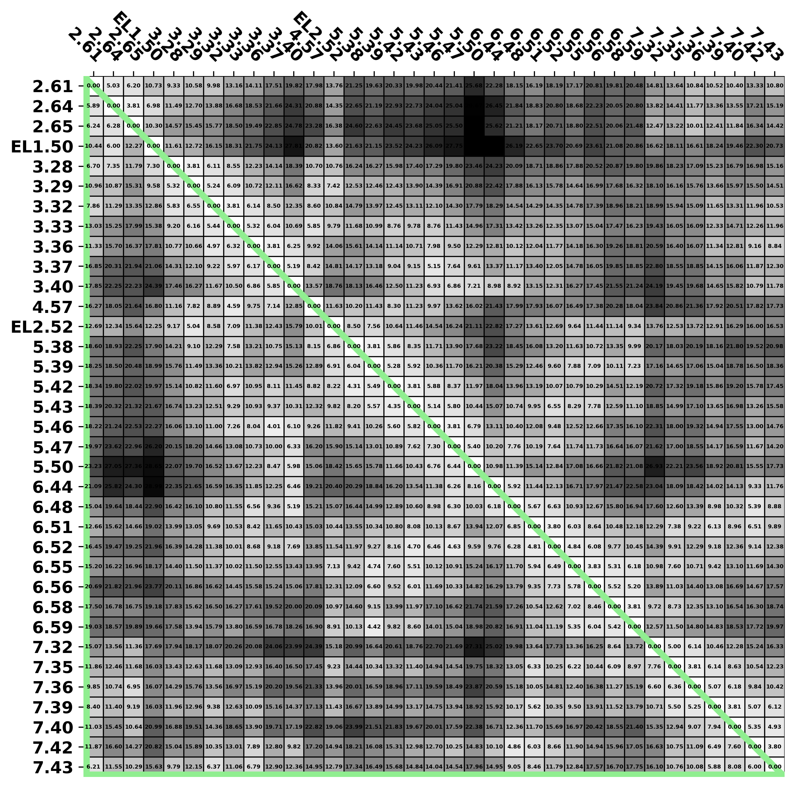
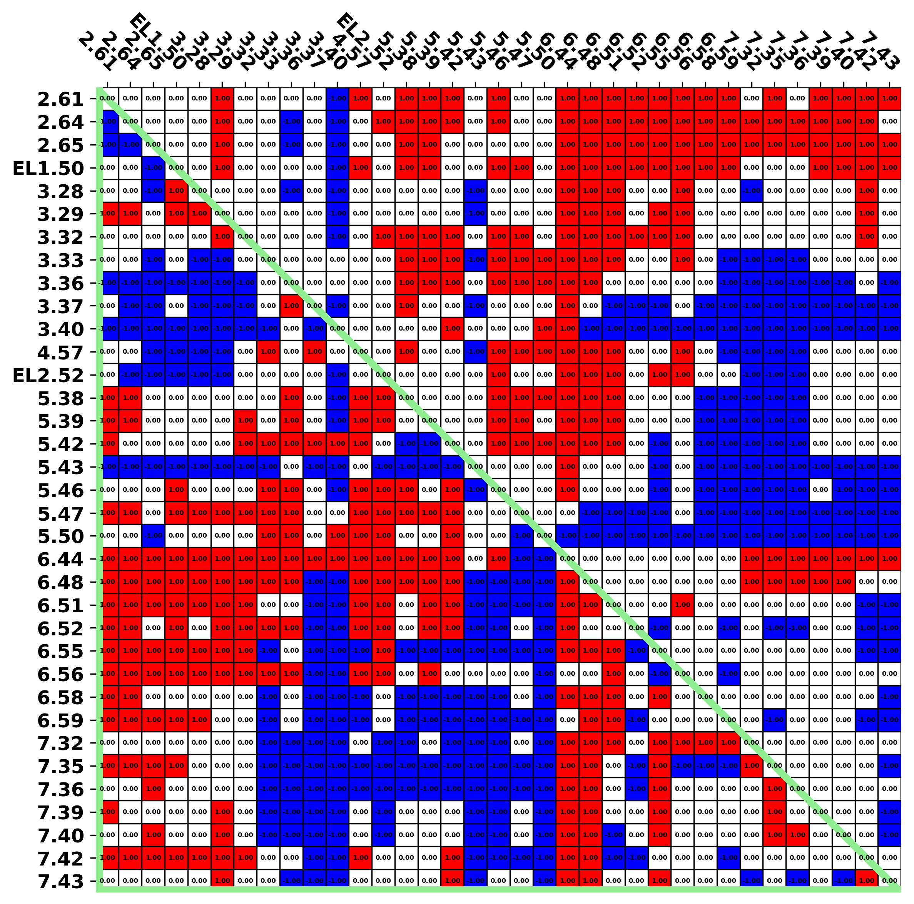
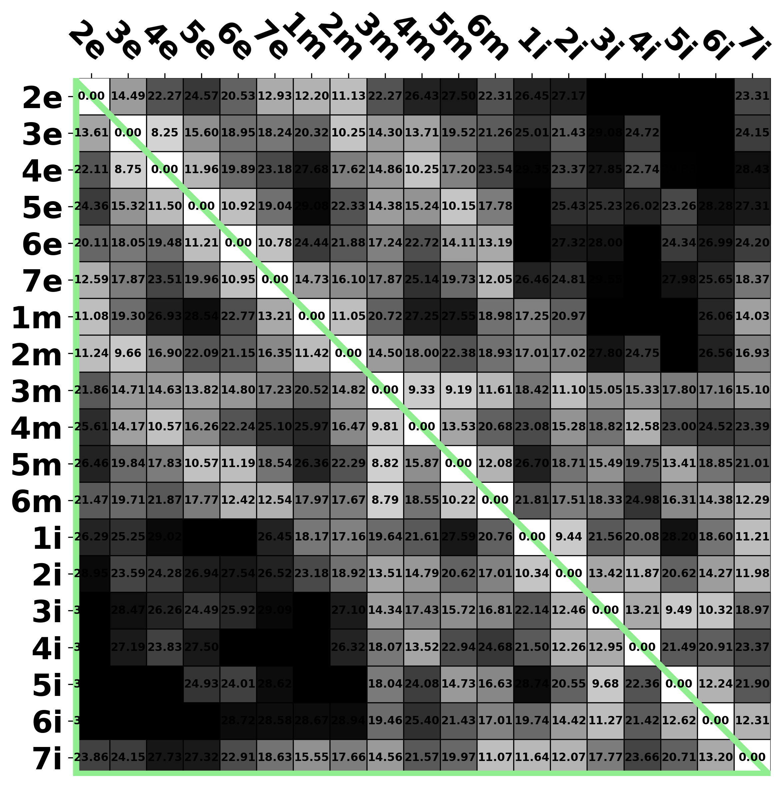
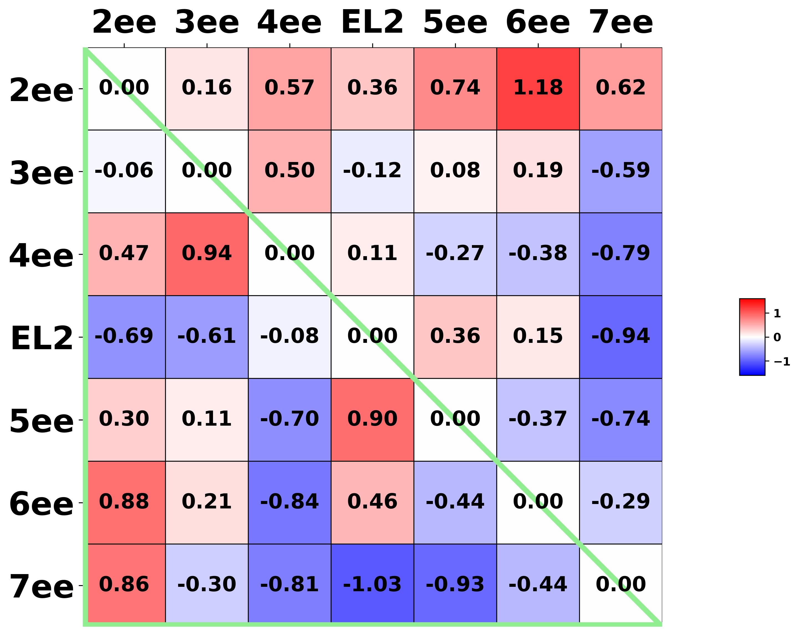

[Return to main menu](..//README.md)
 
# Raw data by structures (DRD3)
[Return to "DRD3"](acc_DRD3.md) 
[Return to "D2-like receptors"](acc_d2like.md) 
## Table of content
 - Distance 
   - [Binding site residues](#Binding-site-residues) 
   - [Sub-segments](#Sub-segments) 
   - [Extracellular-ends (EE)](#Extracellular-ends) 

### Binding site residues 
[Return to top](#top) 

<strong>Pairwise distance</strong>

 - [7CMU (active)](#Binding-site-residues_7cmu) 
 - [7CMV (active)](#Binding-site-residues_7cmv) 
 - [3PBL (inactive)](#Binding-site-residues_3pbl) 

<strong>Pairwise distance difference</strong>

 - [7CMU (active) - 3PBL (inactive)](#Binding-site-residues_diff_a.7cmu-i.3pbl) 
 - [7CMV (active) - 3PBL (inactive)](#Binding-site-residues_diff_a.7cmv-i.3pbl) 
 

#### Pairwise distance
 

### 7CMU (active) 

[Return to top](#top) 

[Return to "Binding site residues"](#Binding-site-residues) 

<table><tr>

</td>
</tr></table>
 
 

### 7CMV (active) 

[Return to top](#top) 

[Return to "Binding site residues"](#Binding-site-residues) 

<table><tr>

</td>
</tr></table>
 
 

### 3PBL (inactive) 

[Return to top](#top) 

[Return to "Binding site residues"](#Binding-site-residues) 

<table><tr>

</td>
</tr></table>
 
 
 

#### Pairwise distance difference
 

### 7CMU (active) - 3PBL (inactive) 

[Return to top](#top) 

[Return to "Binding site residues"](#Binding-site-residues) 

- [Raw](#Binding-site-residues_pdf_raw_diff_a.7cmu-i.3pbl) 
- Classified 
    - [Threshold = 0.0 (Å)](#Binding-site-residues_pdf_cutoff_0.0_diff_a.7cmu-i.3pbl) 
    - [Threshold = 0.2 (Å)](#Binding-site-residues_pdf_cutoff_0.2_diff_a.7cmu-i.3pbl) 
    - [Threshold = 0.4 (Å)](#Binding-site-residues_pdf_cutoff_0.4_diff_a.7cmu-i.3pbl) 
    - [Threshold = 0.6 (Å)](#Binding-site-residues_pdf_cutoff_0.6_diff_a.7cmu-i.3pbl) 
    - [Threshold = 0.8 (Å)](#Binding-site-residues_pdf_cutoff_0.8_diff_a.7cmu-i.3pbl) 
    - [Threshold = 1.0 (Å)](#Binding-site-residues_pdf_cutoff_1.0_diff_a.7cmu-i.3pbl) 
 
 
Raw 

[Return to "Binding site residues"](#Binding-site-residues) 

  
 

#### Binding site residues (active - inactive), distance threshold = 0.0 (Å) 

[Return to "Binding site residues"](#Binding-site-residues) 

<table><tr>

</td>
</tr></table>
 
 

#### Binding site residues (active - inactive), distance threshold = 0.2 (Å) 

[Return to "Binding site residues"](#Binding-site-residues) 

<table><tr>

</td>
</tr></table>
 
 

#### Binding site residues (active - inactive), distance threshold = 0.4 (Å) 

[Return to "Binding site residues"](#Binding-site-residues) 

<table><tr>

</td>
</tr></table>
 
 

#### Binding site residues (active - inactive), distance threshold = 0.6 (Å) 

[Return to "Binding site residues"](#Binding-site-residues) 

<table><tr>

</td>
</tr></table>
 
 

#### Binding site residues (active - inactive), distance threshold = 0.8 (Å) 

[Return to "Binding site residues"](#Binding-site-residues) 

<table><tr>

</td>
</tr></table>
 
 

#### Binding site residues (active - inactive), distance threshold = 1.0 (Å) 

[Return to "Binding site residues"](#Binding-site-residues) 

<table><tr>

</td>
</tr></table>
 
 
 

### 7CMV (active) - 3PBL (inactive) 

[Return to top](#top) 

[Return to "Binding site residues"](#Binding-site-residues) 

- [Raw](#Binding-site-residues_pdf_raw_diff_a.7cmv-i.3pbl) 
- Classified 
    - [Threshold = 0.0 (Å)](#Binding-site-residues_pdf_cutoff_0.0_diff_a.7cmv-i.3pbl) 
    - [Threshold = 0.2 (Å)](#Binding-site-residues_pdf_cutoff_0.2_diff_a.7cmv-i.3pbl) 
    - [Threshold = 0.4 (Å)](#Binding-site-residues_pdf_cutoff_0.4_diff_a.7cmv-i.3pbl) 
    - [Threshold = 0.6 (Å)](#Binding-site-residues_pdf_cutoff_0.6_diff_a.7cmv-i.3pbl) 
    - [Threshold = 0.8 (Å)](#Binding-site-residues_pdf_cutoff_0.8_diff_a.7cmv-i.3pbl) 
    - [Threshold = 1.0 (Å)](#Binding-site-residues_pdf_cutoff_1.0_diff_a.7cmv-i.3pbl) 
 
 
Raw 

[Return to "Binding site residues"](#Binding-site-residues) 

  
 

#### Binding site residues (active - inactive), distance threshold = 0.0 (Å) 

[Return to "Binding site residues"](#Binding-site-residues) 

<table><tr>

</td>
</tr></table>
 
 

#### Binding site residues (active - inactive), distance threshold = 0.2 (Å) 

[Return to "Binding site residues"](#Binding-site-residues) 

<table><tr>

</td>
</tr></table>
 
 

#### Binding site residues (active - inactive), distance threshold = 0.4 (Å) 

[Return to "Binding site residues"](#Binding-site-residues) 

<table><tr>

</td>
</tr></table>
 
 

#### Binding site residues (active - inactive), distance threshold = 0.6 (Å) 

[Return to "Binding site residues"](#Binding-site-residues) 

<table><tr>

</td>
</tr></table>
 
 

#### Binding site residues (active - inactive), distance threshold = 0.8 (Å) 

[Return to "Binding site residues"](#Binding-site-residues) 

<table><tr>

</td>
</tr></table>
 
 

#### Binding site residues (active - inactive), distance threshold = 1.0 (Å) 

[Return to "Binding site residues"](#Binding-site-residues) 

<table><tr>

</td>
</tr></table>
 
 
 
 

### Sub-segments 
[Return to top](#top) 

<strong>Pairwise distance</strong>

 - [7CMU (active)](#Sub-segments_7cmu) 
 - [7CMV (active)](#Sub-segments_7cmv) 
 - [3PBL (inactive)](#Sub-segments_3pbl) 

<strong>Pairwise distance difference</strong>

 - [7CMU (active) - 3PBL (inactive)](#Sub-segments_diff_a.7cmu-i.3pbl) 
 - [7CMV (active) - 3PBL (inactive)](#Sub-segments_diff_a.7cmv-i.3pbl) 
 

#### Pairwise distance
 

### 7CMU (active) 

[Return to top](#top) 

[Return to "Sub-segments"](#Sub-segments) 

<table><tr>

</td>
 
 

### 7CMV (active) 

[Return to top](#top) 

[Return to "Sub-segments"](#Sub-segments) 

<table><tr>

</td>
 
 

### 3PBL (inactive) 

[Return to top](#top) 

[Return to "Sub-segments"](#Sub-segments) 

<table><tr>

</td>
 
 
 

#### Pairwise distance difference
 

### 7CMU (active) - 3PBL (inactive) 

[Return to top](#top) 

[Return to "Sub-segments"](#Sub-segments) 

- [Raw](#Sub-segments_pdf_raw_diff_a.7cmu-i.3pbl) 
- Classified 
    - [Threshold = 0.0 (Å)](#Sub-segments_pdf_cutoff_0.0_diff_a.7cmu-i.3pbl) 
    - [Threshold = 0.2 (Å)](#Sub-segments_pdf_cutoff_0.2_diff_a.7cmu-i.3pbl) 
    - [Threshold = 0.4 (Å)](#Sub-segments_pdf_cutoff_0.4_diff_a.7cmu-i.3pbl) 
    - [Threshold = 0.6 (Å)](#Sub-segments_pdf_cutoff_0.6_diff_a.7cmu-i.3pbl) 
    - [Threshold = 0.8 (Å)](#Sub-segments_pdf_cutoff_0.8_diff_a.7cmu-i.3pbl) 
    - [Threshold = 1.0 (Å)](#Sub-segments_pdf_cutoff_1.0_diff_a.7cmu-i.3pbl) 
 
 
Raw 

[Return to "Sub-segments"](#Sub-segments) 

  
 

#### Sub-segments (active - inactive), distance threshold = 0.0 (Å) 

[Return to "Sub-segments"](#Sub-segments) 

<table><tr>

</td>
</tr></table>
 
 

#### Sub-segments (active - inactive), distance threshold = 0.2 (Å) 

[Return to "Sub-segments"](#Sub-segments) 

<table><tr>

</td>
</tr></table>
 
 

#### Sub-segments (active - inactive), distance threshold = 0.4 (Å) 

[Return to "Sub-segments"](#Sub-segments) 

<table><tr>

</td>
</tr></table>
 
 

#### Sub-segments (active - inactive), distance threshold = 0.6 (Å) 

[Return to "Sub-segments"](#Sub-segments) 

<table><tr>

</td>
</tr></table>
 
 

#### Sub-segments (active - inactive), distance threshold = 0.8 (Å) 

[Return to "Sub-segments"](#Sub-segments) 

<table><tr>

</td>
</tr></table>
 
 

#### Sub-segments (active - inactive), distance threshold = 1.0 (Å) 

[Return to "Sub-segments"](#Sub-segments) 

<table><tr>

</td>
</tr></table>
 
 
 

### 7CMV (active) - 3PBL (inactive) 

[Return to top](#top) 

[Return to "Sub-segments"](#Sub-segments) 

- [Raw](#Sub-segments_pdf_raw_diff_a.7cmv-i.3pbl) 
- Classified 
    - [Threshold = 0.0 (Å)](#Sub-segments_pdf_cutoff_0.0_diff_a.7cmv-i.3pbl) 
    - [Threshold = 0.2 (Å)](#Sub-segments_pdf_cutoff_0.2_diff_a.7cmv-i.3pbl) 
    - [Threshold = 0.4 (Å)](#Sub-segments_pdf_cutoff_0.4_diff_a.7cmv-i.3pbl) 
    - [Threshold = 0.6 (Å)](#Sub-segments_pdf_cutoff_0.6_diff_a.7cmv-i.3pbl) 
    - [Threshold = 0.8 (Å)](#Sub-segments_pdf_cutoff_0.8_diff_a.7cmv-i.3pbl) 
    - [Threshold = 1.0 (Å)](#Sub-segments_pdf_cutoff_1.0_diff_a.7cmv-i.3pbl) 
 
 
Raw 

[Return to "Sub-segments"](#Sub-segments) 

  
 

#### Sub-segments (active - inactive), distance threshold = 0.0 (Å) 

[Return to "Sub-segments"](#Sub-segments) 

<table><tr>

</td>
</tr></table>
 
 

#### Sub-segments (active - inactive), distance threshold = 0.2 (Å) 

[Return to "Sub-segments"](#Sub-segments) 

<table><tr>

</td>
</tr></table>
 
 

#### Sub-segments (active - inactive), distance threshold = 0.4 (Å) 

[Return to "Sub-segments"](#Sub-segments) 

<table><tr>

</td>
</tr></table>
 
 

#### Sub-segments (active - inactive), distance threshold = 0.6 (Å) 

[Return to "Sub-segments"](#Sub-segments) 

<table><tr>

</td>
</tr></table>
 
 

#### Sub-segments (active - inactive), distance threshold = 0.8 (Å) 

[Return to "Sub-segments"](#Sub-segments) 

<table><tr>

</td>
</tr></table>
 
 

#### Sub-segments (active - inactive), distance threshold = 1.0 (Å) 

[Return to "Sub-segments"](#Sub-segments) 

<table><tr>

</td>
</tr></table>
 
 
 
 

### Extracellular-ends 
[Return to top](#top) 

<strong>Pairwise distance</strong>

 - [7CMU (active)](#Extracellular-ends_7cmu) 
 - [7CMV (active)](#Extracellular-ends_7cmv) 
 - [3PBL (inactive)](#Extracellular-ends_3pbl) 

<strong>Pairwise distance difference</strong>

 - [7CMU (active) - 3PBL (inactive)](#Extracellular-ends_diff_a.7cmu-i.3pbl) 
 - [7CMV (active) - 3PBL (inactive)](#Extracellular-ends_diff_a.7cmv-i.3pbl) 
 

#### Pairwise distance
 

### 7CMU (active) 

[Return to top](#top) 

[Return to "Extracellular-ends"](#Extracellular-ends) 

<table><tr>

</td>
 
 

### 7CMV (active) 

[Return to top](#top) 

[Return to "Extracellular-ends"](#Extracellular-ends) 

<table><tr>

</td>
 
 

### 3PBL (inactive) 

[Return to top](#top) 

[Return to "Extracellular-ends"](#Extracellular-ends) 

<table><tr>

</td>
 
 
 

#### Pairwise distance difference
 

### 7CMU (active) - 3PBL (inactive) 

[Return to top](#top) 

[Return to "Extracellular-ends"](#Extracellular-ends) 

- [Raw](#Extracellular-ends_pdf_raw_diff_a.7cmu-i.3pbl) 
- Classified 
    - [Threshold = 0.0 (Å)](#Extracellular-ends_pdf_cutoff_0.0_diff_a.7cmu-i.3pbl) 
    - [Threshold = 0.2 (Å)](#Extracellular-ends_pdf_cutoff_0.2_diff_a.7cmu-i.3pbl) 
    - [Threshold = 0.4 (Å)](#Extracellular-ends_pdf_cutoff_0.4_diff_a.7cmu-i.3pbl) 
    - [Threshold = 0.6 (Å)](#Extracellular-ends_pdf_cutoff_0.6_diff_a.7cmu-i.3pbl) 
    - [Threshold = 0.8 (Å)](#Extracellular-ends_pdf_cutoff_0.8_diff_a.7cmu-i.3pbl) 
    - [Threshold = 1.0 (Å)](#Extracellular-ends_pdf_cutoff_1.0_diff_a.7cmu-i.3pbl) 
 
 
Raw 

[Return to "Extracellular-ends"](#Extracellular-ends) 

  
 

#### Extracellular-ends (active - inactive), distance threshold = 0.0 (Å) 

[Return to "Extracellular-ends"](#Extracellular-ends) 

<table><tr>

</td>
</tr></table>
 
 

#### Extracellular-ends (active - inactive), distance threshold = 0.2 (Å) 

[Return to "Extracellular-ends"](#Extracellular-ends) 

<table><tr>

</td>
</tr></table>
 
 

#### Extracellular-ends (active - inactive), distance threshold = 0.4 (Å) 

[Return to "Extracellular-ends"](#Extracellular-ends) 

<table><tr>

</td>
</tr></table>
 
 

#### Extracellular-ends (active - inactive), distance threshold = 0.6 (Å) 

[Return to "Extracellular-ends"](#Extracellular-ends) 

<table><tr>

</td>
</tr></table>
 
 

#### Extracellular-ends (active - inactive), distance threshold = 0.8 (Å) 

[Return to "Extracellular-ends"](#Extracellular-ends) 

<table><tr>

</td>
</tr></table>
 
 

#### Extracellular-ends (active - inactive), distance threshold = 1.0 (Å) 

[Return to "Extracellular-ends"](#Extracellular-ends) 

<table><tr>

</td>
</tr></table>
 
 
 

### 7CMV (active) - 3PBL (inactive) 

[Return to top](#top) 

[Return to "Extracellular-ends"](#Extracellular-ends) 

- [Raw](#Extracellular-ends_pdf_raw_diff_a.7cmv-i.3pbl) 
- Classified 
    - [Threshold = 0.0 (Å)](#Extracellular-ends_pdf_cutoff_0.0_diff_a.7cmv-i.3pbl) 
    - [Threshold = 0.2 (Å)](#Extracellular-ends_pdf_cutoff_0.2_diff_a.7cmv-i.3pbl) 
    - [Threshold = 0.4 (Å)](#Extracellular-ends_pdf_cutoff_0.4_diff_a.7cmv-i.3pbl) 
    - [Threshold = 0.6 (Å)](#Extracellular-ends_pdf_cutoff_0.6_diff_a.7cmv-i.3pbl) 
    - [Threshold = 0.8 (Å)](#Extracellular-ends_pdf_cutoff_0.8_diff_a.7cmv-i.3pbl) 
    - [Threshold = 1.0 (Å)](#Extracellular-ends_pdf_cutoff_1.0_diff_a.7cmv-i.3pbl) 
 
 
Raw 

[Return to "Extracellular-ends"](#Extracellular-ends) 

  
 

#### Extracellular-ends (active - inactive), distance threshold = 0.0 (Å) 

[Return to "Extracellular-ends"](#Extracellular-ends) 

<table><tr>

</td>
</tr></table>
 
 

#### Extracellular-ends (active - inactive), distance threshold = 0.2 (Å) 

[Return to "Extracellular-ends"](#Extracellular-ends) 

<table><tr>

</td>
</tr></table>
 
 

#### Extracellular-ends (active - inactive), distance threshold = 0.4 (Å) 

[Return to "Extracellular-ends"](#Extracellular-ends) 

<table><tr>

</td>
</tr></table>
 
 

#### Extracellular-ends (active - inactive), distance threshold = 0.6 (Å) 

[Return to "Extracellular-ends"](#Extracellular-ends) 

<table><tr>

</td>
</tr></table>
 
 

#### Extracellular-ends (active - inactive), distance threshold = 0.8 (Å) 

[Return to "Extracellular-ends"](#Extracellular-ends) 

<table><tr>

</td>
</tr></table>
 
 

#### Extracellular-ends (active - inactive), distance threshold = 1.0 (Å) 

[Return to "Extracellular-ends"](#Extracellular-ends) 

<table><tr>

</td>
</tr></table>
 
 
 
 

