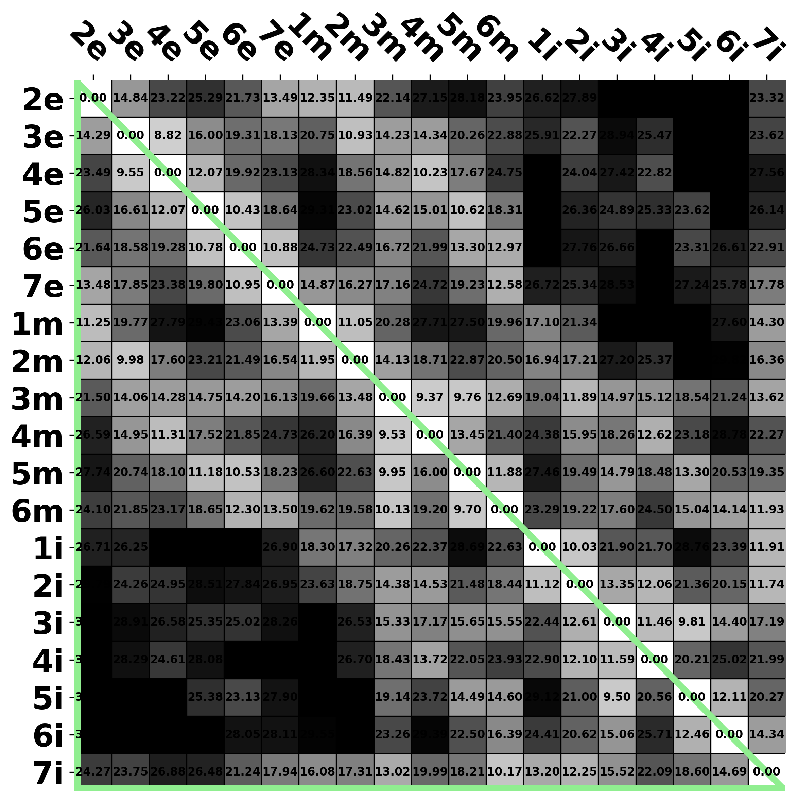
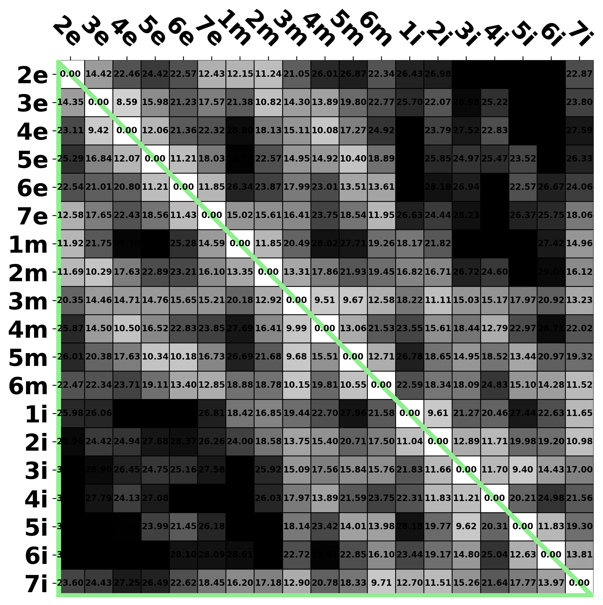
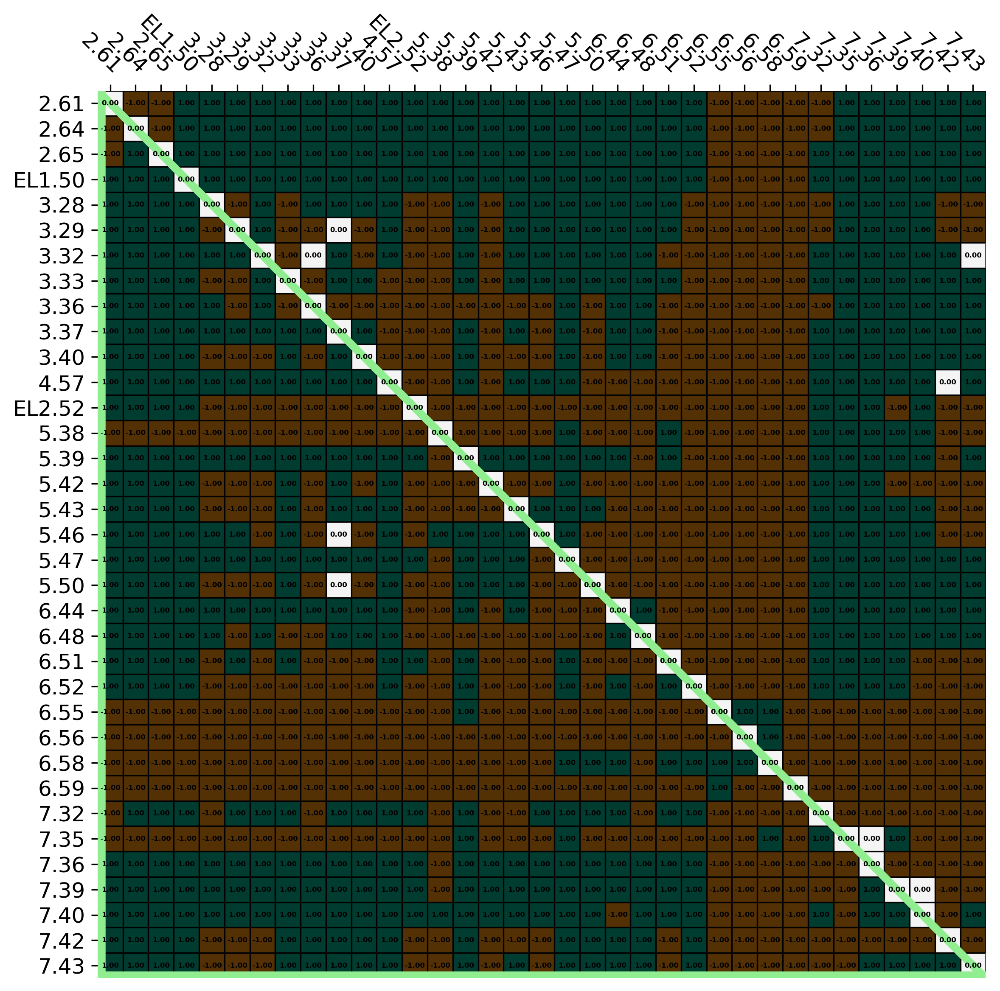
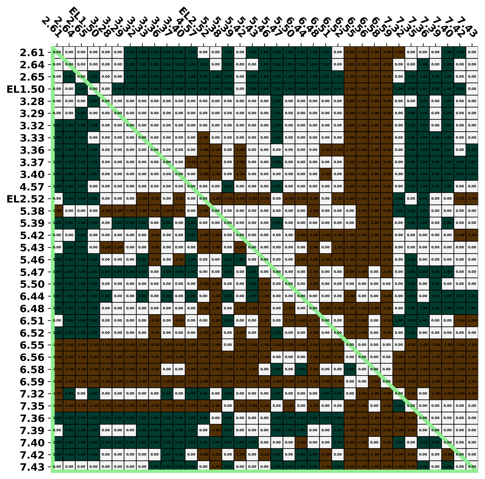

[Return to main menu](..//README.md)
 
# Raw data by structures
[Return to "D2-like receptors (active structures)"](d2like_active.md) 
[Return to "D2-like receptors"](d2like.md) 
## Table of content
 - Distance 
   - [Binding site residues](#Binding-site-residues) 
   - [Sub-segments](#Sub-segments) 

### Binding site residues 
[Return to top](#top) 

<strong>Pairwise distance</strong>

 - [7CMU (D3R active)](#Binding-site-residues_7cmu) 
 - [7CMV (D3R active)](#Binding-site-residues_7cmv) 
 - [7JVR (D2R active)](#Binding-site-residues_7jvr) 

<strong>Pairwise distance difference</strong>

 - [7CMU (D3R) - 7JVR (D2R)](#Binding-site-residues_diff_7CMU-7JVR) 
 - [7CMV (D3R) - 7JVR (D2R)](#Binding-site-residues_diff_7CMV-7JVR) 
 

#### Pairwise distance
 

### 7CMU (D3R active) 

[Return to top](#top) 

[Return to "Binding site residues"](#Binding-site-residues) 

<table><tr>

</td>
</tr></table>
 
 

### 7CMV (D3R active) 

[Return to top](#top) 

[Return to "Binding site residues"](#Binding-site-residues) 

<table><tr>

</td>
</tr></table>
 
 

### 7JVR (D2R active) 

[Return to top](#top) 

[Return to "Binding site residues"](#Binding-site-residues) 

<table><tr>

</td>
</tr></table>
 
 
 

#### Pairwise distance difference
 

### 7CMU (D3R) - 7JVR (D2R) 

[Return to top](#top) 

[Return to "Binding site residues"](#Binding-site-residues) 

- [Raw](#Binding-site-residues_pdf_raw_diff_7CMU-7JVR) 
- Classified 
    - [Threshold = 0.0 (Å)](#Binding-site-residues_pdf_cutoff_0.0_diff_7CMU-7JVR) 
    - [Threshold = 0.2 (Å)](#Binding-site-residues_pdf_cutoff_0.2_diff_7CMU-7JVR) 
    - [Threshold = 0.4 (Å)](#Binding-site-residues_pdf_cutoff_0.4_diff_7CMU-7JVR) 
    - [Threshold = 0.6 (Å)](#Binding-site-residues_pdf_cutoff_0.6_diff_7CMU-7JVR) 
    - [Threshold = 0.8 (Å)](#Binding-site-residues_pdf_cutoff_0.8_diff_7CMU-7JVR) 
    - [Threshold = 1.0 (Å)](#Binding-site-residues_pdf_cutoff_1.0_diff_7CMU-7JVR) 
 
 
Raw 

[Return to "Binding site residues"](#Binding-site-residues) 

</td>
  
 

#### Binding site residues (D3R - D2R), distance threshold = 0.0 (Å) 

[Return to "Binding site residues"](#Binding-site-residues) 

<table><tr>

</td>
</tr></table>
 
 

#### Binding site residues (D3R - D2R), distance threshold = 0.2 (Å) 

[Return to "Binding site residues"](#Binding-site-residues) 

<table><tr>

</td>
</tr></table>
 
 

#### Binding site residues (D3R - D2R), distance threshold = 0.4 (Å) 

[Return to "Binding site residues"](#Binding-site-residues) 

<table><tr>

</td>
</tr></table>
 
 

#### Binding site residues (D3R - D2R), distance threshold = 0.6 (Å) 

[Return to "Binding site residues"](#Binding-site-residues) 

<table><tr>

</td>
</tr></table>
 
 

#### Binding site residues (D3R - D2R), distance threshold = 0.8 (Å) 

[Return to "Binding site residues"](#Binding-site-residues) 

<table><tr>

</td>
</tr></table>
 
 

#### Binding site residues (D3R - D2R), distance threshold = 1.0 (Å) 

[Return to "Binding site residues"](#Binding-site-residues) 

<table><tr>

</td>
</tr></table>
 
 
 

### 7CMV (D3R) - 7JVR (D2R) 

[Return to top](#top) 

[Return to "Binding site residues"](#Binding-site-residues) 

- [Raw](#Binding-site-residues_pdf_raw_diff_7CMV-7JVR) 
- Classified 
    - [Threshold = 0.0 (Å)](#Binding-site-residues_pdf_cutoff_0.0_diff_7CMV-7JVR) 
    - [Threshold = 0.2 (Å)](#Binding-site-residues_pdf_cutoff_0.2_diff_7CMV-7JVR) 
    - [Threshold = 0.4 (Å)](#Binding-site-residues_pdf_cutoff_0.4_diff_7CMV-7JVR) 
    - [Threshold = 0.6 (Å)](#Binding-site-residues_pdf_cutoff_0.6_diff_7CMV-7JVR) 
    - [Threshold = 0.8 (Å)](#Binding-site-residues_pdf_cutoff_0.8_diff_7CMV-7JVR) 
    - [Threshold = 1.0 (Å)](#Binding-site-residues_pdf_cutoff_1.0_diff_7CMV-7JVR) 
 
 
Raw 

[Return to "Binding site residues"](#Binding-site-residues) 

</td>
  
 

#### Binding site residues (D3R - D2R), distance threshold = 0.0 (Å) 

[Return to "Binding site residues"](#Binding-site-residues) 

<table><tr>

</td>
</tr></table>
 
 

#### Binding site residues (D3R - D2R), distance threshold = 0.2 (Å) 

[Return to "Binding site residues"](#Binding-site-residues) 

<table><tr>

</td>
</tr></table>
 
 

#### Binding site residues (D3R - D2R), distance threshold = 0.4 (Å) 

[Return to "Binding site residues"](#Binding-site-residues) 

<table><tr>

</td>
</tr></table>
 
 

#### Binding site residues (D3R - D2R), distance threshold = 0.6 (Å) 

[Return to "Binding site residues"](#Binding-site-residues) 

<table><tr>

</td>
</tr></table>
 
 

#### Binding site residues (D3R - D2R), distance threshold = 0.8 (Å) 

[Return to "Binding site residues"](#Binding-site-residues) 

<table><tr>

</td>
</tr></table>
 
 

#### Binding site residues (D3R - D2R), distance threshold = 1.0 (Å) 

[Return to "Binding site residues"](#Binding-site-residues) 

<table><tr>

</td>
</tr></table>
 
 
 
 

### Sub-segments 
[Return to top](#top) 

<strong>Pairwise distance</strong>

 - [7CMU (D3R active)](#Sub-segments_7cmu) 
 - [7CMV (D3R active)](#Sub-segments_7cmv) 
 - [7JVR (D2R active)](#Sub-segments_7jvr) 

<strong>Pairwise distance difference</strong>

 - [7CMU (D3R) - 7JVR (D2R)](#Sub-segments_diff_7CMU-7JVR) 
 - [7CMV (D3R) - 7JVR (D2R)](#Sub-segments_diff_7CMV-7JVR) 
 

#### Pairwise distance
 

### 7CMU (D3R active) 

[Return to top](#top) 

[Return to "Sub-segments"](#Sub-segments) 

<table><tr>

</td>
</tr></table>
 
 

### 7CMV (D3R active) 

[Return to top](#top) 

[Return to "Sub-segments"](#Sub-segments) 

<table><tr>

</td>
</tr></table>
 
 

### 7JVR (D2R active) 

[Return to top](#top) 

[Return to "Sub-segments"](#Sub-segments) 

<table><tr>

</td>
</tr></table>
 
 
 

#### Pairwise distance difference
 

### 7CMU (D3R) - 7JVR (D2R) 

[Return to top](#top) 

[Return to "Sub-segments"](#Sub-segments) 

- [Raw](#Sub-segments_pdf_raw_diff_7CMU-7JVR) 
- Classified 
    - [Threshold = 0.0 (Å)](#Sub-segments_pdf_cutoff_0.0_diff_7CMU-7JVR) 
    - [Threshold = 0.2 (Å)](#Sub-segments_pdf_cutoff_0.2_diff_7CMU-7JVR) 
    - [Threshold = 0.4 (Å)](#Sub-segments_pdf_cutoff_0.4_diff_7CMU-7JVR) 
    - [Threshold = 0.6 (Å)](#Sub-segments_pdf_cutoff_0.6_diff_7CMU-7JVR) 
    - [Threshold = 0.8 (Å)](#Sub-segments_pdf_cutoff_0.8_diff_7CMU-7JVR) 
    - [Threshold = 1.0 (Å)](#Sub-segments_pdf_cutoff_1.0_diff_7CMU-7JVR) 
 
 
Raw 

[Return to "Sub-segments"](#Sub-segments) 

</td>
  
 

#### Sub-segments (D3R - D2R), distance threshold = 0.0 (Å) 

[Return to "Sub-segments"](#Sub-segments) 

<table><tr>

</td>
</tr></table>
 
 

#### Sub-segments (D3R - D2R), distance threshold = 0.2 (Å) 

[Return to "Sub-segments"](#Sub-segments) 

<table><tr>

</td>
</tr></table>
 
 

#### Sub-segments (D3R - D2R), distance threshold = 0.4 (Å) 

[Return to "Sub-segments"](#Sub-segments) 

<table><tr>

</td>
</tr></table>
 
 

#### Sub-segments (D3R - D2R), distance threshold = 0.6 (Å) 

[Return to "Sub-segments"](#Sub-segments) 

<table><tr>

</td>
</tr></table>
 
 

#### Sub-segments (D3R - D2R), distance threshold = 0.8 (Å) 

[Return to "Sub-segments"](#Sub-segments) 

<table><tr>

</td>
</tr></table>
 
 

#### Sub-segments (D3R - D2R), distance threshold = 1.0 (Å) 

[Return to "Sub-segments"](#Sub-segments) 

<table><tr>

</td>
</tr></table>
 
 
 

### 7CMV (D3R) - 7JVR (D2R) 

[Return to top](#top) 

[Return to "Sub-segments"](#Sub-segments) 

- [Raw](#Sub-segments_pdf_raw_diff_7CMV-7JVR) 
- Classified 
    - [Threshold = 0.0 (Å)](#Sub-segments_pdf_cutoff_0.0_diff_7CMV-7JVR) 
    - [Threshold = 0.2 (Å)](#Sub-segments_pdf_cutoff_0.2_diff_7CMV-7JVR) 
    - [Threshold = 0.4 (Å)](#Sub-segments_pdf_cutoff_0.4_diff_7CMV-7JVR) 
    - [Threshold = 0.6 (Å)](#Sub-segments_pdf_cutoff_0.6_diff_7CMV-7JVR) 
    - [Threshold = 0.8 (Å)](#Sub-segments_pdf_cutoff_0.8_diff_7CMV-7JVR) 
    - [Threshold = 1.0 (Å)](#Sub-segments_pdf_cutoff_1.0_diff_7CMV-7JVR) 
 
 
Raw 

[Return to "Sub-segments"](#Sub-segments) 

</td>
  
 

#### Sub-segments (D3R - D2R), distance threshold = 0.0 (Å) 

[Return to "Sub-segments"](#Sub-segments) 

<table><tr>

</td>
</tr></table>
 
 

#### Sub-segments (D3R - D2R), distance threshold = 0.2 (Å) 

[Return to "Sub-segments"](#Sub-segments) 

<table><tr>

</td>
</tr></table>
 
 

#### Sub-segments (D3R - D2R), distance threshold = 0.4 (Å) 

[Return to "Sub-segments"](#Sub-segments) 

<table><tr>

</td>
</tr></table>
 
 

#### Sub-segments (D3R - D2R), distance threshold = 0.6 (Å) 

[Return to "Sub-segments"](#Sub-segments) 

<table><tr>

</td>
</tr></table>
 
 

#### Sub-segments (D3R - D2R), distance threshold = 0.8 (Å) 

[Return to "Sub-segments"](#Sub-segments) 

<table><tr>

</td>
</tr></table>
 
 

#### Sub-segments (D3R - D2R), distance threshold = 1.0 (Å) 

[Return to "Sub-segments"](#Sub-segments) 

<table><tr>

</td>
</tr></table>
 
 
 
 

