[Return to main menu](../../..//README.md)

# DRD3 structures
[Return to "DRD3"](acc_subtype_heatmap.md) 
[Return to "dopaminergic receptors"](../acc_subfamily_heatmap.md) 
[Return to "(catecholaminergic receptors)"](../../catecholaminergic/acc_subfamily_heatmap.md) 
[Return to "aminergic receptors"](../../acc_family_heatmap.md) 
## Table of content
 - Distance 
   - [Binding site residues](#Binding-site-residues) 
   - [Sub-segments](#Sub-segments) 
   - [Extracellular-ends (EE)](#Extracellular-ends) 
 - EE area 
   - triangle ([CA](#triangle_ca), [sidechain](#triangle_sc) | core-facing: [CA](#triangle_fi_ca), [sidechain](#triangle_fi_sc)) 
   - quadrilateral ([CA](#quadrilateral_ca), [sidechain](#quadrilateral_sc) | core-facing: [CA](#quadrilateral_fi_ca), [sidechain](#quadrilateral_fi_sc)) 
   - pentagon ([CA](#pentagon_ca), [sidechain](#pentagon_sc) | core-facing: [CA](#pentagon_fi_ca), [sidechain](#pentagon_fi_sc)) 
   - hexagon ([CA](#hexagon_ca), [sidechain](#hexagon_sc) | core-facing: [CA](#hexagon_fi_ca), [sidechain](#hexagon_fi_sc)) 
     

### Binding site residues 
[Return to top](#top) 

<strong>Pairwise distance</strong>

* [7CMU (active)](#bsi_matrixBinding-site-residues_7CMU_active)
* [7CMV (active)](#bsi_matrixBinding-site-residues_7CMV_active)
* [3PBL (inactive)](#bsi_matrixBinding-site-residues_3PBL_inactive)

<strong>Pairwise distance difference</strong>

* [7CMU (active) - 3PBL (inactive)](#bsi_matrixBinding-site-residues7cmu3pbl)
* [7CMV (active) - 3PBL (inactive)](#bsi_matrixBinding-site-residues7cmv3pbl)
 
 
 

#### Pairwise distance

###### 7CMU (active)
[Return to "Binding site residues"](#Binding-site-residues) 
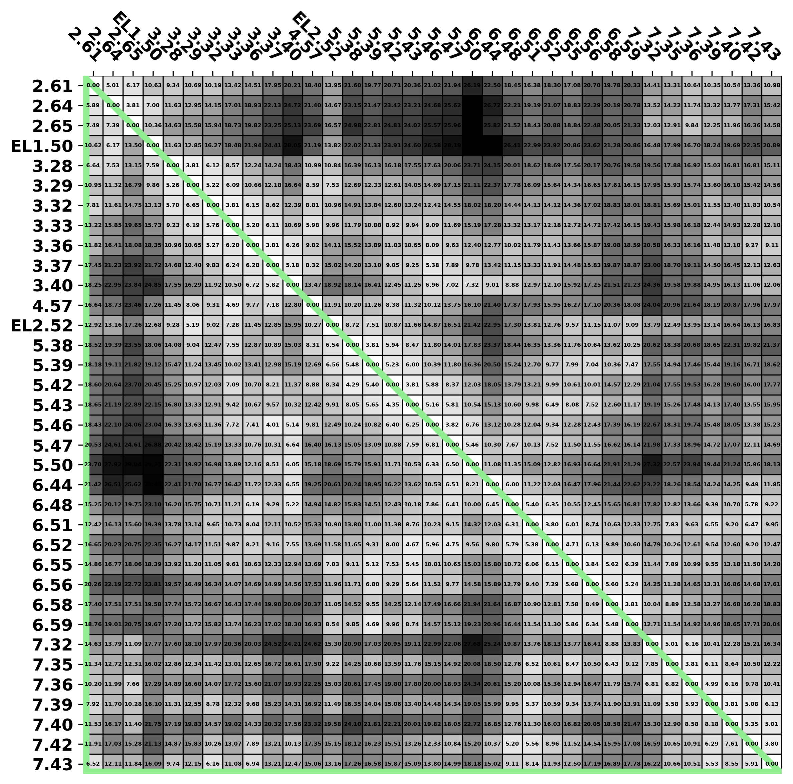
</td>
  

###### 7CMV (active)
[Return to "Binding site residues"](#Binding-site-residues) 

</td>
  

###### 3PBL (inactive)
[Return to "Binding site residues"](#Binding-site-residues) 

</td>
  
 
 

#### Pairwise distance difference

##### 7CMU (active) - 3PBL (inactive)
[Return to "Binding site residues"](#Binding-site-residues) 
- [Raw](#rawbsi_matrixBinding-site-residues7cmu3pbl) 
- Classified 
    - [Threshold = 0.0 (Å)](#0_0bsi_matrixBinding-site-residues7cmu3pbl) 
    - [Threshold = 0.2 (Å)](#0_2bsi_matrixBinding-site-residues7cmu3pbl) 
    - [Threshold = 0.4 (Å)](#0_4bsi_matrixBinding-site-residues7cmu3pbl) 
    - [Threshold = 0.6 (Å)](#0_6bsi_matrixBinding-site-residues7cmu3pbl) 
    - [Threshold = 0.8 (Å)](#0_8bsi_matrixBinding-site-residues7cmu3pbl) 
    - [Threshold = 1.0 (Å)](#1_0bsi_matrixBinding-site-residues7cmu3pbl) 
 

Raw 
[Return to "7CMU (active) - 3PBL (inactive) pairwise distance difference"](#bsi_matrixBinding-site-residues7cmu3pbl) 

  

Threshold = 0.0 (Å) 
[Return to "7CMU (active) - 3PBL (inactive) pairwise distance difference"](#bsi_matrixBinding-site-residues7cmu3pbl) 

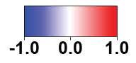</td>
 

Threshold = 0.2 (Å) 
[Return to "7CMU (active) - 3PBL (inactive) pairwise distance difference"](#bsi_matrixBinding-site-residues7cmu3pbl) 

</td>
 

Threshold = 0.4 (Å) 
[Return to "7CMU (active) - 3PBL (inactive) pairwise distance difference"](#bsi_matrixBinding-site-residues7cmu3pbl) 
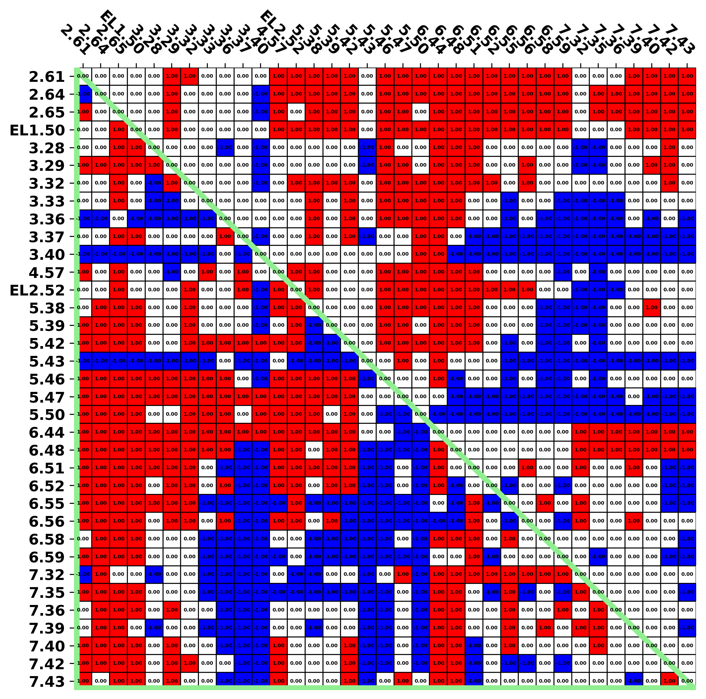
</td>
 

Threshold = 0.6 (Å) 
[Return to "7CMU (active) - 3PBL (inactive) pairwise distance difference"](#bsi_matrixBinding-site-residues7cmu3pbl) 

</td>
 

Threshold = 0.8 (Å) 
[Return to "7CMU (active) - 3PBL (inactive) pairwise distance difference"](#bsi_matrixBinding-site-residues7cmu3pbl) 

</td>
 

Threshold = 1.0 (Å) 
[Return to "7CMU (active) - 3PBL (inactive) pairwise distance difference"](#bsi_matrixBinding-site-residues7cmu3pbl) 

</td>
 

##### 7CMV (active) - 3PBL (inactive)
[Return to "Binding site residues"](#Binding-site-residues) 
- [Raw](#rawbsi_matrixBinding-site-residues7cmv3pbl) 
- Classified 
    - [Threshold = 0.0 (Å)](#0_0bsi_matrixBinding-site-residues7cmv3pbl) 
    - [Threshold = 0.2 (Å)](#0_2bsi_matrixBinding-site-residues7cmv3pbl) 
    - [Threshold = 0.4 (Å)](#0_4bsi_matrixBinding-site-residues7cmv3pbl) 
    - [Threshold = 0.6 (Å)](#0_6bsi_matrixBinding-site-residues7cmv3pbl) 
    - [Threshold = 0.8 (Å)](#0_8bsi_matrixBinding-site-residues7cmv3pbl) 
    - [Threshold = 1.0 (Å)](#1_0bsi_matrixBinding-site-residues7cmv3pbl) 
 

Raw 
[Return to "7CMV (active) - 3PBL (inactive) pairwise distance difference"](#bsi_matrixBinding-site-residues7cmv3pbl) 

  

Threshold = 0.0 (Å) 
[Return to "7CMV (active) - 3PBL (inactive) pairwise distance difference"](#bsi_matrixBinding-site-residues7cmv3pbl) 

</td>
 

Threshold = 0.2 (Å) 
[Return to "7CMV (active) - 3PBL (inactive) pairwise distance difference"](#bsi_matrixBinding-site-residues7cmv3pbl) 
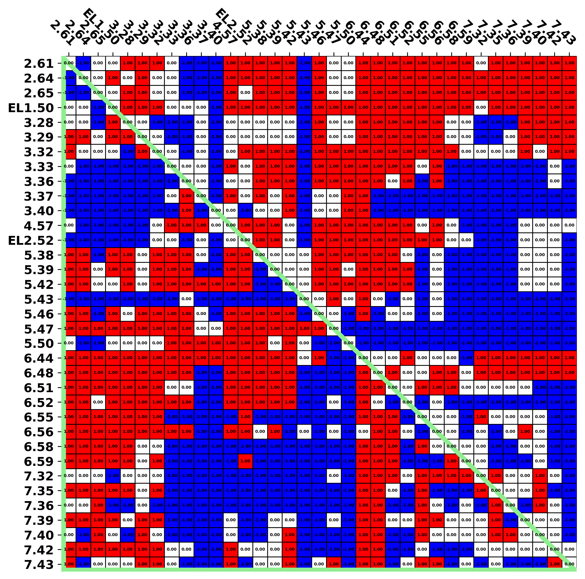
</td>
 

Threshold = 0.4 (Å) 
[Return to "7CMV (active) - 3PBL (inactive) pairwise distance difference"](#bsi_matrixBinding-site-residues7cmv3pbl) 

</td>
 

Threshold = 0.6 (Å) 
[Return to "7CMV (active) - 3PBL (inactive) pairwise distance difference"](#bsi_matrixBinding-site-residues7cmv3pbl) 

</td>
 

Threshold = 0.8 (Å) 
[Return to "7CMV (active) - 3PBL (inactive) pairwise distance difference"](#bsi_matrixBinding-site-residues7cmv3pbl) 
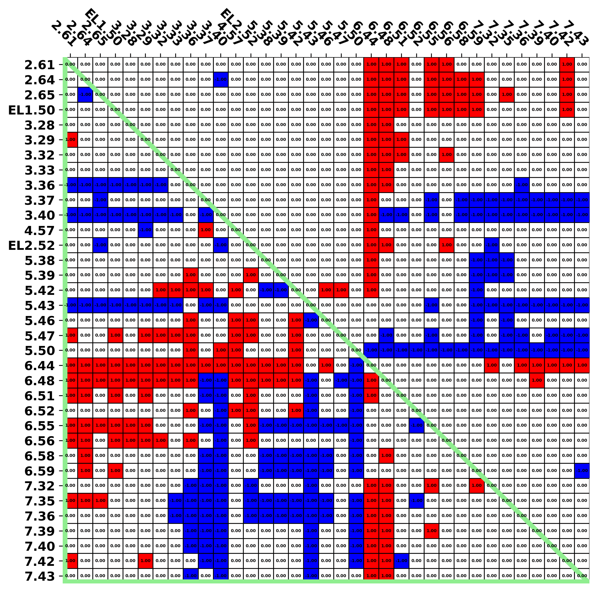
</td>
 

Threshold = 1.0 (Å) 
[Return to "7CMV (active) - 3PBL (inactive) pairwise distance difference"](#bsi_matrixBinding-site-residues7cmv3pbl) 
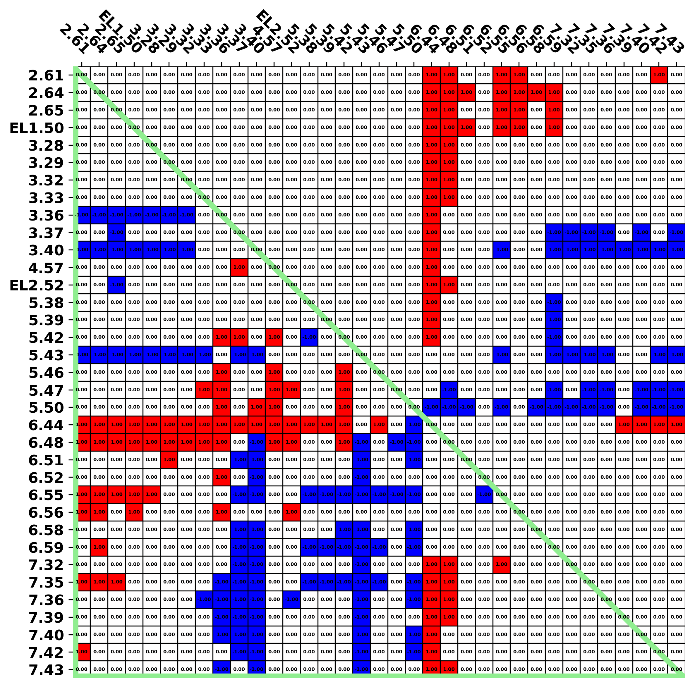
</td>
 
 
 

### Sub-segments 
[Return to top](#top) 

<strong>Pairwise distance</strong>

* [7CMU (active)](#pia_distmatSub-segments_7CMU_active)
* [7CMV (active)](#pia_distmatSub-segments_7CMV_active)
* [3PBL (inactive)](#pia_distmatSub-segments_3PBL_inactive)

<strong>Pairwise distance difference</strong>

* [7CMU (active) - 3PBL (inactive)](#pia_distmatSub-segments7cmu3pbl)
* [7CMV (active) - 3PBL (inactive)](#pia_distmatSub-segments7cmv3pbl)
 
 
 

#### Pairwise distance

###### 7CMU (active)
[Return to "Sub-segments"](#Sub-segments) 

</td>
  

###### 7CMV (active)
[Return to "Sub-segments"](#Sub-segments) 
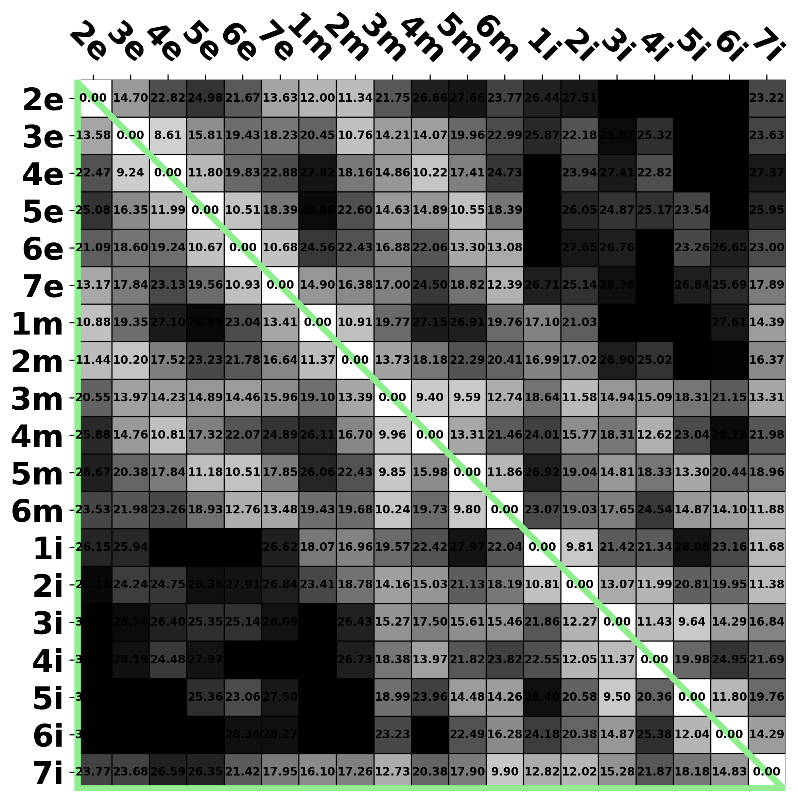
</td>
  

###### 3PBL (inactive)
[Return to "Sub-segments"](#Sub-segments) 

</td>
  
 
 

#### Pairwise distance difference

##### 7CMU (active) - 3PBL (inactive)
[Return to "Sub-segments"](#Sub-segments) 
- [Raw](#rawpia_distmatSub-segments7cmu3pbl) 
- Classified 
    - [Threshold = 0.0 (Å)](#0_0pia_distmatSub-segments7cmu3pbl) 
    - [Threshold = 0.2 (Å)](#0_2pia_distmatSub-segments7cmu3pbl) 
    - [Threshold = 0.4 (Å)](#0_4pia_distmatSub-segments7cmu3pbl) 
    - [Threshold = 0.6 (Å)](#0_6pia_distmatSub-segments7cmu3pbl) 
    - [Threshold = 0.8 (Å)](#0_8pia_distmatSub-segments7cmu3pbl) 
    - [Threshold = 1.0 (Å)](#1_0pia_distmatSub-segments7cmu3pbl) 
 

Raw 
[Return to "7CMU (active) - 3PBL (inactive) pairwise distance difference"](#pia_distmatSub-segments7cmu3pbl) 
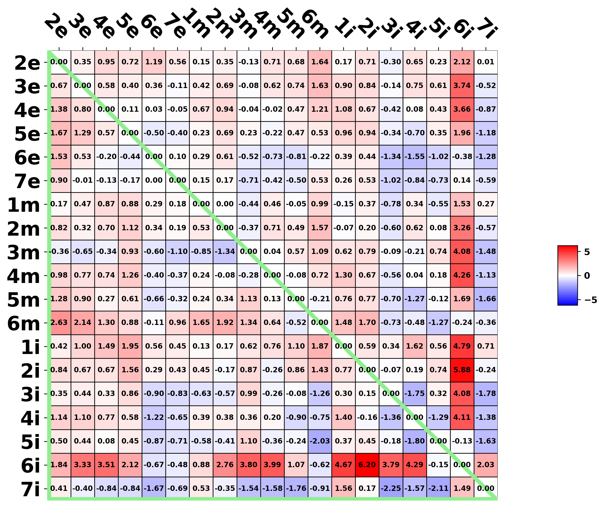
  

Threshold = 0.0 (Å) 
[Return to "7CMU (active) - 3PBL (inactive) pairwise distance difference"](#pia_distmatSub-segments7cmu3pbl) 

</td>
 

Threshold = 0.2 (Å) 
[Return to "7CMU (active) - 3PBL (inactive) pairwise distance difference"](#pia_distmatSub-segments7cmu3pbl) 

</td>
 

Threshold = 0.4 (Å) 
[Return to "7CMU (active) - 3PBL (inactive) pairwise distance difference"](#pia_distmatSub-segments7cmu3pbl) 
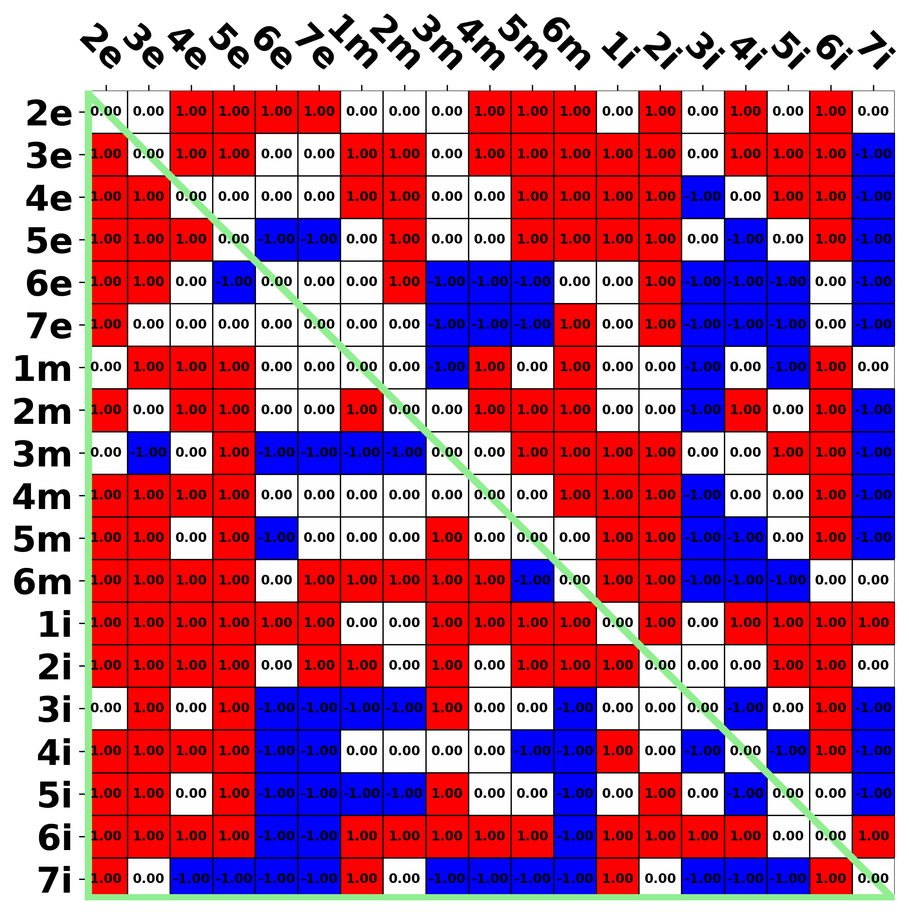
</td>
 

Threshold = 0.6 (Å) 
[Return to "7CMU (active) - 3PBL (inactive) pairwise distance difference"](#pia_distmatSub-segments7cmu3pbl) 

</td>
 

Threshold = 0.8 (Å) 
[Return to "7CMU (active) - 3PBL (inactive) pairwise distance difference"](#pia_distmatSub-segments7cmu3pbl) 
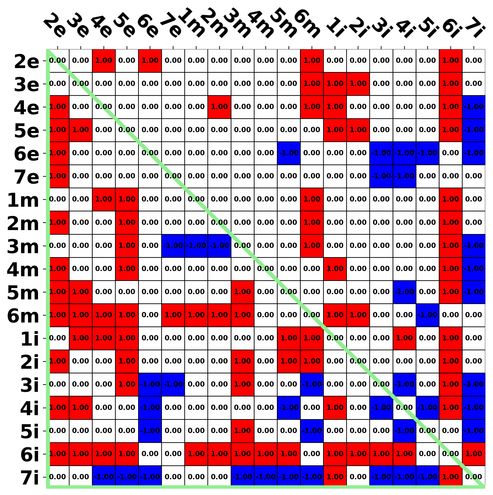
</td>
 

Threshold = 1.0 (Å) 
[Return to "7CMU (active) - 3PBL (inactive) pairwise distance difference"](#pia_distmatSub-segments7cmu3pbl) 

</td>
 

##### 7CMV (active) - 3PBL (inactive)
[Return to "Sub-segments"](#Sub-segments) 
- [Raw](#rawpia_distmatSub-segments7cmv3pbl) 
- Classified 
    - [Threshold = 0.0 (Å)](#0_0pia_distmatSub-segments7cmv3pbl) 
    - [Threshold = 0.2 (Å)](#0_2pia_distmatSub-segments7cmv3pbl) 
    - [Threshold = 0.4 (Å)](#0_4pia_distmatSub-segments7cmv3pbl) 
    - [Threshold = 0.6 (Å)](#0_6pia_distmatSub-segments7cmv3pbl) 
    - [Threshold = 0.8 (Å)](#0_8pia_distmatSub-segments7cmv3pbl) 
    - [Threshold = 1.0 (Å)](#1_0pia_distmatSub-segments7cmv3pbl) 
 

Raw 
[Return to "7CMV (active) - 3PBL (inactive) pairwise distance difference"](#pia_distmatSub-segments7cmv3pbl) 

  

Threshold = 0.0 (Å) 
[Return to "7CMV (active) - 3PBL (inactive) pairwise distance difference"](#pia_distmatSub-segments7cmv3pbl) 
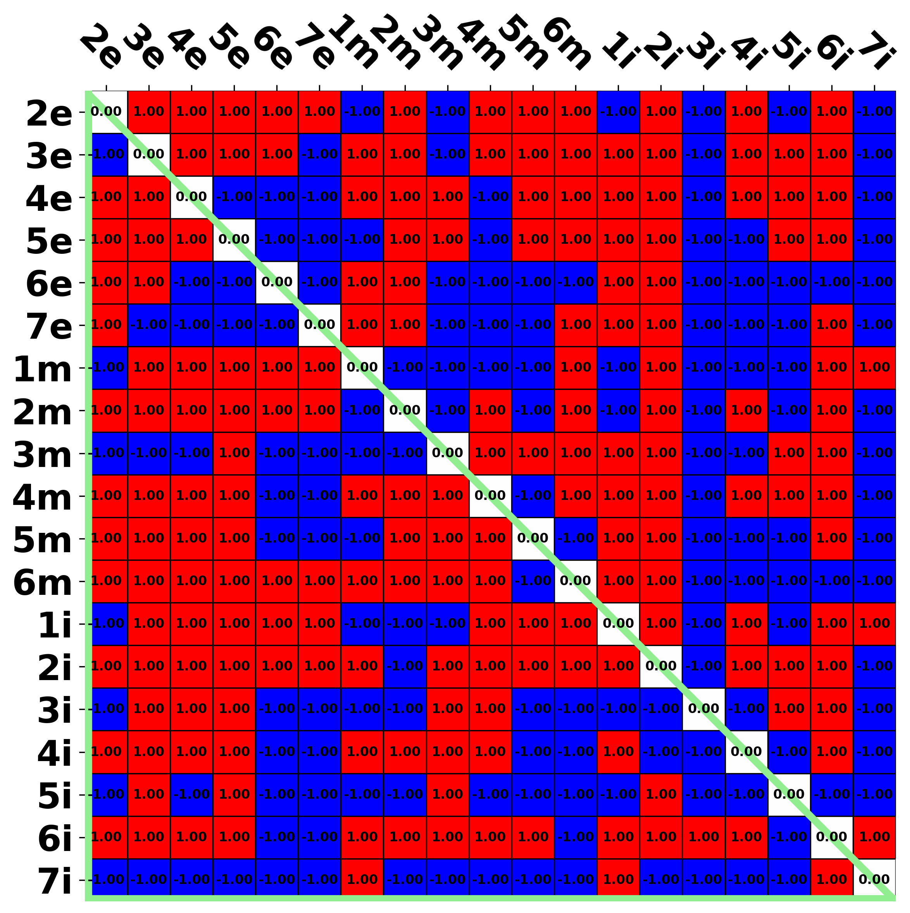
</td>
 

Threshold = 0.2 (Å) 
[Return to "7CMV (active) - 3PBL (inactive) pairwise distance difference"](#pia_distmatSub-segments7cmv3pbl) 

</td>
 

Threshold = 0.4 (Å) 
[Return to "7CMV (active) - 3PBL (inactive) pairwise distance difference"](#pia_distmatSub-segments7cmv3pbl) 

</td>
 

Threshold = 0.6 (Å) 
[Return to "7CMV (active) - 3PBL (inactive) pairwise distance difference"](#pia_distmatSub-segments7cmv3pbl) 

</td>
 

Threshold = 0.8 (Å) 
[Return to "7CMV (active) - 3PBL (inactive) pairwise distance difference"](#pia_distmatSub-segments7cmv3pbl) 

</td>
 

Threshold = 1.0 (Å) 
[Return to "7CMV (active) - 3PBL (inactive) pairwise distance difference"](#pia_distmatSub-segments7cmv3pbl) 
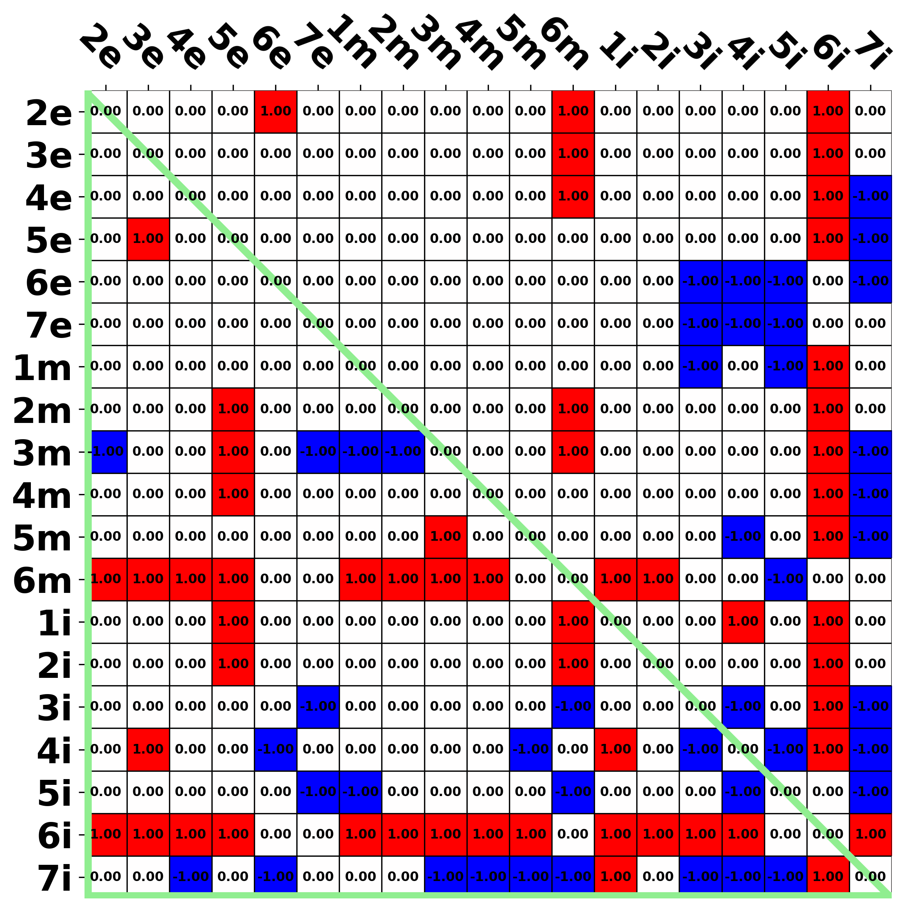
</td>
 
 
 

### Extracellular-ends 
[Return to top](#top) 

<strong>Pairwise distance</strong>

* [7CMU (active)](#end_distmatExtracellular-ends_7CMU_active)
* [7CMV (active)](#end_distmatExtracellular-ends_7CMV_active)
* [3PBL (inactive)](#end_distmatExtracellular-ends_3PBL_inactive)

<strong>Pairwise distance difference</strong>

* [7CMU (active) - 3PBL (inactive)](#end_distmatExtracellular-ends7cmu3pbl)
* [7CMV (active) - 3PBL (inactive)](#end_distmatExtracellular-ends7cmv3pbl)
 
 
 

#### Pairwise distance

###### 7CMU (active)
[Return to "Extracellular-ends"](#Extracellular-ends) 

</td>
  

###### 7CMV (active)
[Return to "Extracellular-ends"](#Extracellular-ends) 
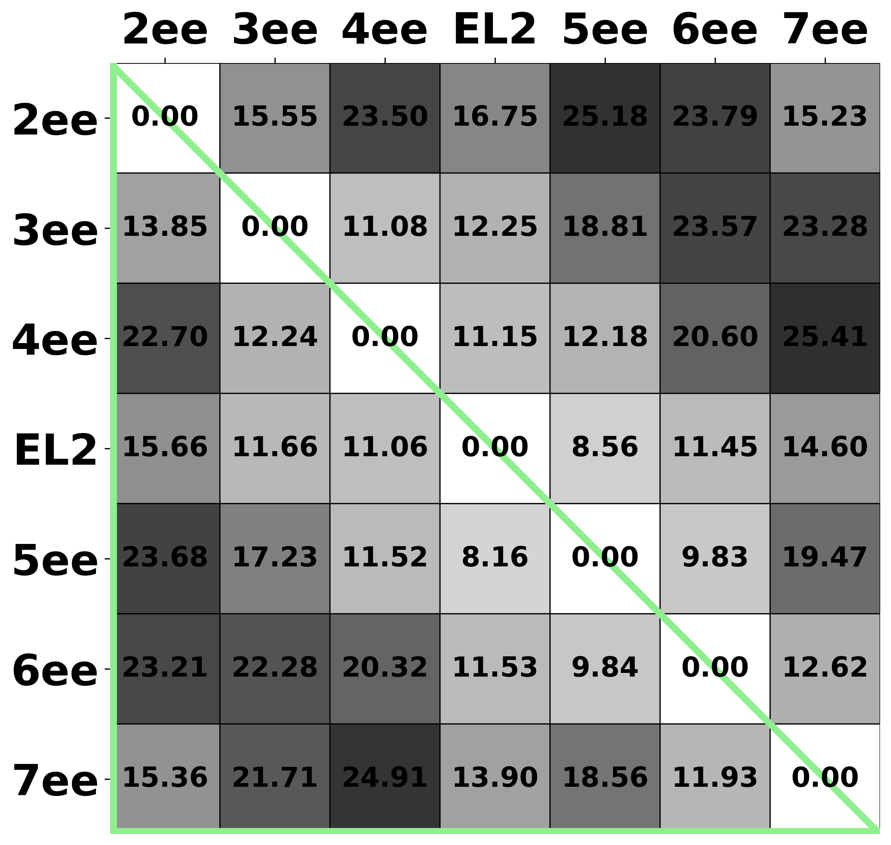
</td>
  

###### 3PBL (inactive)
[Return to "Extracellular-ends"](#Extracellular-ends) 
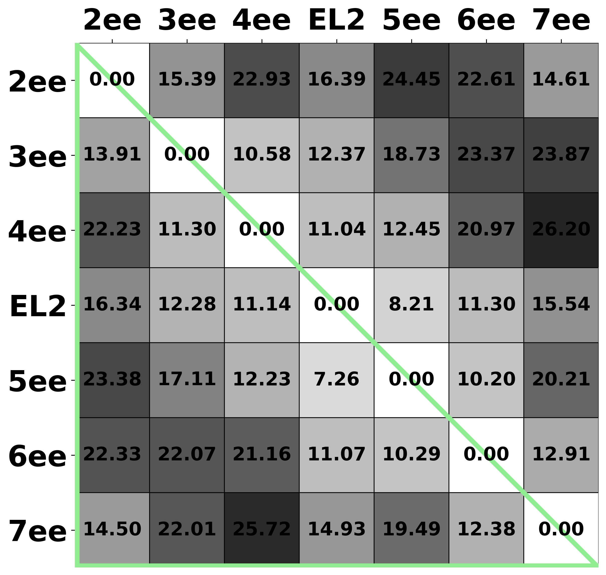
</td>
  
 
 

#### Pairwise distance difference

##### 7CMU (active) - 3PBL (inactive)
[Return to "Extracellular-ends"](#Extracellular-ends) 
- [Raw](#rawend_distmatExtracellular-ends7cmu3pbl) 
- Classified 
    - [Threshold = 0.0 (Å)](#0_0end_distmatExtracellular-ends7cmu3pbl) 
    - [Threshold = 0.2 (Å)](#0_2end_distmatExtracellular-ends7cmu3pbl) 
    - [Threshold = 0.4 (Å)](#0_4end_distmatExtracellular-ends7cmu3pbl) 
    - [Threshold = 0.6 (Å)](#0_6end_distmatExtracellular-ends7cmu3pbl) 
    - [Threshold = 0.8 (Å)](#0_8end_distmatExtracellular-ends7cmu3pbl) 
    - [Threshold = 1.0 (Å)](#1_0end_distmatExtracellular-ends7cmu3pbl) 
 

Raw 
[Return to "7CMU (active) - 3PBL (inactive) pairwise distance difference"](#end_distmatExtracellular-ends7cmu3pbl) 
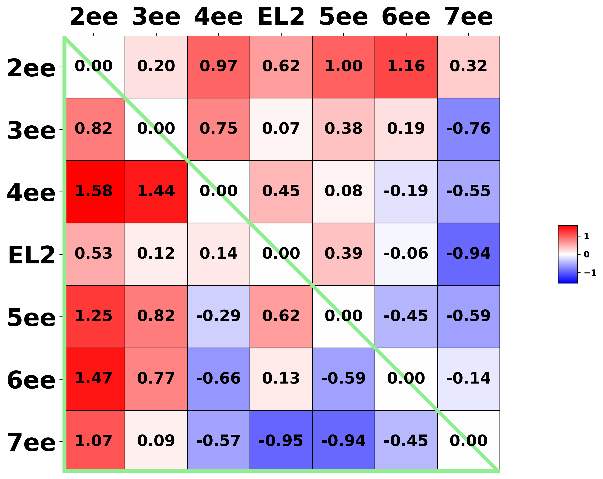
  

Threshold = 0.0 (Å) 
[Return to "7CMU (active) - 3PBL (inactive) pairwise distance difference"](#end_distmatExtracellular-ends7cmu3pbl) 

</td>
 

Threshold = 0.2 (Å) 
[Return to "7CMU (active) - 3PBL (inactive) pairwise distance difference"](#end_distmatExtracellular-ends7cmu3pbl) 

</td>
 

Threshold = 0.4 (Å) 
[Return to "7CMU (active) - 3PBL (inactive) pairwise distance difference"](#end_distmatExtracellular-ends7cmu3pbl) 
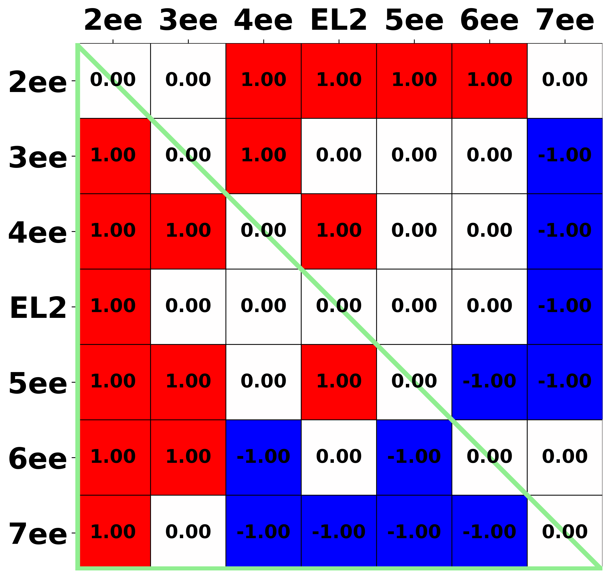
</td>
 

Threshold = 0.6 (Å) 
[Return to "7CMU (active) - 3PBL (inactive) pairwise distance difference"](#end_distmatExtracellular-ends7cmu3pbl) 
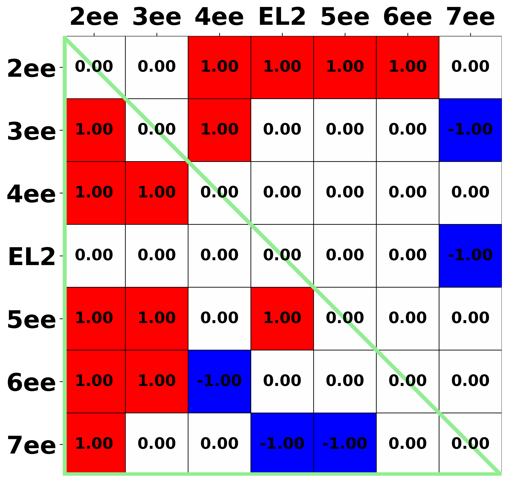
</td>
 

Threshold = 0.8 (Å) 
[Return to "7CMU (active) - 3PBL (inactive) pairwise distance difference"](#end_distmatExtracellular-ends7cmu3pbl) 
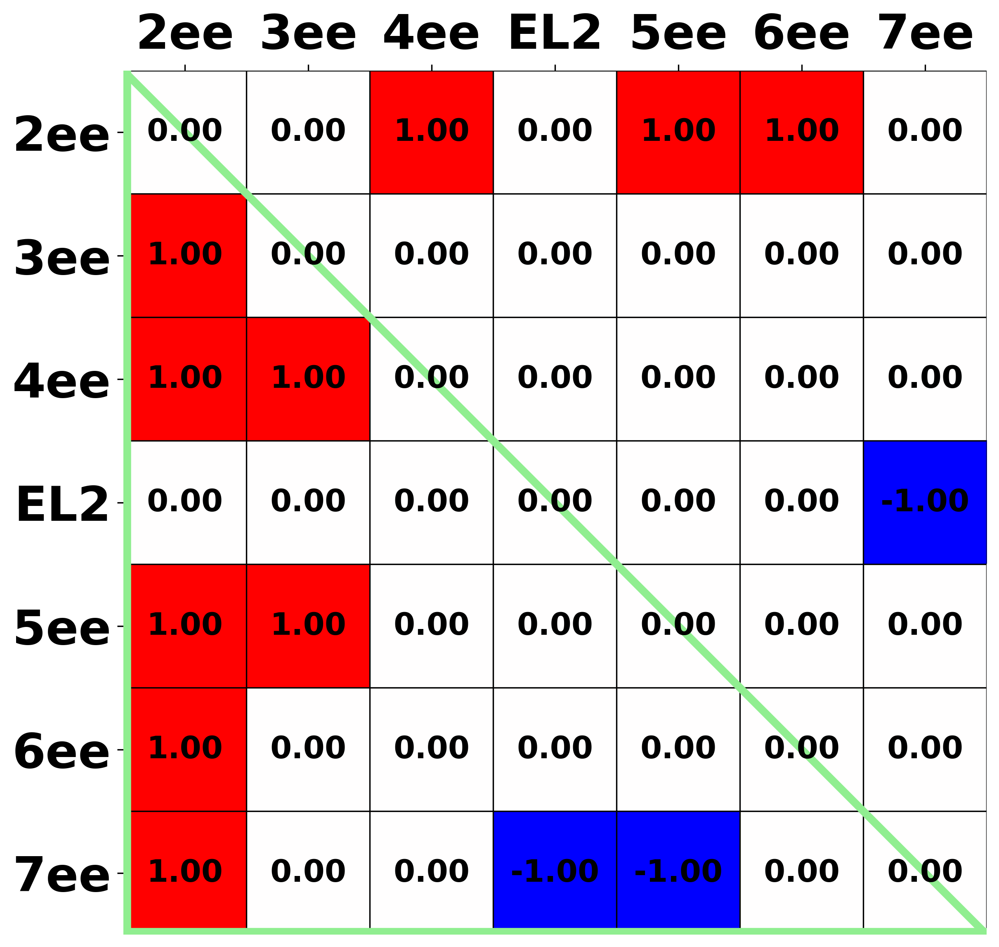
</td>
 

Threshold = 1.0 (Å) 
[Return to "7CMU (active) - 3PBL (inactive) pairwise distance difference"](#end_distmatExtracellular-ends7cmu3pbl) 
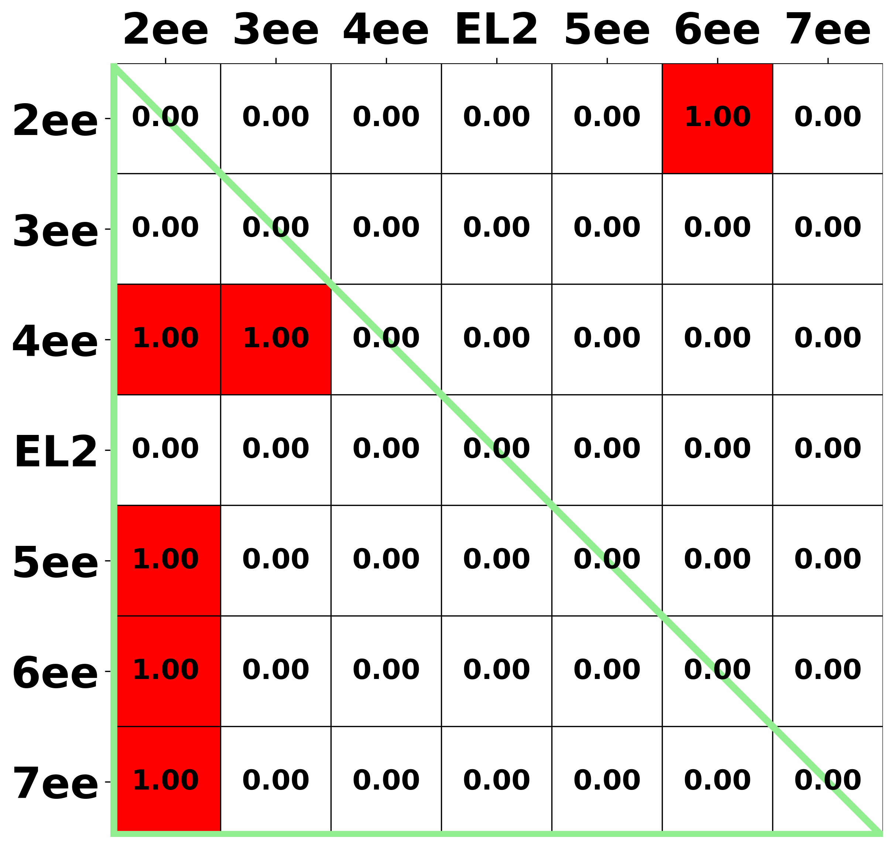
</td>
 

##### 7CMV (active) - 3PBL (inactive)
[Return to "Extracellular-ends"](#Extracellular-ends) 
- [Raw](#rawend_distmatExtracellular-ends7cmv3pbl) 
- Classified 
    - [Threshold = 0.0 (Å)](#0_0end_distmatExtracellular-ends7cmv3pbl) 
    - [Threshold = 0.2 (Å)](#0_2end_distmatExtracellular-ends7cmv3pbl) 
    - [Threshold = 0.4 (Å)](#0_4end_distmatExtracellular-ends7cmv3pbl) 
    - [Threshold = 0.6 (Å)](#0_6end_distmatExtracellular-ends7cmv3pbl) 
    - [Threshold = 0.8 (Å)](#0_8end_distmatExtracellular-ends7cmv3pbl) 
    - [Threshold = 1.0 (Å)](#1_0end_distmatExtracellular-ends7cmv3pbl) 
 

Raw 
[Return to "7CMV (active) - 3PBL (inactive) pairwise distance difference"](#end_distmatExtracellular-ends7cmv3pbl) 

  

Threshold = 0.0 (Å) 
[Return to "7CMV (active) - 3PBL (inactive) pairwise distance difference"](#end_distmatExtracellular-ends7cmv3pbl) 
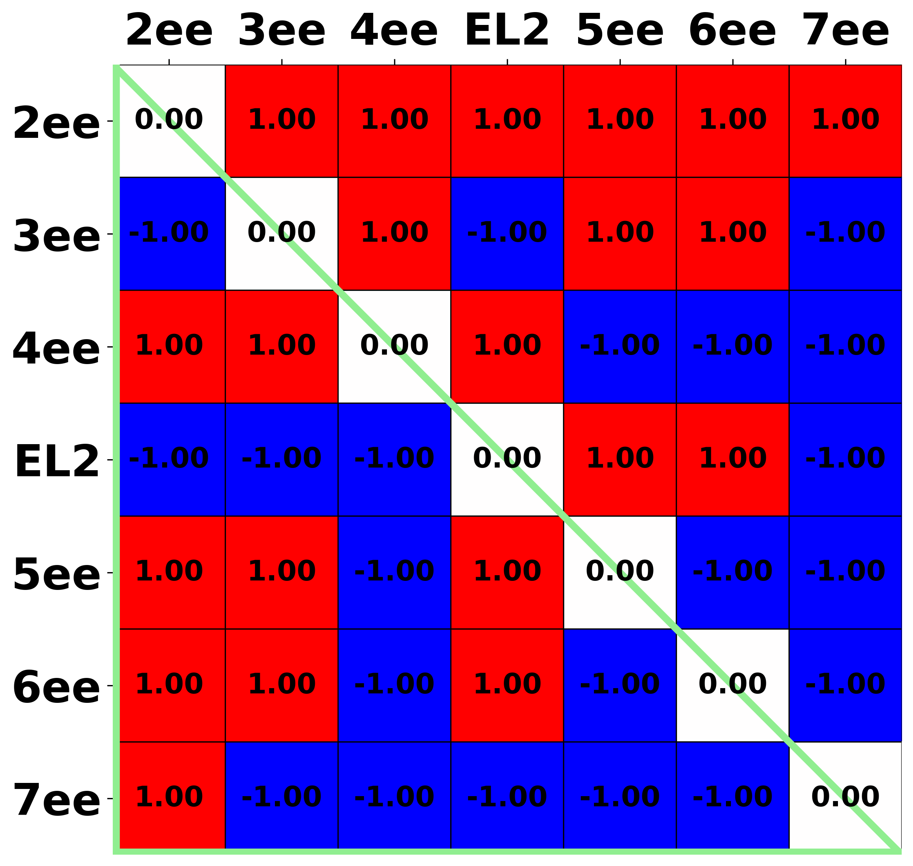
</td>
 

Threshold = 0.2 (Å) 
[Return to "7CMV (active) - 3PBL (inactive) pairwise distance difference"](#end_distmatExtracellular-ends7cmv3pbl) 

</td>
 

Threshold = 0.4 (Å) 
[Return to "7CMV (active) - 3PBL (inactive) pairwise distance difference"](#end_distmatExtracellular-ends7cmv3pbl) 
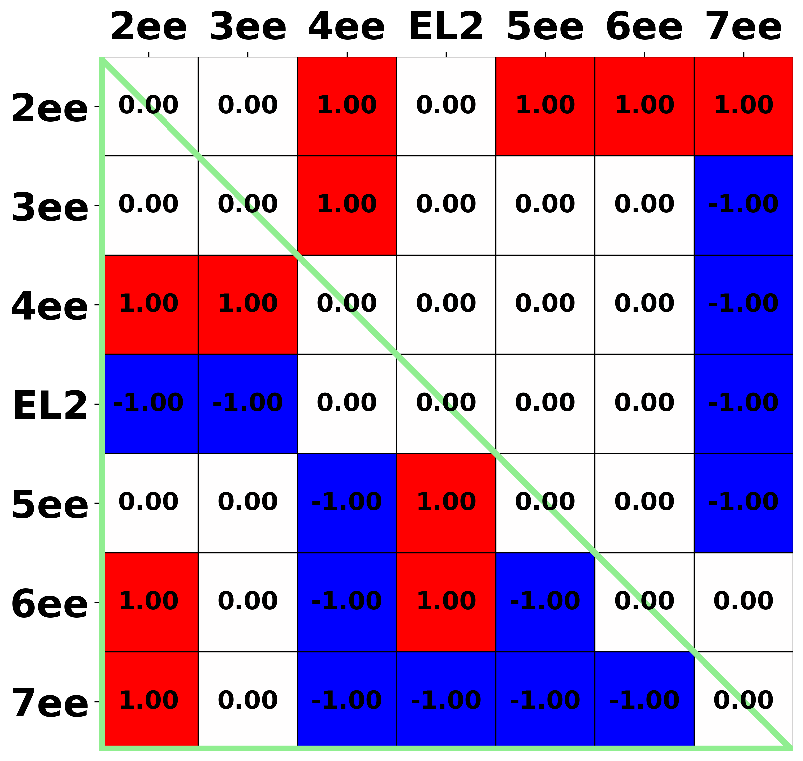
</td>
 

Threshold = 0.6 (Å) 
[Return to "7CMV (active) - 3PBL (inactive) pairwise distance difference"](#end_distmatExtracellular-ends7cmv3pbl) 

</td>
 

Threshold = 0.8 (Å) 
[Return to "7CMV (active) - 3PBL (inactive) pairwise distance difference"](#end_distmatExtracellular-ends7cmv3pbl) 
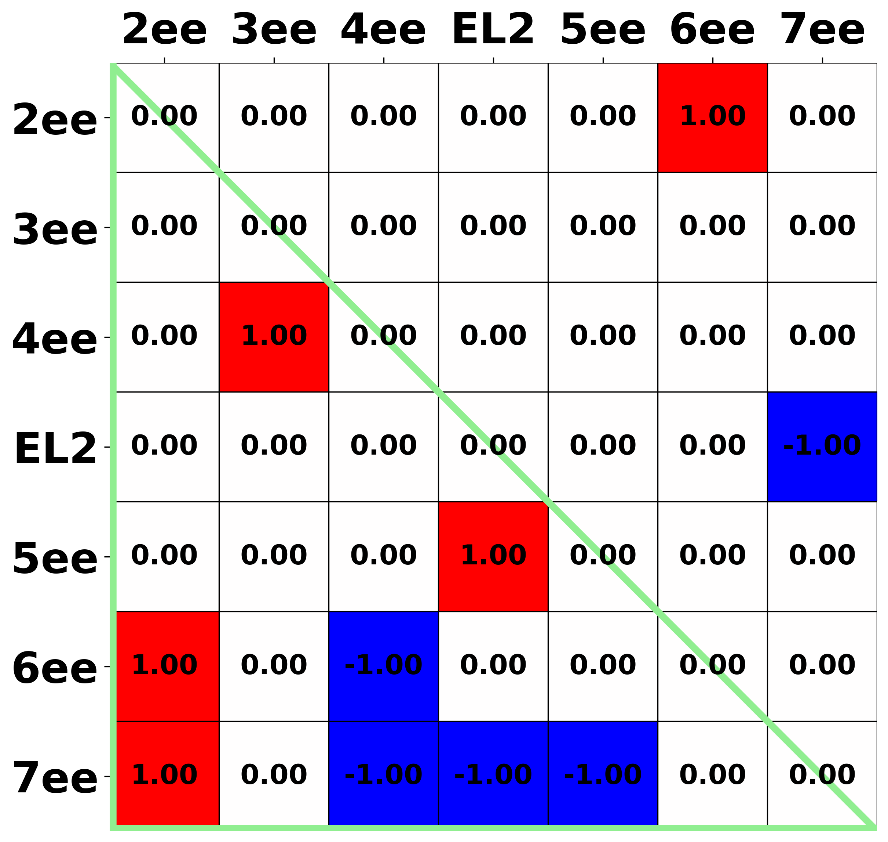
</td>
 

Threshold = 1.0 (Å) 
[Return to "7CMV (active) - 3PBL (inactive) pairwise distance difference"](#end_distmatExtracellular-ends7cmv3pbl) 

</td>
 
 
 

## EE area (CA)

 
### triangle (CA) 
[Return to top](#top) 

<strong> Area difference</strong>

* [7CMU (active) - 3PBL (inactive) |||  (CA)](#triangle7cmu3pbl_ca)
* [7CMV (active) - 3PBL (inactive) |||  (CA)](#triangle7cmv3pbl_ca)
 
 
 

#### EE area difference (CA)

##### 7CMU (active) - 3PBL (inactive) (CA)
[Return to "triangle (CA)"](#triangle_ca) 
- [Raw](ee_area/triangle_area_diff.csv) 
- Classified 
    - [Threshold = 0.0 (Å2)](#triangle0_0_ca) 
    - [Threshold = 0.8 (Å2)](#triangle0_8_ca) 
    - [Threshold = 1.6 (Å2)](#triangle1_6_ca) 
    - [Threshold = 2.4 (Å2)](#triangle2_4_ca) 
    - [Threshold = 3.2 (Å2)](#triangle3_2_ca) 
    - [Threshold = 4.0 (Å2)](#triangle4_0_ca) 
 

 

#### triangle area (CA), area threshold = 0.0 (Å2) 
[Return to "triangle (CA)"](#triangle_ca) 
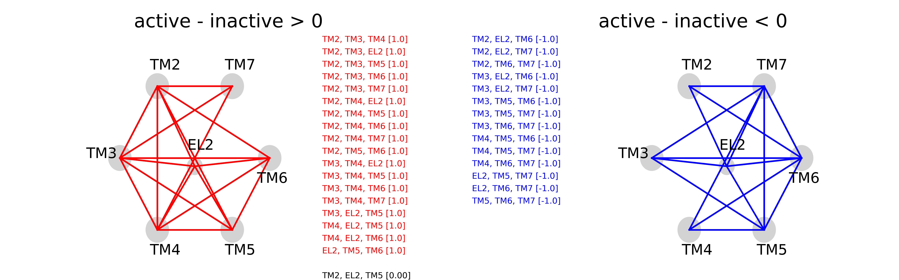

 

#### triangle area (CA), area threshold = 0.8 (Å2) 
[Return to "triangle (CA)"](#triangle_ca) 

 

#### triangle area (CA), area threshold = 1.6 (Å2) 
[Return to "triangle (CA)"](#triangle_ca) 
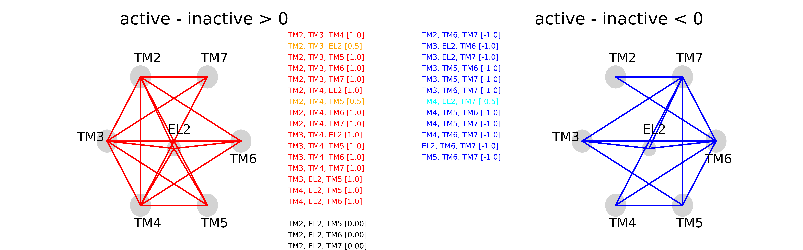

 

#### triangle area (CA), area threshold = 2.4 (Å2) 
[Return to "triangle (CA)"](#triangle_ca) 

 

#### triangle area (CA), area threshold = 3.2 (Å2) 
[Return to "triangle (CA)"](#triangle_ca) 
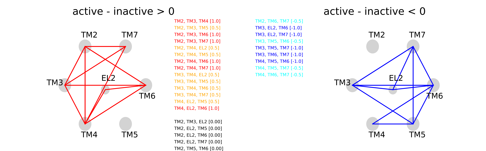

 

#### triangle area (CA), area threshold = 4.0 (Å2) 
[Return to "triangle (CA)"](#triangle_ca) 

##### 7CMV (active) - 3PBL (inactive) (CA)
[Return to "triangle (CA)"](#triangle_ca) 
- [Raw](ee_area/triangle_area_diff.csv) 
- Classified 
    - [Threshold = 0.0 (Å2)](#triangle0_0_ca) 
    - [Threshold = 0.8 (Å2)](#triangle0_8_ca) 
    - [Threshold = 1.6 (Å2)](#triangle1_6_ca) 
    - [Threshold = 2.4 (Å2)](#triangle2_4_ca) 
    - [Threshold = 3.2 (Å2)](#triangle3_2_ca) 
    - [Threshold = 4.0 (Å2)](#triangle4_0_ca) 
 

 

#### triangle area (CA), area threshold = 0.0 (Å2) 
[Return to "triangle (CA)"](#triangle_ca) 

 

#### triangle area (CA), area threshold = 0.8 (Å2) 
[Return to "triangle (CA)"](#triangle_ca) 
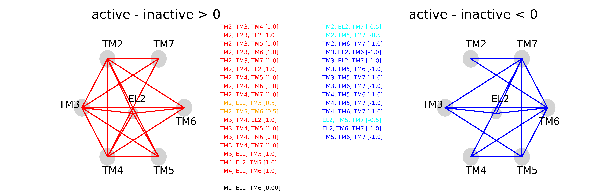

 

#### triangle area (CA), area threshold = 1.6 (Å2) 
[Return to "triangle (CA)"](#triangle_ca) 

 

#### triangle area (CA), area threshold = 2.4 (Å2) 
[Return to "triangle (CA)"](#triangle_ca) 
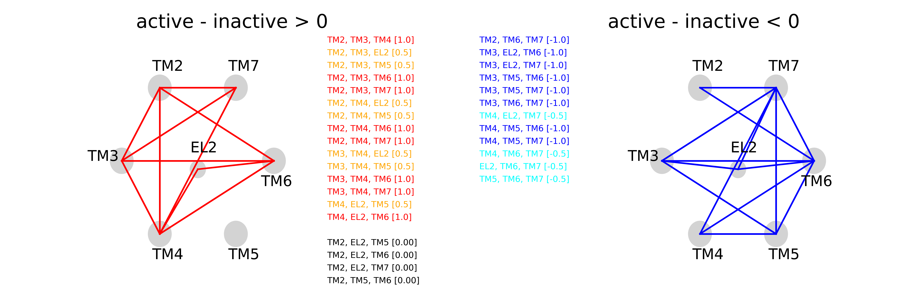

 

#### triangle area (CA), area threshold = 3.2 (Å2) 
[Return to "triangle (CA)"](#triangle_ca) 

 

#### triangle area (CA), area threshold = 4.0 (Å2) 
[Return to "triangle (CA)"](#triangle_ca) 
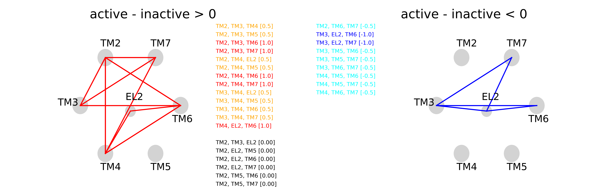

 
 

 
### quadrilateral (CA) 
[Return to top](#top) 

<strong> Area difference</strong>

* [7CMU (active) - 3PBL (inactive) |||  (CA)](#quadrilateral7cmu3pbl_ca)
* [7CMV (active) - 3PBL (inactive) |||  (CA)](#quadrilateral7cmv3pbl_ca)
 
 
 

#### EE area difference (CA)

##### 7CMU (active) - 3PBL (inactive) (CA)
[Return to "quadrilateral (CA)"](#quadrilateral_ca) 
- [Raw](ee_area/quadrilateral_area_diff.csv) 
- Classified 
    - [Threshold = 0.0 (Å2)](#quadrilateral0_0_ca) 
    - [Threshold = 0.8 (Å2)](#quadrilateral0_8_ca) 
    - [Threshold = 1.6 (Å2)](#quadrilateral1_6_ca) 
    - [Threshold = 2.4 (Å2)](#quadrilateral2_4_ca) 
    - [Threshold = 3.2 (Å2)](#quadrilateral3_2_ca) 
    - [Threshold = 4.0 (Å2)](#quadrilateral4_0_ca) 
 

 

#### quadrilateral area (CA), area threshold = 0.0 (Å2) 
[Return to "quadrilateral (CA)"](#quadrilateral_ca) 

 

#### quadrilateral area (CA), area threshold = 0.8 (Å2) 
[Return to "quadrilateral (CA)"](#quadrilateral_ca) 

 

#### quadrilateral area (CA), area threshold = 1.6 (Å2) 
[Return to "quadrilateral (CA)"](#quadrilateral_ca) 
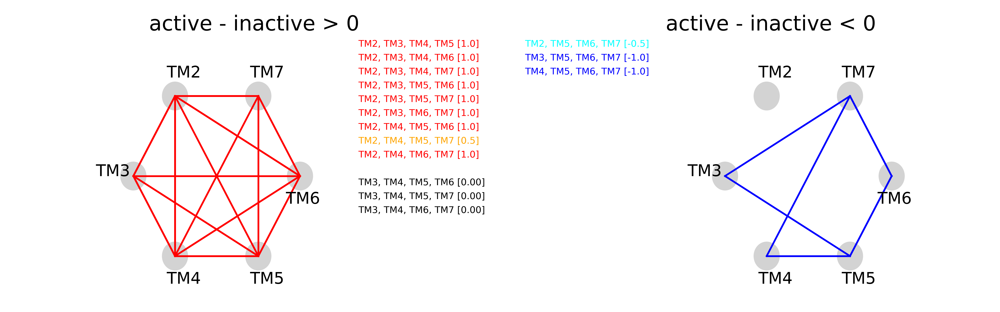

 

#### quadrilateral area (CA), area threshold = 2.4 (Å2) 
[Return to "quadrilateral (CA)"](#quadrilateral_ca) 

 

#### quadrilateral area (CA), area threshold = 3.2 (Å2) 
[Return to "quadrilateral (CA)"](#quadrilateral_ca) 
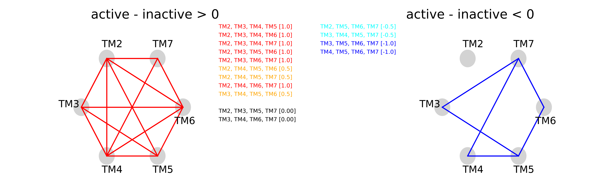

 

#### quadrilateral area (CA), area threshold = 4.0 (Å2) 
[Return to "quadrilateral (CA)"](#quadrilateral_ca) 

##### 7CMV (active) - 3PBL (inactive) (CA)
[Return to "quadrilateral (CA)"](#quadrilateral_ca) 
- [Raw](ee_area/quadrilateral_area_diff.csv) 
- Classified 
    - [Threshold = 0.0 (Å2)](#quadrilateral0_0_ca) 
    - [Threshold = 0.8 (Å2)](#quadrilateral0_8_ca) 
    - [Threshold = 1.6 (Å2)](#quadrilateral1_6_ca) 
    - [Threshold = 2.4 (Å2)](#quadrilateral2_4_ca) 
    - [Threshold = 3.2 (Å2)](#quadrilateral3_2_ca) 
    - [Threshold = 4.0 (Å2)](#quadrilateral4_0_ca) 
 

 

#### quadrilateral area (CA), area threshold = 0.0 (Å2) 
[Return to "quadrilateral (CA)"](#quadrilateral_ca) 
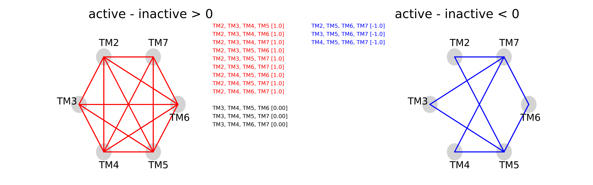

 

#### quadrilateral area (CA), area threshold = 0.8 (Å2) 
[Return to "quadrilateral (CA)"](#quadrilateral_ca) 

 

#### quadrilateral area (CA), area threshold = 1.6 (Å2) 
[Return to "quadrilateral (CA)"](#quadrilateral_ca) 

 

#### quadrilateral area (CA), area threshold = 2.4 (Å2) 
[Return to "quadrilateral (CA)"](#quadrilateral_ca) 
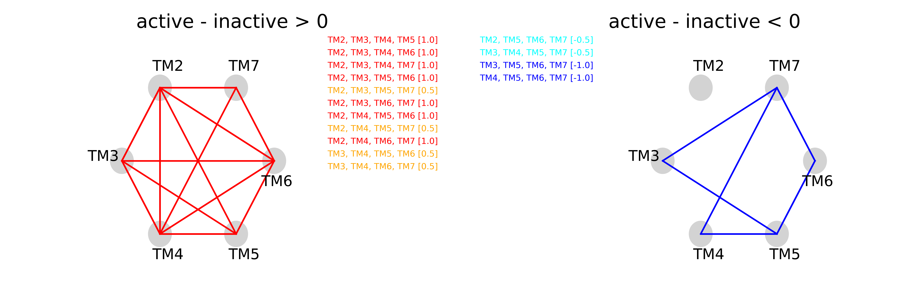

 

#### quadrilateral area (CA), area threshold = 3.2 (Å2) 
[Return to "quadrilateral (CA)"](#quadrilateral_ca) 

 

#### quadrilateral area (CA), area threshold = 4.0 (Å2) 
[Return to "quadrilateral (CA)"](#quadrilateral_ca) 
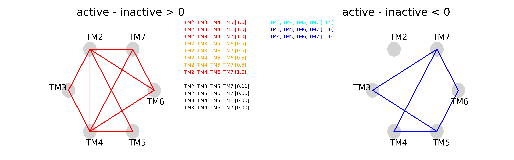

 
 

 
### pentagon (CA) 
[Return to top](#top) 

<strong> Area difference</strong>

* [7CMU (active) - 3PBL (inactive) |||  (CA)](#pentagon7cmu3pbl_ca)
* [7CMV (active) - 3PBL (inactive) |||  (CA)](#pentagon7cmv3pbl_ca)
 
 
 

#### EE area difference (CA)

##### 7CMU (active) - 3PBL (inactive) (CA)
[Return to "pentagon (CA)"](#pentagon_ca) 
- [Raw](ee_area/pentagon_area_diff.csv) 
- Classified 
    - [Threshold = 0.0 (Å2)](#pentagon0_0_ca) 
    - [Threshold = 0.8 (Å2)](#pentagon0_8_ca) 
    - [Threshold = 1.6 (Å2)](#pentagon1_6_ca) 
    - [Threshold = 2.4 (Å2)](#pentagon2_4_ca) 
    - [Threshold = 3.2 (Å2)](#pentagon3_2_ca) 
    - [Threshold = 4.0 (Å2)](#pentagon4_0_ca) 
 

 

#### pentagon area (CA), area threshold = 0.0 (Å2) 
[Return to "pentagon (CA)"](#pentagon_ca) 
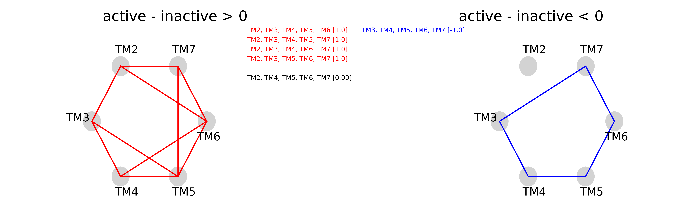

 

#### pentagon area (CA), area threshold = 0.8 (Å2) 
[Return to "pentagon (CA)"](#pentagon_ca) 

 

#### pentagon area (CA), area threshold = 1.6 (Å2) 
[Return to "pentagon (CA)"](#pentagon_ca) 

 

#### pentagon area (CA), area threshold = 2.4 (Å2) 
[Return to "pentagon (CA)"](#pentagon_ca) 
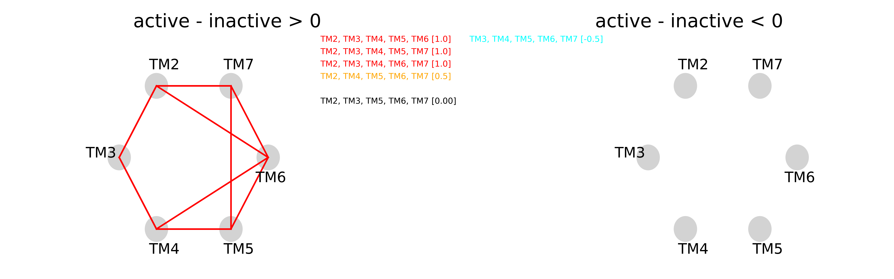

 

#### pentagon area (CA), area threshold = 3.2 (Å2) 
[Return to "pentagon (CA)"](#pentagon_ca) 
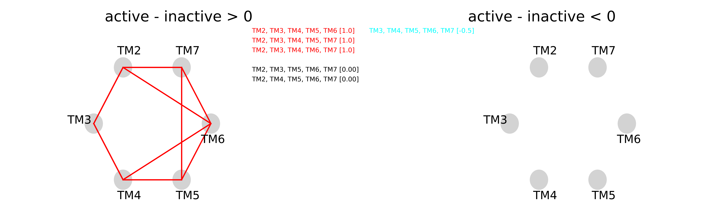

 

#### pentagon area (CA), area threshold = 4.0 (Å2) 
[Return to "pentagon (CA)"](#pentagon_ca) 

##### 7CMV (active) - 3PBL (inactive) (CA)
[Return to "pentagon (CA)"](#pentagon_ca) 
- [Raw](ee_area/pentagon_area_diff.csv) 
- Classified 
    - [Threshold = 0.0 (Å2)](#pentagon0_0_ca) 
    - [Threshold = 0.8 (Å2)](#pentagon0_8_ca) 
    - [Threshold = 1.6 (Å2)](#pentagon1_6_ca) 
    - [Threshold = 2.4 (Å2)](#pentagon2_4_ca) 
    - [Threshold = 3.2 (Å2)](#pentagon3_2_ca) 
    - [Threshold = 4.0 (Å2)](#pentagon4_0_ca) 
 

 

#### pentagon area (CA), area threshold = 0.0 (Å2) 
[Return to "pentagon (CA)"](#pentagon_ca) 

 

#### pentagon area (CA), area threshold = 0.8 (Å2) 
[Return to "pentagon (CA)"](#pentagon_ca) 

 

#### pentagon area (CA), area threshold = 1.6 (Å2) 
[Return to "pentagon (CA)"](#pentagon_ca) 

 

#### pentagon area (CA), area threshold = 2.4 (Å2) 
[Return to "pentagon (CA)"](#pentagon_ca) 

 

#### pentagon area (CA), area threshold = 3.2 (Å2) 
[Return to "pentagon (CA)"](#pentagon_ca) 

 

#### pentagon area (CA), area threshold = 4.0 (Å2) 
[Return to "pentagon (CA)"](#pentagon_ca) 

 
 

 
### hexagon (CA) 
[Return to top](#top) 

<strong> Area difference</strong>

* [7CMU (active) - 3PBL (inactive) |||  (CA)](#hexagon7cmu3pbl_ca)
* [7CMV (active) - 3PBL (inactive) |||  (CA)](#hexagon7cmv3pbl_ca)
 
 
 

#### EE area difference (CA)

##### 7CMU (active) - 3PBL (inactive) (CA)
[Return to "hexagon (CA)"](#hexagon_ca) 
- [Raw](ee_area/hexagon_area_diff.csv) 
- Classified 
    - [Threshold = 0.0 (Å2)](#hexagon0_0_ca) 
    - [Threshold = 0.8 (Å2)](#hexagon0_8_ca) 
    - [Threshold = 1.6 (Å2)](#hexagon1_6_ca) 
    - [Threshold = 2.4 (Å2)](#hexagon2_4_ca) 
    - [Threshold = 3.2 (Å2)](#hexagon3_2_ca) 
    - [Threshold = 4.0 (Å2)](#hexagon4_0_ca) 
 

 

#### hexagon area (CA), area threshold = 0.0 (Å2) 
[Return to "hexagon (CA)"](#hexagon_ca) 

 

#### hexagon area (CA), area threshold = 0.8 (Å2) 
[Return to "hexagon (CA)"](#hexagon_ca) 

 

#### hexagon area (CA), area threshold = 1.6 (Å2) 
[Return to "hexagon (CA)"](#hexagon_ca) 

 

#### hexagon area (CA), area threshold = 2.4 (Å2) 
[Return to "hexagon (CA)"](#hexagon_ca) 

 

#### hexagon area (CA), area threshold = 3.2 (Å2) 
[Return to "hexagon (CA)"](#hexagon_ca) 

 

#### hexagon area (CA), area threshold = 4.0 (Å2) 
[Return to "hexagon (CA)"](#hexagon_ca) 

##### 7CMV (active) - 3PBL (inactive) (CA)
[Return to "hexagon (CA)"](#hexagon_ca) 
- [Raw](ee_area/hexagon_area_diff.csv) 
- Classified 
    - [Threshold = 0.0 (Å2)](#hexagon0_0_ca) 
    - [Threshold = 0.8 (Å2)](#hexagon0_8_ca) 
    - [Threshold = 1.6 (Å2)](#hexagon1_6_ca) 
    - [Threshold = 2.4 (Å2)](#hexagon2_4_ca) 
    - [Threshold = 3.2 (Å2)](#hexagon3_2_ca) 
    - [Threshold = 4.0 (Å2)](#hexagon4_0_ca) 
 

 

#### hexagon area (CA), area threshold = 0.0 (Å2) 
[Return to "hexagon (CA)"](#hexagon_ca) 

 

#### hexagon area (CA), area threshold = 0.8 (Å2) 
[Return to "hexagon (CA)"](#hexagon_ca) 

 

#### hexagon area (CA), area threshold = 1.6 (Å2) 
[Return to "hexagon (CA)"](#hexagon_ca) 

 

#### hexagon area (CA), area threshold = 2.4 (Å2) 
[Return to "hexagon (CA)"](#hexagon_ca) 

 

#### hexagon area (CA), area threshold = 3.2 (Å2) 
[Return to "hexagon (CA)"](#hexagon_ca) 

 

#### hexagon area (CA), area threshold = 4.0 (Å2) 
[Return to "hexagon (CA)"](#hexagon_ca) 

 
 

## EE area (sidechain)

 
### triangle (sidechain) 
[Return to top](#top) 

<strong> Area difference</strong>

* [7CMU (active) - 3PBL (inactive) |||  (sidechain)](#triangle7cmu3pbl_sc)
* [7CMV (active) - 3PBL (inactive) |||  (sidechain)](#triangle7cmv3pbl_sc)
 
 
 

#### EE area difference (sidechain)

##### 7CMU (active) - 3PBL (inactive) (sidechain)
[Return to "triangle (sidechain)"](#triangle_sc) 
- [Raw](ee_area/triangle_sc_area_diff.csv) 
- Classified 
    - [Threshold = 0.0 (Å2)](#triangle0_0_sc) 
    - [Threshold = 0.8 (Å2)](#triangle0_8_sc) 
    - [Threshold = 1.6 (Å2)](#triangle1_6_sc) 
    - [Threshold = 2.4 (Å2)](#triangle2_4_sc) 
    - [Threshold = 3.2 (Å2)](#triangle3_2_sc) 
    - [Threshold = 4.0 (Å2)](#triangle4_0_sc) 
 

 

#### triangle area (sidechain), area threshold = 0.0 (Å2) 
[Return to "triangle (sidechain)"](#triangle_sc) 

 

#### triangle area (sidechain), area threshold = 0.8 (Å2) 
[Return to "triangle (sidechain)"](#triangle_sc) 

 

#### triangle area (sidechain), area threshold = 1.6 (Å2) 
[Return to "triangle (sidechain)"](#triangle_sc) 

 

#### triangle area (sidechain), area threshold = 2.4 (Å2) 
[Return to "triangle (sidechain)"](#triangle_sc) 

 

#### triangle area (sidechain), area threshold = 3.2 (Å2) 
[Return to "triangle (sidechain)"](#triangle_sc) 

 

#### triangle area (sidechain), area threshold = 4.0 (Å2) 
[Return to "triangle (sidechain)"](#triangle_sc) 

##### 7CMV (active) - 3PBL (inactive) (sidechain)
[Return to "triangle (sidechain)"](#triangle_sc) 
- [Raw](ee_area/triangle_sc_area_diff.csv) 
- Classified 
    - [Threshold = 0.0 (Å2)](#triangle0_0_sc) 
    - [Threshold = 0.8 (Å2)](#triangle0_8_sc) 
    - [Threshold = 1.6 (Å2)](#triangle1_6_sc) 
    - [Threshold = 2.4 (Å2)](#triangle2_4_sc) 
    - [Threshold = 3.2 (Å2)](#triangle3_2_sc) 
    - [Threshold = 4.0 (Å2)](#triangle4_0_sc) 
 

 

#### triangle area (sidechain), area threshold = 0.0 (Å2) 
[Return to "triangle (sidechain)"](#triangle_sc) 

 

#### triangle area (sidechain), area threshold = 0.8 (Å2) 
[Return to "triangle (sidechain)"](#triangle_sc) 

 

#### triangle area (sidechain), area threshold = 1.6 (Å2) 
[Return to "triangle (sidechain)"](#triangle_sc) 

 

#### triangle area (sidechain), area threshold = 2.4 (Å2) 
[Return to "triangle (sidechain)"](#triangle_sc) 

 

#### triangle area (sidechain), area threshold = 3.2 (Å2) 
[Return to "triangle (sidechain)"](#triangle_sc) 

 

#### triangle area (sidechain), area threshold = 4.0 (Å2) 
[Return to "triangle (sidechain)"](#triangle_sc) 

 
 

 
### quadrilateral (sidechain) 
[Return to top](#top) 

<strong> Area difference</strong>

* [7CMU (active) - 3PBL (inactive) |||  (sidechain)](#quadrilateral7cmu3pbl_sc)
* [7CMV (active) - 3PBL (inactive) |||  (sidechain)](#quadrilateral7cmv3pbl_sc)
 
 
 

#### EE area difference (sidechain)

##### 7CMU (active) - 3PBL (inactive) (sidechain)
[Return to "quadrilateral (sidechain)"](#quadrilateral_sc) 
- [Raw](ee_area/quadrilateral_sc_area_diff.csv) 
- Classified 
    - [Threshold = 0.0 (Å2)](#quadrilateral0_0_sc) 
    - [Threshold = 0.8 (Å2)](#quadrilateral0_8_sc) 
    - [Threshold = 1.6 (Å2)](#quadrilateral1_6_sc) 
    - [Threshold = 2.4 (Å2)](#quadrilateral2_4_sc) 
    - [Threshold = 3.2 (Å2)](#quadrilateral3_2_sc) 
    - [Threshold = 4.0 (Å2)](#quadrilateral4_0_sc) 
 

 

#### quadrilateral area (sidechain), area threshold = 0.0 (Å2) 
[Return to "quadrilateral (sidechain)"](#quadrilateral_sc) 

 

#### quadrilateral area (sidechain), area threshold = 0.8 (Å2) 
[Return to "quadrilateral (sidechain)"](#quadrilateral_sc) 

 

#### quadrilateral area (sidechain), area threshold = 1.6 (Å2) 
[Return to "quadrilateral (sidechain)"](#quadrilateral_sc) 

 

#### quadrilateral area (sidechain), area threshold = 2.4 (Å2) 
[Return to "quadrilateral (sidechain)"](#quadrilateral_sc) 

 

#### quadrilateral area (sidechain), area threshold = 3.2 (Å2) 
[Return to "quadrilateral (sidechain)"](#quadrilateral_sc) 

 

#### quadrilateral area (sidechain), area threshold = 4.0 (Å2) 
[Return to "quadrilateral (sidechain)"](#quadrilateral_sc) 

##### 7CMV (active) - 3PBL (inactive) (sidechain)
[Return to "quadrilateral (sidechain)"](#quadrilateral_sc) 
- [Raw](ee_area/quadrilateral_sc_area_diff.csv) 
- Classified 
    - [Threshold = 0.0 (Å2)](#quadrilateral0_0_sc) 
    - [Threshold = 0.8 (Å2)](#quadrilateral0_8_sc) 
    - [Threshold = 1.6 (Å2)](#quadrilateral1_6_sc) 
    - [Threshold = 2.4 (Å2)](#quadrilateral2_4_sc) 
    - [Threshold = 3.2 (Å2)](#quadrilateral3_2_sc) 
    - [Threshold = 4.0 (Å2)](#quadrilateral4_0_sc) 
 

 

#### quadrilateral area (sidechain), area threshold = 0.0 (Å2) 
[Return to "quadrilateral (sidechain)"](#quadrilateral_sc) 

 

#### quadrilateral area (sidechain), area threshold = 0.8 (Å2) 
[Return to "quadrilateral (sidechain)"](#quadrilateral_sc) 

 

#### quadrilateral area (sidechain), area threshold = 1.6 (Å2) 
[Return to "quadrilateral (sidechain)"](#quadrilateral_sc) 

 

#### quadrilateral area (sidechain), area threshold = 2.4 (Å2) 
[Return to "quadrilateral (sidechain)"](#quadrilateral_sc) 

 

#### quadrilateral area (sidechain), area threshold = 3.2 (Å2) 
[Return to "quadrilateral (sidechain)"](#quadrilateral_sc) 

 

#### quadrilateral area (sidechain), area threshold = 4.0 (Å2) 
[Return to "quadrilateral (sidechain)"](#quadrilateral_sc) 

 
 

 
### pentagon (sidechain) 
[Return to top](#top) 

<strong> Area difference</strong>

* [7CMU (active) - 3PBL (inactive) |||  (sidechain)](#pentagon7cmu3pbl_sc)
* [7CMV (active) - 3PBL (inactive) |||  (sidechain)](#pentagon7cmv3pbl_sc)
 
 
 

#### EE area difference (sidechain)

##### 7CMU (active) - 3PBL (inactive) (sidechain)
[Return to "pentagon (sidechain)"](#pentagon_sc) 
- [Raw](ee_area/pentagon_sc_area_diff.csv) 
- Classified 
    - [Threshold = 0.0 (Å2)](#pentagon0_0_sc) 
    - [Threshold = 0.8 (Å2)](#pentagon0_8_sc) 
    - [Threshold = 1.6 (Å2)](#pentagon1_6_sc) 
    - [Threshold = 2.4 (Å2)](#pentagon2_4_sc) 
    - [Threshold = 3.2 (Å2)](#pentagon3_2_sc) 
    - [Threshold = 4.0 (Å2)](#pentagon4_0_sc) 
 

 

#### pentagon area (sidechain), area threshold = 0.0 (Å2) 
[Return to "pentagon (sidechain)"](#pentagon_sc) 

 

#### pentagon area (sidechain), area threshold = 0.8 (Å2) 
[Return to "pentagon (sidechain)"](#pentagon_sc) 

 

#### pentagon area (sidechain), area threshold = 1.6 (Å2) 
[Return to "pentagon (sidechain)"](#pentagon_sc) 

 

#### pentagon area (sidechain), area threshold = 2.4 (Å2) 
[Return to "pentagon (sidechain)"](#pentagon_sc) 

 

#### pentagon area (sidechain), area threshold = 3.2 (Å2) 
[Return to "pentagon (sidechain)"](#pentagon_sc) 

 

#### pentagon area (sidechain), area threshold = 4.0 (Å2) 
[Return to "pentagon (sidechain)"](#pentagon_sc) 

##### 7CMV (active) - 3PBL (inactive) (sidechain)
[Return to "pentagon (sidechain)"](#pentagon_sc) 
- [Raw](ee_area/pentagon_sc_area_diff.csv) 
- Classified 
    - [Threshold = 0.0 (Å2)](#pentagon0_0_sc) 
    - [Threshold = 0.8 (Å2)](#pentagon0_8_sc) 
    - [Threshold = 1.6 (Å2)](#pentagon1_6_sc) 
    - [Threshold = 2.4 (Å2)](#pentagon2_4_sc) 
    - [Threshold = 3.2 (Å2)](#pentagon3_2_sc) 
    - [Threshold = 4.0 (Å2)](#pentagon4_0_sc) 
 

 

#### pentagon area (sidechain), area threshold = 0.0 (Å2) 
[Return to "pentagon (sidechain)"](#pentagon_sc) 

 

#### pentagon area (sidechain), area threshold = 0.8 (Å2) 
[Return to "pentagon (sidechain)"](#pentagon_sc) 

 

#### pentagon area (sidechain), area threshold = 1.6 (Å2) 
[Return to "pentagon (sidechain)"](#pentagon_sc) 

 

#### pentagon area (sidechain), area threshold = 2.4 (Å2) 
[Return to "pentagon (sidechain)"](#pentagon_sc) 

 

#### pentagon area (sidechain), area threshold = 3.2 (Å2) 
[Return to "pentagon (sidechain)"](#pentagon_sc) 

 

#### pentagon area (sidechain), area threshold = 4.0 (Å2) 
[Return to "pentagon (sidechain)"](#pentagon_sc) 

 
 

 
### hexagon (sidechain) 
[Return to top](#top) 

<strong> Area difference</strong>

* [7CMU (active) - 3PBL (inactive) |||  (sidechain)](#hexagon7cmu3pbl_sc)
* [7CMV (active) - 3PBL (inactive) |||  (sidechain)](#hexagon7cmv3pbl_sc)
 
 
 

#### EE area difference (sidechain)

##### 7CMU (active) - 3PBL (inactive) (sidechain)
[Return to "hexagon (sidechain)"](#hexagon_sc) 
- [Raw](ee_area/hexagon_sc_area_diff.csv) 
- Classified 
    - [Threshold = 0.0 (Å2)](#hexagon0_0_sc) 
    - [Threshold = 0.8 (Å2)](#hexagon0_8_sc) 
    - [Threshold = 1.6 (Å2)](#hexagon1_6_sc) 
    - [Threshold = 2.4 (Å2)](#hexagon2_4_sc) 
    - [Threshold = 3.2 (Å2)](#hexagon3_2_sc) 
    - [Threshold = 4.0 (Å2)](#hexagon4_0_sc) 
 

 

#### hexagon area (sidechain), area threshold = 0.0 (Å2) 
[Return to "hexagon (sidechain)"](#hexagon_sc) 

 

#### hexagon area (sidechain), area threshold = 0.8 (Å2) 
[Return to "hexagon (sidechain)"](#hexagon_sc) 

 

#### hexagon area (sidechain), area threshold = 1.6 (Å2) 
[Return to "hexagon (sidechain)"](#hexagon_sc) 

 

#### hexagon area (sidechain), area threshold = 2.4 (Å2) 
[Return to "hexagon (sidechain)"](#hexagon_sc) 

 

#### hexagon area (sidechain), area threshold = 3.2 (Å2) 
[Return to "hexagon (sidechain)"](#hexagon_sc) 

 

#### hexagon area (sidechain), area threshold = 4.0 (Å2) 
[Return to "hexagon (sidechain)"](#hexagon_sc) 

##### 7CMV (active) - 3PBL (inactive) (sidechain)
[Return to "hexagon (sidechain)"](#hexagon_sc) 
- [Raw](ee_area/hexagon_sc_area_diff.csv) 
- Classified 
    - [Threshold = 0.0 (Å2)](#hexagon0_0_sc) 
    - [Threshold = 0.8 (Å2)](#hexagon0_8_sc) 
    - [Threshold = 1.6 (Å2)](#hexagon1_6_sc) 
    - [Threshold = 2.4 (Å2)](#hexagon2_4_sc) 
    - [Threshold = 3.2 (Å2)](#hexagon3_2_sc) 
    - [Threshold = 4.0 (Å2)](#hexagon4_0_sc) 
 

 

#### hexagon area (sidechain), area threshold = 0.0 (Å2) 
[Return to "hexagon (sidechain)"](#hexagon_sc) 

 

#### hexagon area (sidechain), area threshold = 0.8 (Å2) 
[Return to "hexagon (sidechain)"](#hexagon_sc) 

 

#### hexagon area (sidechain), area threshold = 1.6 (Å2) 
[Return to "hexagon (sidechain)"](#hexagon_sc) 

 

#### hexagon area (sidechain), area threshold = 2.4 (Å2) 
[Return to "hexagon (sidechain)"](#hexagon_sc) 

 

#### hexagon area (sidechain), area threshold = 3.2 (Å2) 
[Return to "hexagon (sidechain)"](#hexagon_sc) 

 

#### hexagon area (sidechain), area threshold = 4.0 (Å2) 
[Return to "hexagon (sidechain)"](#hexagon_sc) 

 
 

## EE area (core-facing CA)

 
### triangle (core-facing CA) 
[Return to top](#top) 

<strong> Area difference</strong>

* [7CMU (active) - 3PBL (inactive) |||  (core-facing CA)](#triangle7cmu3pbl_fi_ca)
* [7CMV (active) - 3PBL (inactive) |||  (core-facing CA)](#triangle7cmv3pbl_fi_ca)
 
 
 

#### EE area difference (core-facing CA)

##### 7CMU (active) - 3PBL (inactive) (core-facing CA)
[Return to "triangle (core-facing CA)"](#triangle_fi_ca) 
- [Raw](ee_area_fi/triangle_area_fi_diff.csv) 
- Classified 
    - [Threshold = 0.0 (Å2)](#triangle0_0_fi_ca) 
    - [Threshold = 0.8 (Å2)](#triangle0_8_fi_ca) 
    - [Threshold = 1.6 (Å2)](#triangle1_6_fi_ca) 
    - [Threshold = 2.4 (Å2)](#triangle2_4_fi_ca) 
    - [Threshold = 3.2 (Å2)](#triangle3_2_fi_ca) 
    - [Threshold = 4.0 (Å2)](#triangle4_0_fi_ca) 
 

 

#### triangle area (core-facing CA), area threshold = 0.0 (Å2) 
[Return to "triangle (core-facing CA)"](#triangle_fi_ca) 

 

#### triangle area (core-facing CA), area threshold = 0.8 (Å2) 
[Return to "triangle (core-facing CA)"](#triangle_fi_ca) 

 

#### triangle area (core-facing CA), area threshold = 1.6 (Å2) 
[Return to "triangle (core-facing CA)"](#triangle_fi_ca) 

 

#### triangle area (core-facing CA), area threshold = 2.4 (Å2) 
[Return to "triangle (core-facing CA)"](#triangle_fi_ca) 
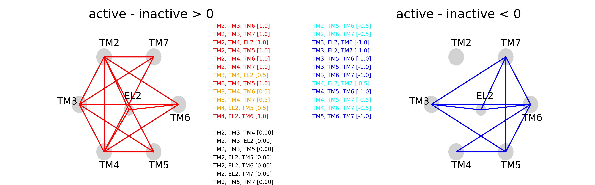

 

#### triangle area (core-facing CA), area threshold = 3.2 (Å2) 
[Return to "triangle (core-facing CA)"](#triangle_fi_ca) 
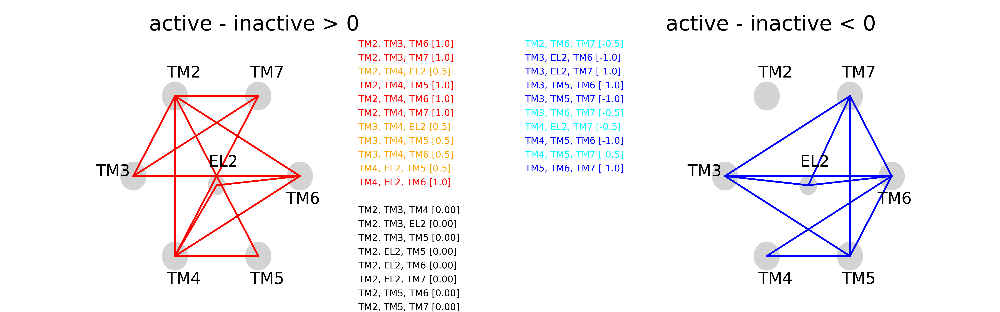

 

#### triangle area (core-facing CA), area threshold = 4.0 (Å2) 
[Return to "triangle (core-facing CA)"](#triangle_fi_ca) 

##### 7CMV (active) - 3PBL (inactive) (core-facing CA)
[Return to "triangle (core-facing CA)"](#triangle_fi_ca) 
- [Raw](ee_area_fi/triangle_area_fi_diff.csv) 
- Classified 
    - [Threshold = 0.0 (Å2)](#triangle0_0_fi_ca) 
    - [Threshold = 0.8 (Å2)](#triangle0_8_fi_ca) 
    - [Threshold = 1.6 (Å2)](#triangle1_6_fi_ca) 
    - [Threshold = 2.4 (Å2)](#triangle2_4_fi_ca) 
    - [Threshold = 3.2 (Å2)](#triangle3_2_fi_ca) 
    - [Threshold = 4.0 (Å2)](#triangle4_0_fi_ca) 
 

 

#### triangle area (core-facing CA), area threshold = 0.0 (Å2) 
[Return to "triangle (core-facing CA)"](#triangle_fi_ca) 
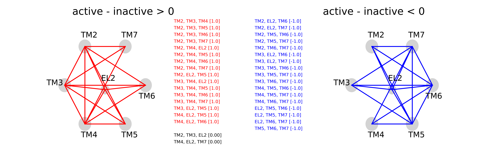

 

#### triangle area (core-facing CA), area threshold = 0.8 (Å2) 
[Return to "triangle (core-facing CA)"](#triangle_fi_ca) 

 

#### triangle area (core-facing CA), area threshold = 1.6 (Å2) 
[Return to "triangle (core-facing CA)"](#triangle_fi_ca) 
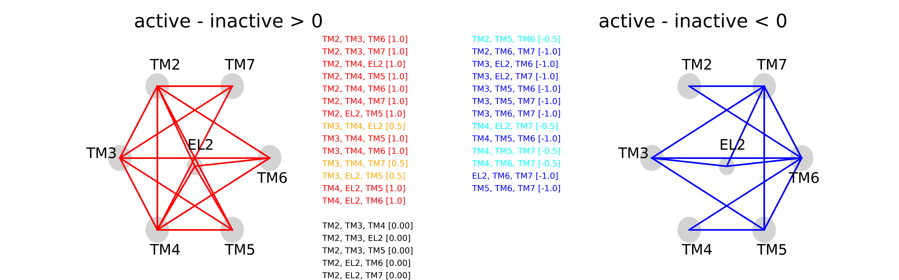

 

#### triangle area (core-facing CA), area threshold = 2.4 (Å2) 
[Return to "triangle (core-facing CA)"](#triangle_fi_ca) 

 

#### triangle area (core-facing CA), area threshold = 3.2 (Å2) 
[Return to "triangle (core-facing CA)"](#triangle_fi_ca) 

 

#### triangle area (core-facing CA), area threshold = 4.0 (Å2) 
[Return to "triangle (core-facing CA)"](#triangle_fi_ca) 
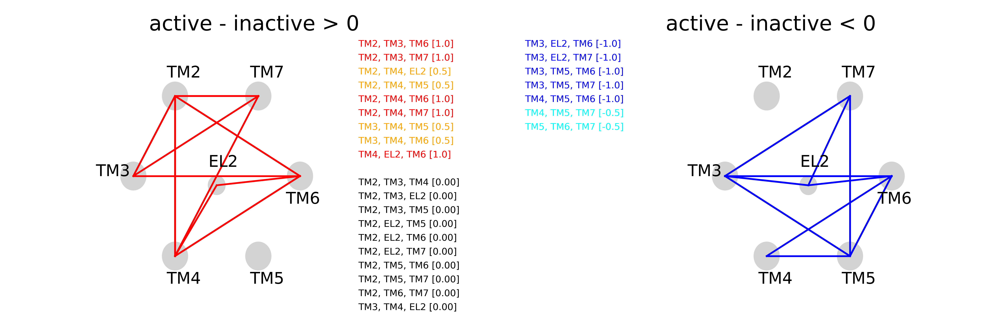

 
 

 
### quadrilateral (core-facing CA) 
[Return to top](#top) 

<strong> Area difference</strong>

* [7CMU (active) - 3PBL (inactive) |||  (core-facing CA)](#quadrilateral7cmu3pbl_fi_ca)
* [7CMV (active) - 3PBL (inactive) |||  (core-facing CA)](#quadrilateral7cmv3pbl_fi_ca)
 
 
 

#### EE area difference (core-facing CA)

##### 7CMU (active) - 3PBL (inactive) (core-facing CA)
[Return to "quadrilateral (core-facing CA)"](#quadrilateral_fi_ca) 
- [Raw](ee_area_fi/quadrilateral_area_fi_diff.csv) 
- Classified 
    - [Threshold = 0.0 (Å2)](#quadrilateral0_0_fi_ca) 
    - [Threshold = 0.8 (Å2)](#quadrilateral0_8_fi_ca) 
    - [Threshold = 1.6 (Å2)](#quadrilateral1_6_fi_ca) 
    - [Threshold = 2.4 (Å2)](#quadrilateral2_4_fi_ca) 
    - [Threshold = 3.2 (Å2)](#quadrilateral3_2_fi_ca) 
    - [Threshold = 4.0 (Å2)](#quadrilateral4_0_fi_ca) 
 

 

#### quadrilateral area (core-facing CA), area threshold = 0.0 (Å2) 
[Return to "quadrilateral (core-facing CA)"](#quadrilateral_fi_ca) 
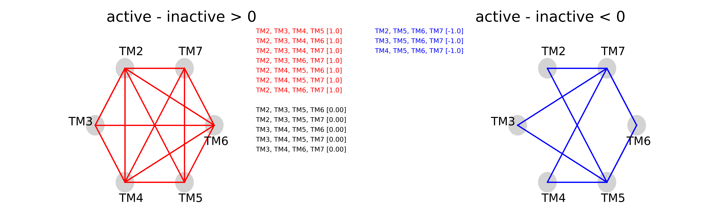

 

#### quadrilateral area (core-facing CA), area threshold = 0.8 (Å2) 
[Return to "quadrilateral (core-facing CA)"](#quadrilateral_fi_ca) 
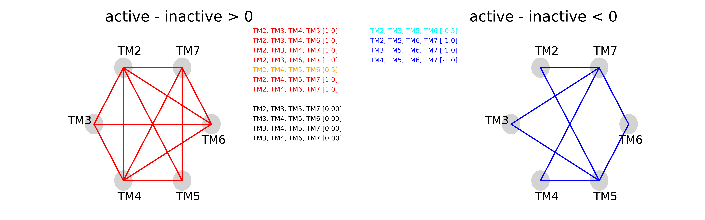

 

#### quadrilateral area (core-facing CA), area threshold = 1.6 (Å2) 
[Return to "quadrilateral (core-facing CA)"](#quadrilateral_fi_ca) 

 

#### quadrilateral area (core-facing CA), area threshold = 2.4 (Å2) 
[Return to "quadrilateral (core-facing CA)"](#quadrilateral_fi_ca) 
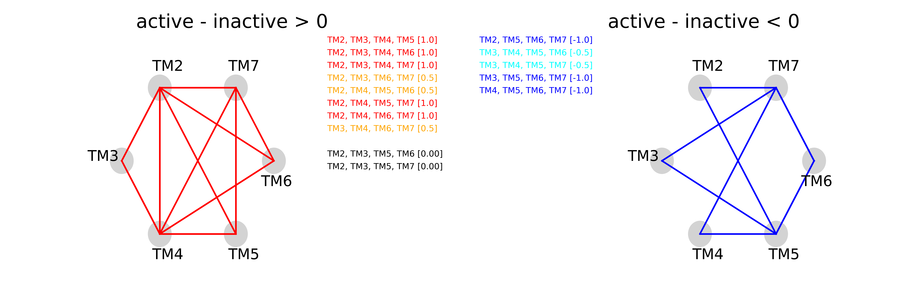

 

#### quadrilateral area (core-facing CA), area threshold = 3.2 (Å2) 
[Return to "quadrilateral (core-facing CA)"](#quadrilateral_fi_ca) 

 

#### quadrilateral area (core-facing CA), area threshold = 4.0 (Å2) 
[Return to "quadrilateral (core-facing CA)"](#quadrilateral_fi_ca) 
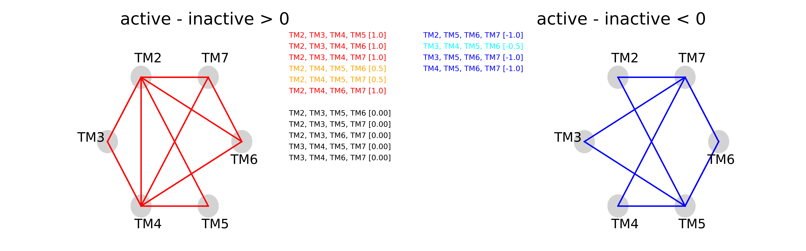

##### 7CMV (active) - 3PBL (inactive) (core-facing CA)
[Return to "quadrilateral (core-facing CA)"](#quadrilateral_fi_ca) 
- [Raw](ee_area_fi/quadrilateral_area_fi_diff.csv) 
- Classified 
    - [Threshold = 0.0 (Å2)](#quadrilateral0_0_fi_ca) 
    - [Threshold = 0.8 (Å2)](#quadrilateral0_8_fi_ca) 
    - [Threshold = 1.6 (Å2)](#quadrilateral1_6_fi_ca) 
    - [Threshold = 2.4 (Å2)](#quadrilateral2_4_fi_ca) 
    - [Threshold = 3.2 (Å2)](#quadrilateral3_2_fi_ca) 
    - [Threshold = 4.0 (Å2)](#quadrilateral4_0_fi_ca) 
 

 

#### quadrilateral area (core-facing CA), area threshold = 0.0 (Å2) 
[Return to "quadrilateral (core-facing CA)"](#quadrilateral_fi_ca) 

 

#### quadrilateral area (core-facing CA), area threshold = 0.8 (Å2) 
[Return to "quadrilateral (core-facing CA)"](#quadrilateral_fi_ca) 

 

#### quadrilateral area (core-facing CA), area threshold = 1.6 (Å2) 
[Return to "quadrilateral (core-facing CA)"](#quadrilateral_fi_ca) 
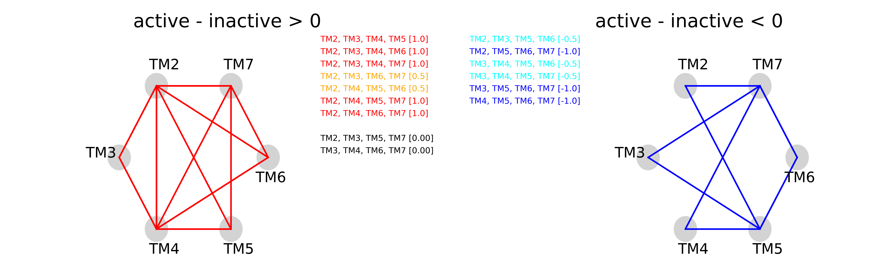

 

#### quadrilateral area (core-facing CA), area threshold = 2.4 (Å2) 
[Return to "quadrilateral (core-facing CA)"](#quadrilateral_fi_ca) 

 

#### quadrilateral area (core-facing CA), area threshold = 3.2 (Å2) 
[Return to "quadrilateral (core-facing CA)"](#quadrilateral_fi_ca) 
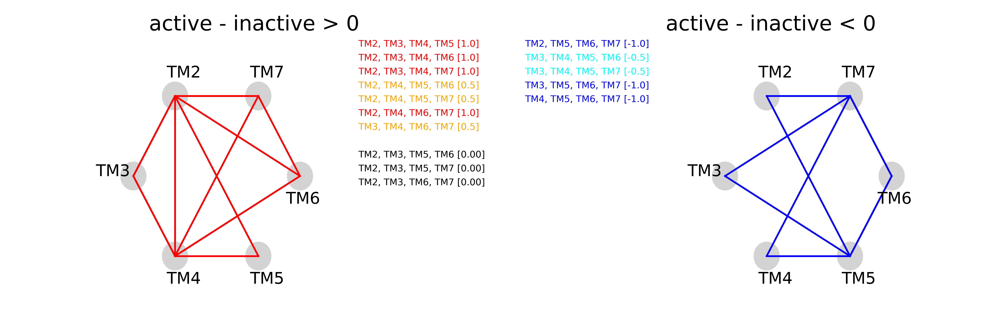

 

#### quadrilateral area (core-facing CA), area threshold = 4.0 (Å2) 
[Return to "quadrilateral (core-facing CA)"](#quadrilateral_fi_ca) 

 
 

 
### pentagon (core-facing CA) 
[Return to top](#top) 

<strong> Area difference</strong>

* [7CMU (active) - 3PBL (inactive) |||  (core-facing CA)](#pentagon7cmu3pbl_fi_ca)
* [7CMV (active) - 3PBL (inactive) |||  (core-facing CA)](#pentagon7cmv3pbl_fi_ca)
 
 
 

#### EE area difference (core-facing CA)

##### 7CMU (active) - 3PBL (inactive) (core-facing CA)
[Return to "pentagon (core-facing CA)"](#pentagon_fi_ca) 
- [Raw](ee_area_fi/pentagon_area_fi_diff.csv) 
- Classified 
    - [Threshold = 0.0 (Å2)](#pentagon0_0_fi_ca) 
    - [Threshold = 0.8 (Å2)](#pentagon0_8_fi_ca) 
    - [Threshold = 1.6 (Å2)](#pentagon1_6_fi_ca) 
    - [Threshold = 2.4 (Å2)](#pentagon2_4_fi_ca) 
    - [Threshold = 3.2 (Å2)](#pentagon3_2_fi_ca) 
    - [Threshold = 4.0 (Å2)](#pentagon4_0_fi_ca) 
 

 

#### pentagon area (core-facing CA), area threshold = 0.0 (Å2) 
[Return to "pentagon (core-facing CA)"](#pentagon_fi_ca) 

 

#### pentagon area (core-facing CA), area threshold = 0.8 (Å2) 
[Return to "pentagon (core-facing CA)"](#pentagon_fi_ca) 

 

#### pentagon area (core-facing CA), area threshold = 1.6 (Å2) 
[Return to "pentagon (core-facing CA)"](#pentagon_fi_ca) 
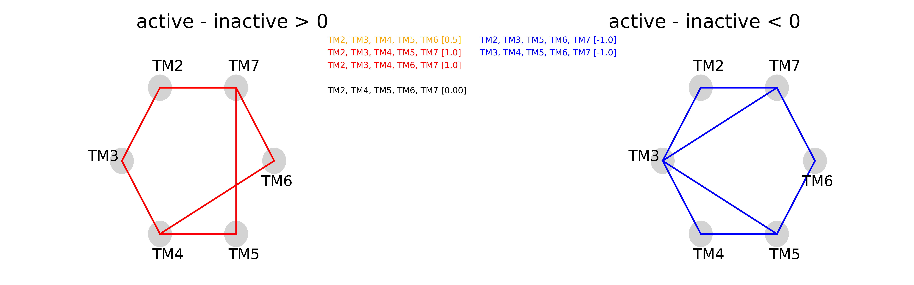

 

#### pentagon area (core-facing CA), area threshold = 2.4 (Å2) 
[Return to "pentagon (core-facing CA)"](#pentagon_fi_ca) 
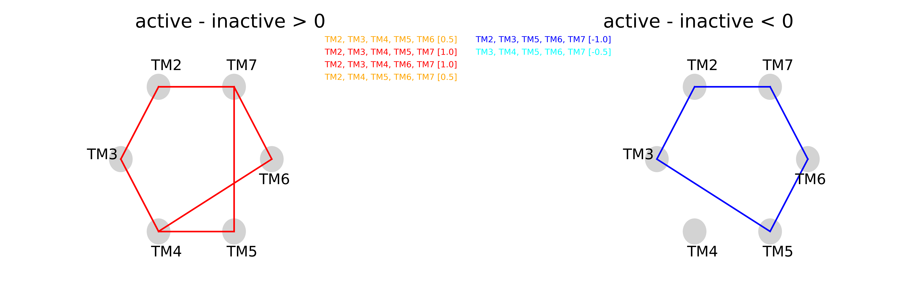

 

#### pentagon area (core-facing CA), area threshold = 3.2 (Å2) 
[Return to "pentagon (core-facing CA)"](#pentagon_fi_ca) 

 

#### pentagon area (core-facing CA), area threshold = 4.0 (Å2) 
[Return to "pentagon (core-facing CA)"](#pentagon_fi_ca) 

##### 7CMV (active) - 3PBL (inactive) (core-facing CA)
[Return to "pentagon (core-facing CA)"](#pentagon_fi_ca) 
- [Raw](ee_area_fi/pentagon_area_fi_diff.csv) 
- Classified 
    - [Threshold = 0.0 (Å2)](#pentagon0_0_fi_ca) 
    - [Threshold = 0.8 (Å2)](#pentagon0_8_fi_ca) 
    - [Threshold = 1.6 (Å2)](#pentagon1_6_fi_ca) 
    - [Threshold = 2.4 (Å2)](#pentagon2_4_fi_ca) 
    - [Threshold = 3.2 (Å2)](#pentagon3_2_fi_ca) 
    - [Threshold = 4.0 (Å2)](#pentagon4_0_fi_ca) 
 

 

#### pentagon area (core-facing CA), area threshold = 0.0 (Å2) 
[Return to "pentagon (core-facing CA)"](#pentagon_fi_ca) 
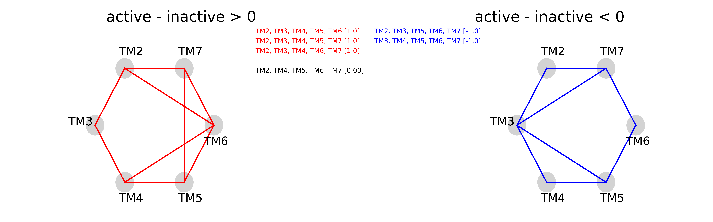

 

#### pentagon area (core-facing CA), area threshold = 0.8 (Å2) 
[Return to "pentagon (core-facing CA)"](#pentagon_fi_ca) 

 

#### pentagon area (core-facing CA), area threshold = 1.6 (Å2) 
[Return to "pentagon (core-facing CA)"](#pentagon_fi_ca) 

 

#### pentagon area (core-facing CA), area threshold = 2.4 (Å2) 
[Return to "pentagon (core-facing CA)"](#pentagon_fi_ca) 

 

#### pentagon area (core-facing CA), area threshold = 3.2 (Å2) 
[Return to "pentagon (core-facing CA)"](#pentagon_fi_ca) 
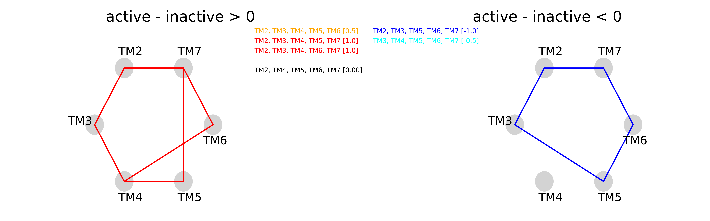

 

#### pentagon area (core-facing CA), area threshold = 4.0 (Å2) 
[Return to "pentagon (core-facing CA)"](#pentagon_fi_ca) 
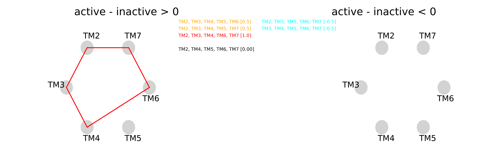

 
 

 
### hexagon (core-facing CA) 
[Return to top](#top) 

<strong> Area difference</strong>

* [7CMU (active) - 3PBL (inactive) |||  (core-facing CA)](#hexagon7cmu3pbl_fi_ca)
* [7CMV (active) - 3PBL (inactive) |||  (core-facing CA)](#hexagon7cmv3pbl_fi_ca)
 
 
 

#### EE area difference (core-facing CA)

##### 7CMU (active) - 3PBL (inactive) (core-facing CA)
[Return to "hexagon (core-facing CA)"](#hexagon_fi_ca) 
- [Raw](ee_area_fi/hexagon_area_fi_diff.csv) 
- Classified 
    - [Threshold = 0.0 (Å2)](#hexagon0_0_fi_ca) 
    - [Threshold = 0.8 (Å2)](#hexagon0_8_fi_ca) 
    - [Threshold = 1.6 (Å2)](#hexagon1_6_fi_ca) 
    - [Threshold = 2.4 (Å2)](#hexagon2_4_fi_ca) 
    - [Threshold = 3.2 (Å2)](#hexagon3_2_fi_ca) 
    - [Threshold = 4.0 (Å2)](#hexagon4_0_fi_ca) 
 

 

#### hexagon area (core-facing CA), area threshold = 0.0 (Å2) 
[Return to "hexagon (core-facing CA)"](#hexagon_fi_ca) 
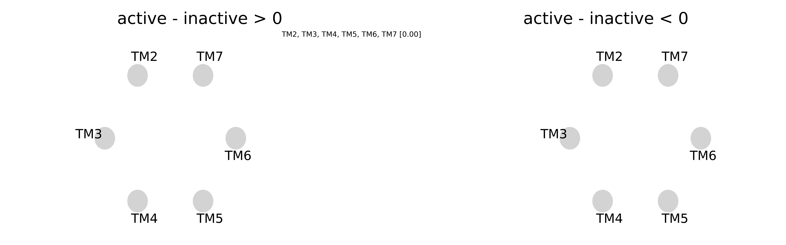

 

#### hexagon area (core-facing CA), area threshold = 0.8 (Å2) 
[Return to "hexagon (core-facing CA)"](#hexagon_fi_ca) 

 

#### hexagon area (core-facing CA), area threshold = 1.6 (Å2) 
[Return to "hexagon (core-facing CA)"](#hexagon_fi_ca) 

 

#### hexagon area (core-facing CA), area threshold = 2.4 (Å2) 
[Return to "hexagon (core-facing CA)"](#hexagon_fi_ca) 

 

#### hexagon area (core-facing CA), area threshold = 3.2 (Å2) 
[Return to "hexagon (core-facing CA)"](#hexagon_fi_ca) 

 

#### hexagon area (core-facing CA), area threshold = 4.0 (Å2) 
[Return to "hexagon (core-facing CA)"](#hexagon_fi_ca) 

##### 7CMV (active) - 3PBL (inactive) (core-facing CA)
[Return to "hexagon (core-facing CA)"](#hexagon_fi_ca) 
- [Raw](ee_area_fi/hexagon_area_fi_diff.csv) 
- Classified 
    - [Threshold = 0.0 (Å2)](#hexagon0_0_fi_ca) 
    - [Threshold = 0.8 (Å2)](#hexagon0_8_fi_ca) 
    - [Threshold = 1.6 (Å2)](#hexagon1_6_fi_ca) 
    - [Threshold = 2.4 (Å2)](#hexagon2_4_fi_ca) 
    - [Threshold = 3.2 (Å2)](#hexagon3_2_fi_ca) 
    - [Threshold = 4.0 (Å2)](#hexagon4_0_fi_ca) 
 

 

#### hexagon area (core-facing CA), area threshold = 0.0 (Å2) 
[Return to "hexagon (core-facing CA)"](#hexagon_fi_ca) 

 

#### hexagon area (core-facing CA), area threshold = 0.8 (Å2) 
[Return to "hexagon (core-facing CA)"](#hexagon_fi_ca) 

 

#### hexagon area (core-facing CA), area threshold = 1.6 (Å2) 
[Return to "hexagon (core-facing CA)"](#hexagon_fi_ca) 

 

#### hexagon area (core-facing CA), area threshold = 2.4 (Å2) 
[Return to "hexagon (core-facing CA)"](#hexagon_fi_ca) 
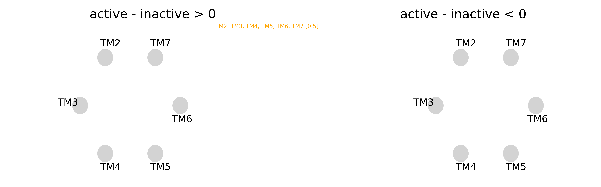

 

#### hexagon area (core-facing CA), area threshold = 3.2 (Å2) 
[Return to "hexagon (core-facing CA)"](#hexagon_fi_ca) 

 

#### hexagon area (core-facing CA), area threshold = 4.0 (Å2) 
[Return to "hexagon (core-facing CA)"](#hexagon_fi_ca) 

 
 

## EE area (core-facing sidechain)

 
### triangle (core-facing sidechain) 
[Return to top](#top) 

<strong> Area difference</strong>

* [7CMU (active) - 3PBL (inactive) |||  (core-facing sidechain)](#triangle7cmu3pbl_fi_sc)
* [7CMV (active) - 3PBL (inactive) |||  (core-facing sidechain)](#triangle7cmv3pbl_fi_sc)
 
 
 

#### EE area difference (core-facing sidechain)

##### 7CMU (active) - 3PBL (inactive) (core-facing sidechain)
[Return to "triangle (core-facing sidechain)"](#triangle_fi_sc) 
- [Raw](ee_area_fi/triangle_sc_area_fi_diff.csv) 
- Classified 
    - [Threshold = 0.0 (Å2)](#triangle0_0_fi_sc) 
    - [Threshold = 0.8 (Å2)](#triangle0_8_fi_sc) 
    - [Threshold = 1.6 (Å2)](#triangle1_6_fi_sc) 
    - [Threshold = 2.4 (Å2)](#triangle2_4_fi_sc) 
    - [Threshold = 3.2 (Å2)](#triangle3_2_fi_sc) 
    - [Threshold = 4.0 (Å2)](#triangle4_0_fi_sc) 
 

 

#### triangle area (core-facing sidechain), area threshold = 0.0 (Å2) 
[Return to "triangle (core-facing sidechain)"](#triangle_fi_sc) 

 

#### triangle area (core-facing sidechain), area threshold = 0.8 (Å2) 
[Return to "triangle (core-facing sidechain)"](#triangle_fi_sc) 

 

#### triangle area (core-facing sidechain), area threshold = 1.6 (Å2) 
[Return to "triangle (core-facing sidechain)"](#triangle_fi_sc) 

 

#### triangle area (core-facing sidechain), area threshold = 2.4 (Å2) 
[Return to "triangle (core-facing sidechain)"](#triangle_fi_sc) 

 

#### triangle area (core-facing sidechain), area threshold = 3.2 (Å2) 
[Return to "triangle (core-facing sidechain)"](#triangle_fi_sc) 

 

#### triangle area (core-facing sidechain), area threshold = 4.0 (Å2) 
[Return to "triangle (core-facing sidechain)"](#triangle_fi_sc) 

##### 7CMV (active) - 3PBL (inactive) (core-facing sidechain)
[Return to "triangle (core-facing sidechain)"](#triangle_fi_sc) 
- [Raw](ee_area_fi/triangle_sc_area_fi_diff.csv) 
- Classified 
    - [Threshold = 0.0 (Å2)](#triangle0_0_fi_sc) 
    - [Threshold = 0.8 (Å2)](#triangle0_8_fi_sc) 
    - [Threshold = 1.6 (Å2)](#triangle1_6_fi_sc) 
    - [Threshold = 2.4 (Å2)](#triangle2_4_fi_sc) 
    - [Threshold = 3.2 (Å2)](#triangle3_2_fi_sc) 
    - [Threshold = 4.0 (Å2)](#triangle4_0_fi_sc) 
 

 

#### triangle area (core-facing sidechain), area threshold = 0.0 (Å2) 
[Return to "triangle (core-facing sidechain)"](#triangle_fi_sc) 

 

#### triangle area (core-facing sidechain), area threshold = 0.8 (Å2) 
[Return to "triangle (core-facing sidechain)"](#triangle_fi_sc) 

 

#### triangle area (core-facing sidechain), area threshold = 1.6 (Å2) 
[Return to "triangle (core-facing sidechain)"](#triangle_fi_sc) 

 

#### triangle area (core-facing sidechain), area threshold = 2.4 (Å2) 
[Return to "triangle (core-facing sidechain)"](#triangle_fi_sc) 

 

#### triangle area (core-facing sidechain), area threshold = 3.2 (Å2) 
[Return to "triangle (core-facing sidechain)"](#triangle_fi_sc) 

 

#### triangle area (core-facing sidechain), area threshold = 4.0 (Å2) 
[Return to "triangle (core-facing sidechain)"](#triangle_fi_sc) 

 
 

 
### quadrilateral (core-facing sidechain) 
[Return to top](#top) 

<strong> Area difference</strong>

* [7CMU (active) - 3PBL (inactive) |||  (core-facing sidechain)](#quadrilateral7cmu3pbl_fi_sc)
* [7CMV (active) - 3PBL (inactive) |||  (core-facing sidechain)](#quadrilateral7cmv3pbl_fi_sc)
 
 
 

#### EE area difference (core-facing sidechain)

##### 7CMU (active) - 3PBL (inactive) (core-facing sidechain)
[Return to "quadrilateral (core-facing sidechain)"](#quadrilateral_fi_sc) 
- [Raw](ee_area_fi/quadrilateral_sc_area_fi_diff.csv) 
- Classified 
    - [Threshold = 0.0 (Å2)](#quadrilateral0_0_fi_sc) 
    - [Threshold = 0.8 (Å2)](#quadrilateral0_8_fi_sc) 
    - [Threshold = 1.6 (Å2)](#quadrilateral1_6_fi_sc) 
    - [Threshold = 2.4 (Å2)](#quadrilateral2_4_fi_sc) 
    - [Threshold = 3.2 (Å2)](#quadrilateral3_2_fi_sc) 
    - [Threshold = 4.0 (Å2)](#quadrilateral4_0_fi_sc) 
 

 

#### quadrilateral area (core-facing sidechain), area threshold = 0.0 (Å2) 
[Return to "quadrilateral (core-facing sidechain)"](#quadrilateral_fi_sc) 

 

#### quadrilateral area (core-facing sidechain), area threshold = 0.8 (Å2) 
[Return to "quadrilateral (core-facing sidechain)"](#quadrilateral_fi_sc) 

 

#### quadrilateral area (core-facing sidechain), area threshold = 1.6 (Å2) 
[Return to "quadrilateral (core-facing sidechain)"](#quadrilateral_fi_sc) 

 

#### quadrilateral area (core-facing sidechain), area threshold = 2.4 (Å2) 
[Return to "quadrilateral (core-facing sidechain)"](#quadrilateral_fi_sc) 

 

#### quadrilateral area (core-facing sidechain), area threshold = 3.2 (Å2) 
[Return to "quadrilateral (core-facing sidechain)"](#quadrilateral_fi_sc) 

 

#### quadrilateral area (core-facing sidechain), area threshold = 4.0 (Å2) 
[Return to "quadrilateral (core-facing sidechain)"](#quadrilateral_fi_sc) 

##### 7CMV (active) - 3PBL (inactive) (core-facing sidechain)
[Return to "quadrilateral (core-facing sidechain)"](#quadrilateral_fi_sc) 
- [Raw](ee_area_fi/quadrilateral_sc_area_fi_diff.csv) 
- Classified 
    - [Threshold = 0.0 (Å2)](#quadrilateral0_0_fi_sc) 
    - [Threshold = 0.8 (Å2)](#quadrilateral0_8_fi_sc) 
    - [Threshold = 1.6 (Å2)](#quadrilateral1_6_fi_sc) 
    - [Threshold = 2.4 (Å2)](#quadrilateral2_4_fi_sc) 
    - [Threshold = 3.2 (Å2)](#quadrilateral3_2_fi_sc) 
    - [Threshold = 4.0 (Å2)](#quadrilateral4_0_fi_sc) 
 

 

#### quadrilateral area (core-facing sidechain), area threshold = 0.0 (Å2) 
[Return to "quadrilateral (core-facing sidechain)"](#quadrilateral_fi_sc) 

 

#### quadrilateral area (core-facing sidechain), area threshold = 0.8 (Å2) 
[Return to "quadrilateral (core-facing sidechain)"](#quadrilateral_fi_sc) 

 

#### quadrilateral area (core-facing sidechain), area threshold = 1.6 (Å2) 
[Return to "quadrilateral (core-facing sidechain)"](#quadrilateral_fi_sc) 

 

#### quadrilateral area (core-facing sidechain), area threshold = 2.4 (Å2) 
[Return to "quadrilateral (core-facing sidechain)"](#quadrilateral_fi_sc) 

 

#### quadrilateral area (core-facing sidechain), area threshold = 3.2 (Å2) 
[Return to "quadrilateral (core-facing sidechain)"](#quadrilateral_fi_sc) 

 

#### quadrilateral area (core-facing sidechain), area threshold = 4.0 (Å2) 
[Return to "quadrilateral (core-facing sidechain)"](#quadrilateral_fi_sc) 

 
 

 
### pentagon (core-facing sidechain) 
[Return to top](#top) 

<strong> Area difference</strong>

* [7CMU (active) - 3PBL (inactive) |||  (core-facing sidechain)](#pentagon7cmu3pbl_fi_sc)
* [7CMV (active) - 3PBL (inactive) |||  (core-facing sidechain)](#pentagon7cmv3pbl_fi_sc)
 
 
 

#### EE area difference (core-facing sidechain)

##### 7CMU (active) - 3PBL (inactive) (core-facing sidechain)
[Return to "pentagon (core-facing sidechain)"](#pentagon_fi_sc) 
- [Raw](ee_area_fi/pentagon_sc_area_fi_diff.csv) 
- Classified 
    - [Threshold = 0.0 (Å2)](#pentagon0_0_fi_sc) 
    - [Threshold = 0.8 (Å2)](#pentagon0_8_fi_sc) 
    - [Threshold = 1.6 (Å2)](#pentagon1_6_fi_sc) 
    - [Threshold = 2.4 (Å2)](#pentagon2_4_fi_sc) 
    - [Threshold = 3.2 (Å2)](#pentagon3_2_fi_sc) 
    - [Threshold = 4.0 (Å2)](#pentagon4_0_fi_sc) 
 

 

#### pentagon area (core-facing sidechain), area threshold = 0.0 (Å2) 
[Return to "pentagon (core-facing sidechain)"](#pentagon_fi_sc) 

 

#### pentagon area (core-facing sidechain), area threshold = 0.8 (Å2) 
[Return to "pentagon (core-facing sidechain)"](#pentagon_fi_sc) 

 

#### pentagon area (core-facing sidechain), area threshold = 1.6 (Å2) 
[Return to "pentagon (core-facing sidechain)"](#pentagon_fi_sc) 

 

#### pentagon area (core-facing sidechain), area threshold = 2.4 (Å2) 
[Return to "pentagon (core-facing sidechain)"](#pentagon_fi_sc) 

 

#### pentagon area (core-facing sidechain), area threshold = 3.2 (Å2) 
[Return to "pentagon (core-facing sidechain)"](#pentagon_fi_sc) 

 

#### pentagon area (core-facing sidechain), area threshold = 4.0 (Å2) 
[Return to "pentagon (core-facing sidechain)"](#pentagon_fi_sc) 

##### 7CMV (active) - 3PBL (inactive) (core-facing sidechain)
[Return to "pentagon (core-facing sidechain)"](#pentagon_fi_sc) 
- [Raw](ee_area_fi/pentagon_sc_area_fi_diff.csv) 
- Classified 
    - [Threshold = 0.0 (Å2)](#pentagon0_0_fi_sc) 
    - [Threshold = 0.8 (Å2)](#pentagon0_8_fi_sc) 
    - [Threshold = 1.6 (Å2)](#pentagon1_6_fi_sc) 
    - [Threshold = 2.4 (Å2)](#pentagon2_4_fi_sc) 
    - [Threshold = 3.2 (Å2)](#pentagon3_2_fi_sc) 
    - [Threshold = 4.0 (Å2)](#pentagon4_0_fi_sc) 
 

 

#### pentagon area (core-facing sidechain), area threshold = 0.0 (Å2) 
[Return to "pentagon (core-facing sidechain)"](#pentagon_fi_sc) 

 

#### pentagon area (core-facing sidechain), area threshold = 0.8 (Å2) 
[Return to "pentagon (core-facing sidechain)"](#pentagon_fi_sc) 

 

#### pentagon area (core-facing sidechain), area threshold = 1.6 (Å2) 
[Return to "pentagon (core-facing sidechain)"](#pentagon_fi_sc) 

 

#### pentagon area (core-facing sidechain), area threshold = 2.4 (Å2) 
[Return to "pentagon (core-facing sidechain)"](#pentagon_fi_sc) 

 

#### pentagon area (core-facing sidechain), area threshold = 3.2 (Å2) 
[Return to "pentagon (core-facing sidechain)"](#pentagon_fi_sc) 

 

#### pentagon area (core-facing sidechain), area threshold = 4.0 (Å2) 
[Return to "pentagon (core-facing sidechain)"](#pentagon_fi_sc) 

 
 

 
### hexagon (core-facing sidechain) 
[Return to top](#top) 

<strong> Area difference</strong>

* [7CMU (active) - 3PBL (inactive) |||  (core-facing sidechain)](#hexagon7cmu3pbl_fi_sc)
* [7CMV (active) - 3PBL (inactive) |||  (core-facing sidechain)](#hexagon7cmv3pbl_fi_sc)
 
 
 

#### EE area difference (core-facing sidechain)

##### 7CMU (active) - 3PBL (inactive) (core-facing sidechain)
[Return to "hexagon (core-facing sidechain)"](#hexagon_fi_sc) 
- [Raw](ee_area_fi/hexagon_sc_area_fi_diff.csv) 
- Classified 
    - [Threshold = 0.0 (Å2)](#hexagon0_0_fi_sc) 
    - [Threshold = 0.8 (Å2)](#hexagon0_8_fi_sc) 
    - [Threshold = 1.6 (Å2)](#hexagon1_6_fi_sc) 
    - [Threshold = 2.4 (Å2)](#hexagon2_4_fi_sc) 
    - [Threshold = 3.2 (Å2)](#hexagon3_2_fi_sc) 
    - [Threshold = 4.0 (Å2)](#hexagon4_0_fi_sc) 
 

 

#### hexagon area (core-facing sidechain), area threshold = 0.0 (Å2) 
[Return to "hexagon (core-facing sidechain)"](#hexagon_fi_sc) 

 

#### hexagon area (core-facing sidechain), area threshold = 0.8 (Å2) 
[Return to "hexagon (core-facing sidechain)"](#hexagon_fi_sc) 

 

#### hexagon area (core-facing sidechain), area threshold = 1.6 (Å2) 
[Return to "hexagon (core-facing sidechain)"](#hexagon_fi_sc) 

 

#### hexagon area (core-facing sidechain), area threshold = 2.4 (Å2) 
[Return to "hexagon (core-facing sidechain)"](#hexagon_fi_sc) 

 

#### hexagon area (core-facing sidechain), area threshold = 3.2 (Å2) 
[Return to "hexagon (core-facing sidechain)"](#hexagon_fi_sc) 

 

#### hexagon area (core-facing sidechain), area threshold = 4.0 (Å2) 
[Return to "hexagon (core-facing sidechain)"](#hexagon_fi_sc) 

##### 7CMV (active) - 3PBL (inactive) (core-facing sidechain)
[Return to "hexagon (core-facing sidechain)"](#hexagon_fi_sc) 
- [Raw](ee_area_fi/hexagon_sc_area_fi_diff.csv) 
- Classified 
    - [Threshold = 0.0 (Å2)](#hexagon0_0_fi_sc) 
    - [Threshold = 0.8 (Å2)](#hexagon0_8_fi_sc) 
    - [Threshold = 1.6 (Å2)](#hexagon1_6_fi_sc) 
    - [Threshold = 2.4 (Å2)](#hexagon2_4_fi_sc) 
    - [Threshold = 3.2 (Å2)](#hexagon3_2_fi_sc) 
    - [Threshold = 4.0 (Å2)](#hexagon4_0_fi_sc) 
 

 

#### hexagon area (core-facing sidechain), area threshold = 0.0 (Å2) 
[Return to "hexagon (core-facing sidechain)"](#hexagon_fi_sc) 

 

#### hexagon area (core-facing sidechain), area threshold = 0.8 (Å2) 
[Return to "hexagon (core-facing sidechain)"](#hexagon_fi_sc) 

 

#### hexagon area (core-facing sidechain), area threshold = 1.6 (Å2) 
[Return to "hexagon (core-facing sidechain)"](#hexagon_fi_sc) 

 

#### hexagon area (core-facing sidechain), area threshold = 2.4 (Å2) 
[Return to "hexagon (core-facing sidechain)"](#hexagon_fi_sc) 

 

#### hexagon area (core-facing sidechain), area threshold = 3.2 (Å2) 
[Return to "hexagon (core-facing sidechain)"](#hexagon_fi_sc) 

 

#### hexagon area (core-facing sidechain), area threshold = 4.0 (Å2) 
[Return to "hexagon (core-facing sidechain)"](#hexagon_fi_sc) 

 
 

